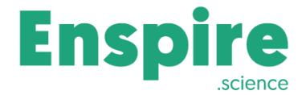
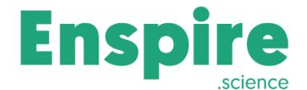

# **Enspire Science ERC training Course materials**

Thank you for participating in our ERC training!

Please find below a list of our ERC articles, as well as useful links discussed in the course.

#### **Introduction**

- The Enspire Science knowledge base: <https://enspire.science/blog-preview/>
- The ERC's website: <https://erc.europa.eu/>
- ERC Grant: Bringing You One Step Closer: <https://enspire.science/erc-grant/>
- What's unique about ERC AdG?: <https://enspire.science/unique-erc-adg/>
- The distorting effect of 'winning' grants exceptions in Horizon Europe and ERC: [https://enspire.science/distorting-effect-of-winning-grants-exceptions-in-horizon-euro](https://enspire.science/distorting-effect-of-winning-grants-exceptions-in-horizon-europe-and-erc/) [pe-and-erc/](https://enspire.science/distorting-effect-of-winning-grants-exceptions-in-horizon-europe-and-erc/)
- Why you should not copy from winning proposals: <https://enspire.science/not-copy-erc-winning-proposals/>

# **The ERC PI**

- ERC eligibility calculator:<https://enspire.science/erc-eligibility-calculator/>
- Eligibility windows for ERC candidates with Medical Doctor degrees: [https://enspire.science/eligibility-windows-for-erc-candidates-with-medical-doctor-de](https://enspire.science/eligibility-windows-for-erc-candidates-with-medical-doctor-degrees/) [grees/](https://enspire.science/eligibility-windows-for-erc-candidates-with-medical-doctor-degrees/)
- ERC The post-CoG era: is there a 'no fly zone' for early AdG applicants?: <https://enspire.science/erc-cog-adg/>
- Who is "ERC material"?: <https://enspire.science/erc-material/>
- ERC who's afraid of h-index?: <https://enspire.science/h-index-erc/>

**IL Office:** 10 HaArba'a St., Tel-Aviv, 6314305 Israel **| UK Office:** 6-10 Claremont Road, Surbiton, Surrey KT6 4QU, UK.

# **The ERC project**

- High-gain in ERC: What is it all about?: <https://enspire.science/high-gain-in-erc-what-is-it-all-about/>
- How to correctly assess ERC High-Risk: <https://enspire.science/how-to-correctly-assess-erc-high-risk/>
- ERC is not a grant for "fishing expedition" research: <https://enspire.science/erc-is-not-a-grant-for-fishing-expedition-research/>
- The "non-incremental" ERC challenge: <https://enspire.science/non-incremental-erc-challenge/>
- Hypothesis in ERC How to do it right: <https://enspire.science/hypothesis-in-erc/>
- The guide to collaborations in ERC: <https://enspire.science/the-guide-to-collaborations-in-erc/>
- Guide to the unique ERC "open-ended" requirement: <https://enspire.science/guide-to-erc-open-ended-research/>
- Fragmented projects in ERC: <https://enspire.science/fragmented-projects-in-erc/>
- ERC for Social Sciences and Humanities? YES PLEASE: <https://enspire.science/erc-for-social-sciences-and-humanities/>
- Breaking down the reasons for non-competitive ERC proposals: [https://enspire.science/breaking-down-the-reasons-for-non-competitive-erc-proposal](https://enspire.science/breaking-down-the-reasons-for-non-competitive-erc-proposals/) [s/](https://enspire.science/breaking-down-the-reasons-for-non-competitive-erc-proposals/)
- ERC Grant writing keep your recycling for the environment: <https://enspire.science/erc-grant-writing-keep-your-recycling-for-the-environment/>
- The B1 and B2 forms in the ERC application: <https://enspire.science/the-b1-and-b2-forms-in-the-erc-application/>

### **Panel selection**

- Potential review panel members in ERC: <https://enspire.science/review-panel-members-erc/>
- ERC panel database: <https://enspire.science/grants/erc/erc-review-panel-members-database/>

#### **The evaluation process**

- ERC Evaluation The "Black box": <https://enspire.science/erc-evaluation-black-box/>
- Remember the PI blocking mechanism when considering to apply: <https://enspire.science/erc-blocking-mechanism/>

**IL Office:** 10 HaArba'a St., Tel-Aviv, 6314305 Israel **| UK Office:** 6-10 Claremont Road, Surbiton, Surrey KT6 4QU, UK.

**Tel:** +972-3-9678558 **| Email:** info@enspire.science **| Web:** <https://enspire.science>

- ERC Interview What should the applicant expect?: <https://enspire.science/erc-interview-applicant-expect/>
- ERC How to read the Evaluation Summary Report (ESR)? <https://enspire.science/erc-esr/>

#### **ERC Synergy**

- ERC Synergy Grant (SyG) what you have to know: <https://enspire.science/erc-synergy-grant-what-to-know/>
- 3 stages of ERC SyG evaluation process: <https://enspire.science/3-stages-of-erc-syg-evaluation-process/>

# **EIC Pathfinder Open**

● The hidden link between ERC and EIC Pathfinder Open: <https://enspire.science/the-hidden-link-between-erc-and-eic-pathfinder-open/>

# **Technical aspects**

- ERC budget presentation guide How to do it right: <https://enspire.science/erc-budget-presentation-guide-how-to-do-it-right/>
- **●** Horizon Europe Programme Guide How to complete your ethics self-assessment: [https://ec.europa.eu/info/funding-tenders/opportunities/docs/2021-2027/common/guid](https://ec.europa.eu/info/funding-tenders/opportunities/docs/2021-2027/common/guidance/how-to-complete-your-ethics-self-assessment_en.pdf) [ance/how-to-complete-your-ethics-self-assessment\\_en.pdf](https://ec.europa.eu/info/funding-tenders/opportunities/docs/2021-2027/common/guidance/how-to-complete-your-ethics-self-assessment_en.pdf)
- Guide to Open Access in Horizon Europe: <https://enspire.science/guide-to-open-access-in-horizon-europe/>
- ERC typical last-minute mistakes: <https://enspire.science/erc-typical-mistakes/>

#### **Grant writing tips**

- Feeding the reviewer: <https://enspire.science/grant-review-process-feeding-the-reviewer/>
- Grant review guide: top 6 ways to annoy a grant reviewer: <https://enspire.science/grant-review-guide-top-6-ways-to-annoy-a-grant-reviewer/>
- Grant application: Top tips for a visually-successful application: [https://enspire.science/grant-application-top-tips-for-a-visually-successful-applicatio](https://enspire.science/grant-application-top-tips-for-a-visually-successful-application/) [n/](https://enspire.science/grant-application-top-tips-for-a-visually-successful-application/)
- Avoiding logic jumps in grant applications: <https://enspire.science/avoiding-logic-jumps-in-grant-applications/>

**IL Office:** 10 HaArba'a St., Tel-Aviv, 6314305 Israel **| UK Office:** 6-10 Claremont Road, Surbiton, Surrey KT6 4QU, UK.

**Tel:** +972-3-9678558 **| Email:** info@enspire.science **| Web:** <https://enspire.science>

# **Our services**

#### **Standard Review**

The ["Standard](https://enspire.science/services/individual-services/standard-review/) Review" service resembles the official review process and provides a detailed report about the way the project is presented. It includes a single review cycle followed by a question and answer session.

#### **Deep Dive Review**

The ["Deep](https://enspire.science/services/individual-services/deep-dive-review/) Dive" review service is our most in-depth and interactive process of preparing the application from idea to submission. During this comprehensive service, we accompany you through every single step of the grant-writing process.

#### **ERC Interview preparation**

An individual and entirely researcher-centric interview [preparation](https://enspire.science/services/individual-services/erc-interview-training/) service, based on the applicant's ERC proposal and the selected review panel(s).