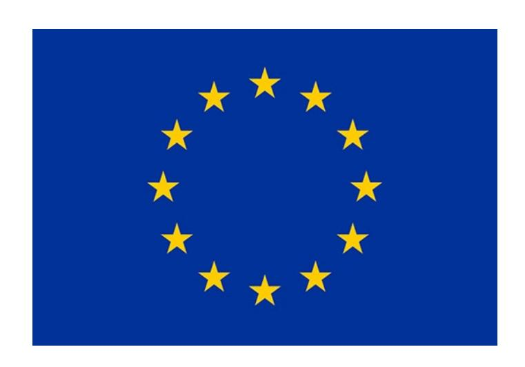
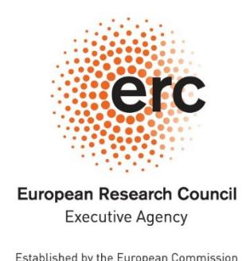

# **Horizon Europe European Research Council (ERC)**

# ERC Rules of submission and evaluation under Horizon Europe

Version 5.0 1 June 2026

# **HISTORY OF CHANGES**

| Version | Publication date | Changes                                                                                    |
|---------|---------------------|--------------------------------------------------------------------------------------------|
| 1.0     | 25.02.2021          |  Initial version applicable to the 2021 calls                                          |
| 2.0     | 15.07.2021          |  Version applicable from the 2022 calls                                                |
| 3.0     | 23.05.2024          |  Version applicable to the AdG 2024 call and from the 2025 calls                    |
| 4.0     | 09.07.2025          |  Version applicable from the 2026 calls                                                |
| 5.0     | 01.06.2026          |  Version applicable to the AdG 2026 and ERC Plus 2026 calls and from the 2027 calls |

**The European Research Council rules of submission, and the related methods and procedures for peer review and proposal evaluation relevant to the specific programme implementing Horizon Europe**

# **TABLE OF CONTENTS**

|      | CONTEXT, SCOPE AND DEFINITION OF TERMS 2                                                       |  |
|------|------------------------------------------------------------------------------------------------|--|
| 1.   | INTRODUCTION 3                                                                                 |  |
| 2.   | SUBMISSION 5                                                                                   |  |
| 2.1  | Calls for proposals 5                                                                          |  |
| 2.2  | Submission of proposals 5                                                                      |  |
| 2.3  | Reception by ERCEA 8                                                                           |  |
| 2.4  | Admissibility and eligibility checks 9                                                         |  |
| 2.5  | Admissibility and eligibility review committee 9                                               |  |
| 3.   | EVALUATION OF PROPOSALS 10                                                                     |  |
| 3.1  | Role of independent external experts 10                                                        |  |
| 3.2  | Selection and appointment of independent external experts 10                                   |  |
| 3.3  | Exclusion of independent external experts at the request of applicants 12                      |  |
| 3.4  | Observers 12                                                                                   |  |
| 3.5  | Selection and award criteria 13                                                                |  |
| 3.6  | The evaluation of ERC grants 14                                                                |  |
| 3.7. | Coordination and support actions 18                                                            |  |
| 3.8  | Feedback to applicants 18                                                                      |  |
| 3.9  | Admissibility, eligibility and evaluation review procedures and enquiries and complaints 20 |  |
| 3.10 | Reporting and information on the evaluation process 21                                         |  |
| 3.11 | Assessment of suspected breaches of research integrity 22                                      |  |
| 4.   | AWARD DECISION AND PREPARATION OF GRANT AGREEMENTS 22                                          |  |
|      | ANNEX A: ETHICS REVIEW PROCESS 25                                                              |  |
|      | ANNEX B: LETTER OF APPOINTMENT FOR ERC REMOTE REFEREES 27                                      |  |

# **CONTEXT, SCOPE AND DEFINITION OF TERMS**

The European Research Council (ERC) is established by the European Commission[1](#page-4-1) under the provisions of the Specific Programme of Horizon Europe - the Framework Programme for Research and Innovation as one of the means for implementing the actions under the pillar 'Excellent Science' of Horizon Europe.

The ERC consists of the independent ERC Scientific Council and the dedicated implementation structure. It is established by the European Commission and is operating according to the principles of scientific excellence, open science, autonomy, efficiency, effectiveness, transparency*,* accountability and research integrity ensured by the European Commission. The dedicated implementation structure is set up in the form of an executive agency[2](#page-4-2) .

The following definition of terms applies to this document:

"ERCEA" refers to the European Research Council Executive Agency.

"Horizon Europe Regulation" refers to the Regulation (EU) 2021/695 establishing Horizon Europe – the Framework Programme for Research and Innovation, laying down its rules for participation and dissemination[3](#page-4-3) .

"Horizon Europe Specific Programme" refers to the Council Decision (EU) 2021/764 establishing the Specific Programme implementing Horizon Europe - the Framework Programme for Research and Innovation as set out in Article 1(2)(a) of the Horizon Europe Regulation[4](#page-4-4) .

"Financial Regulation" refers to Regulation (EU, Euratom) 2024/2509 of the European Parliament and of the Council of 23 September 2024 on the financial rules applicable to the general budget of the Union (recast)[5](#page-4-5) .

"Responsible Authorising Officer (RAO)" refers for the purpose of these rules to the ERCEA staff at an appropriate level responsible for implementing the operational appropriations relating to the component of Horizon Europe managed by ERCEA, and in particular for launching the calls, taking the rejection and grant award decisions and signing the grant agreements, as well as signing the independent external experts' contracts.

1 Commission Decision C(2021) 3402, of 15.2.2021 establishing the European Research Council for Horizon Europe – the Framework Programme for Research and innovation and repealing Decision C(2013)8915.

2 Commission Implementing Decision (EU) 2021/173, of 12 February 2021, establishing the European Climate, Infrastructure and Environment Executive Agency, the European Health and Digital Executive Agency, the European Research Executive Agency, the European Innovation Council and SMEs Executive Agency, the European Research Council Executive Agency, and the European Education and Culture Executive Agency and repealing Implementing Decisions 2013/801/EU, 2013/771/EU, 2013/778/EU, 2013/779/EU, 2013/776/EU and 2013/770/EU, OJ L 50, 15.2.2021, p. 9.

3 Regulation (EU) 2021/695 of the European Parliament and of the Council, of 28 April 2021, establishing Horizon Europe – the Framework Programme for Research and Innovation, laying down its rules for participation and dissemination, and repealing Regulations (EU) No 1290/2013 and (EU) No 1291/2013, OJ L 170, 12.5.2021, p. 1.

4 Council Decision (EU) 2021/764 of 10 May 2021 establishing the Specific Programme implementing Horizon Europe – the Framework Programme for Research and Innovation, and repealing Decision 2013/743/EU, OJ L 167I, 12.5.2021, p. 1.

5 OJ L2024/2509, 26.9.2024, ELI: http://data.europa.eu/eli/reg/2024/2509/oj

"Independent external expert" is an expert who is external to the ERC and the Commission[6](#page-5-1) , and is working impartially in a personal capacity and without conflict of interest[7](#page-5-2) .

"Panel" refers to the committee composed of independent external experts who are responsible for evaluating the proposals in accordance with Article 153 of the Financial Regulation and 29(1) of Horizon Europe Regulation.

"Applicant legal entity" refers to the host institution of the principal investigator.

"Principal investigator" (PI) refers to the independent researcher applying for ERC funding, with scientific responsibility for the project.

If not specified otherwise, "applicants" refers to both the principal investigator and the applicant legal entity.

The purpose of this document is to set out the rules applying to the submission and proposal evaluation, and to the award of grants to successful applicant legal entities. The rules set parameters to ensure that the procedures leading up to the award of grants are rigorous, fair, effective and appropriate. They have been defined in association with the ERC Scientific Council, the latter being responsible, inter alia, for establishing the overall ERC strategy, the work programme for the implementation of the ERC activities ('ERC Work Programme'), the methods and procedures for peer review and proposal evaluation on the basis of which the proposals to be funded are determined under the Horizon Europe Specific Programme and for proposing the independent external experts assisting in evaluation of ERC frontier research actions[8](#page-5-3) .

Section 2 describes the key principles applying to the process. The procedures for the submission of proposals and their handling, including the verification of eligibility criteria, are also described under that section.

Section 3 describes the evaluation of proposals, including the way in which independent external experts are selected and appointed, and the way evaluation is organised. It describes also the way in which appeals and complaints are handled, and the reporting of the evaluation.

Section 4 describes the preparation and award of grants.

# **1. INTRODUCTION**

Applications for ERC frontier research grants under Horizon Europe are made in the form of proposals submitted through the funding and tender opportunities portal ("the portal"),

6 Exceptionally, in duly justified cases, when relevant specialised knowledge is held by staff of Union institutions or bodies, and provided that these are not implementing Horizon Europe as a funding body, such staff may work as independent external experts in compliance with Article 29(1) of the Horizon Europe Regulation.

7 See relevant ERC Guide for Peer Reviewers for more information about types of experts and their specific roles in the ERC evaluation process.

8 Article 2(34) of Horizon Europe Regulation: 'ERC frontier research action' means a principal investigatorled research action, including ERC Proof of Concept, hosted by single or multiple beneficiaries receiving funding from the European Research Council. Point 1.3.1. b) ii) of Annex 1 of the Horizon Europe Specific Programme: "the ERC Scientific Council will (…) make a proposal on the basis of which experts shall be appointed in the case of ERC frontier research actions". Hence, the derogation of Article 49(1) of Horizon Europe Regulation applies to the selection of these experts.

generally following calls for proposals ("calls")[9](#page-6-0) . Calls consist of the publication of the relevant documentation, including the work programme and associated documents. Proposals set out details of the planned work, the teams that will carry it out, the estimated budget and the indication of the sources and amounts of any funding received or applied for in respect of the same action[10.](#page-6-1)

The ERCEA appoints independent external experts to carry out the evaluation of proposals to identify those whose quality is sufficiently high for possible funding.

Based on the outcome of the evaluation, the ERCEA draws up the final list(s) of proposals for possible funding. On the basis of the final ranked list the grants are awarded to the applicant legal entities by the RAO, within the available budget, by means of a formal grant agreement. Grants must respect the principles of equal treatment, transparency, co-financing, noncumulative award and no double financing, non-retroactivity and no-profit in accordance with Article 191 of the Financial Regulation. In addition to the general principles applying to grants, the evaluation of proposals rests on a number of well established principles as established by the Scientific Council:

- **Excellence.** ERC frontier research projects are selected for funding based solely on the criterion of excellence[11.](#page-6-2)
- **Transparency.** Funding and award decisions must be based on clearly described rules and procedures, and applicant legal entities and principal investigators should receive adequate feedback at all stages of the evaluation and, where applicable, the reasons for rejection[12](#page-6-3).
- **Fairness and impartiality**. All proposals shall be treated equally. They must be evaluated impartially on their merits, irrespective of their origin or the identity of the submitting entity, the principal investigator or any team member.
- **Confidentiality.** All proposals and related data, knowledge and documents communicated to the ERCEA must be treated in confidence[13.](#page-6-4)
- **Efficiency and speed.** Evaluation, preparation and award of grants should be as rapid as possible, in accordance with the requirements set out in the legislation[14,](#page-6-5) while maintaining the quality of the evaluation.
- **Ethics and security considerations.** Any proposal which contravenes ethical principles and/or does not comply with security rules[15](#page-6-6) may be rejected from the evaluation, selection and award procedure at any time.

4

9 With the possible exception of coordination and support actions referred to in Article 24(3) of Horizon Europe Regulation, carried out by legal entities identified in the Work Programme when the actions do not fall under the scope of a call for proposals.

10 Article 199 of the Financial Regulation.

11 Article 28(2) of Horizon Europe Regulation.

12 During the entire procedure, applicants may be asked to clarify supporting documents and obvious clerical errors, in accordance with Article 154 of the Financial Regulation.

13 Commission Decision (EU, Euratom) 2015/444, of 13 March 2015, on the security rules for protecting EU classified information and its implementing rules.

14 Article 31 of the Horizon Europe Regulation.

15 Articles 18, 19 and 20 of the Horizon Europe Regulation.

• **Research integrity considerations.** The breach of research integrity rules may result in the rejection of a proposal at any time.

The work programmes will specify further details of the application of the award criteria. Where appropriate and duly justified, the work programmes may provide for eligibility criteria in addition to those set out in Horizon Europe Regulation.

The call may spell out in more detail the way in which these rules and procedures will be implemented and, where options are presented, which are to be followed.

# **2. SUBMISSION**

#### **2.1 Calls for proposals**

The content and indicative timing of calls are set out in the ERC Work Programme. The ERC Work Programme and information documents relevant for the call are published on the Commission funding and tender opportunities portal and on the ERC website. The hyperlink to the portal with access to the electronic submission system is available via the ERC website as well as in the Information for Applicants to the relevant call documents. These websites provide all the necessary information for those wishing to apply to calls. Contact details are provided for National Contact Points ('NCPs'), and the relevant call mailboxes (for any queries related to the call). A dedicated help desk is available to deal with issues relating to the electronic submission of proposals.

Calls for frontier research projects may specify a single indicative budget for the entire call or separate indicative budgets for specific areas of research that will be evaluated by separate panels of independent experts.

The ERC Work Programme announces indicative dates for when calls will be opened as well as their respective proposal submission deadlines. The definite dates are published at the time calls are opened[16.](#page-7-3)

Each call, or part of a call, will also specify whether it has a single-stage or two-stage submission and the number of steps of the evaluation procedure. In the case of a two-stage submission, only those applicants whose proposals were positively evaluated in a first stage are invited to submit complete proposals in a second stage, as per the procedure specified in the call[17.](#page-7-4)

For each call, a 'call coordinator' will be assigned as the contact point for practical questions and to plan and organise the proposal reception and evaluation process.

#### **2.2 Submission of proposals**

Due to the bottom-up nature of the ERC frontier research actions, the ERC receives a large number of proposals in all fields of research.

Applicants will be informed of which information they need to provide, e.g. keywords, choice of panels, the identity codes of their organisations and the summary information about the

16 As provided in the ERC Work Programme, the Director of the European Research Council Executive Agency

may delay the envisaged deadline by up to two months. 17 In accordance with Article 28(4) of the Horizon Europe Regulation, the Commission shall take into account the possibility of a two-stage submission procedure provided in the provisions of the Financial Regulation (Article 203(2)), where appropriate and consistent with the objectives of the call.

proposal. Applicants will be duly informed about the processing of these data, in line with the relevant provisions of the data protection regulation [18](#page-8-0).

Proposals are submitted electronically via the electronic submission system operated by the Commission services in accordance with the provisions of the Financial Regulation[19](#page-8-1) and the ERC Work Programme. Proposals for 'frontier' research actions may – pursuant to the provisions of the ERC Work Programme – involve one or a group of principal investigator(s). Proposals are submitted by a PI[20](#page-8-2) (or by a contact person on behalf of the PI) empowered by the applicant legal entity, to which the grant may be awarded. A proposal can be submitted in any official EU language. However, for reasons of efficiency, the use of English is strongly advised. If the PI needs the call documents in another official EU language, they should submit a request within 10 days after call publication[21.](#page-8-3)

The PI submitting the proposal must make the necessary declarations[22](#page-8-4), among them those confirming:

- to have obtained before submitting the proposal the written consent of all participants on their participation and the content of the proposal, as well as of any researcher mentioned in the proposal as participating in the project[23](#page-8-5), should the proposal be funded;
- the correctness and completeness of the information contained in the proposal and that none of the budgeted activities have started before the proposal was submitted;
- the compliance with ethical principles;
- not to be subject to any exclusion grounds under the Financial Regulation[24](#page-8-6);
- to have the financial and operational capacity to carry out the proposed action.

Throughout the submission and evaluation process, the PI submitting the proposal is the main contact for communication with the ERCEA. Where appropriate, the applicant legal entity represented by the main contact person of the applicant legal entity will be in copy of the communications from ERCEA to the PI. Communications related to the submission of the proposal as well as information letters with the outcome of the admissibility, eligibility checks, evaluation or ethics review will take place through the portal. However, for the cases mentioned in section 2.3 the Agency may contact the PI by email or, in case of urgency, by phone.

The preparation and uploading of all the proposal data and the declarations of applicant's agreement must take place prior to the proposal submission. Before submitting the proposal,

18 Regulation (EU) 2018/1725 of the European Parliament and of the Council, of 23 October 2018, on the protection of natural persons with regard to the processing of personal data by the Union institutions, bodies, offices and agencies and on the free movement of such data, and repealing Regulation (EC) No 45/2001 and Decision No 1247/2002/EC (OJ L295, 21/11/2018, p. 39).

19 Article 152(2) of the Financial Regulation.

20 For the case of actions involving a group of PIs the proposal is submitted by the Corresponding Principal Investigator.

21 For the contact information, see section 2.1 of this document.

22 The complete list of declarations can be found in the proposal submission forms (Part A).

23 Including but not limited to: a team member, a collaborator, another PI or a member of the advisory board.

24 Article 138 of the Financial Regulation.

the applicant legal entity must also be registered in the Participant Register on the portal with access to the electronic submission system and a LEAR (Legal Entity Appointed Representative) must be appointed in accordance with the relevant section of the Online Manual[25](#page-9-0).

The electronic submission system will carry out a number of basic preliminary verification checks (e.g. for completeness of the proposal, internal data consistency, absence of virus infection, file types, size limitations, etc.). These checks do not replace the formal eligibility checks as they cannot solely assure that the contents of these files correspond to the requirements of the call.

Only upon completion of these checks as well as after the completion of the required declarations, the electronic submission system will allow the proposal to be submitted.

The ERC Work Programme may provide specific formatting requirements. The submission system may automatically check page limits in specific parts of the proposal, and if necessary, issue warnings before the final submission. In the case of a submitted proposal exceeding the specified limits, the system may blank out the excess pages or perform another action provided for in the ERC Work Programme. A proposal exceeding the page limits will not be blocked by the submission system.

The ERCEA has no access to the proposal until the call deadline has passed.

Submission is deemed to occur when the PI has received an email confirming successful submission, as specified in section 2.3, and not at any point prior to this.

Proposals not submitted before the specified deadline in accordance to the above procedure will not be regarded as having been received by the ERCEA. In accordance with the relevant section of the Online Manual, applicants who failed to submit a proposal, and who believe that such a failure was due to a fault in the electronic submission system, may send a complaint within 4 calendar days after call closure (by means specified in the submission system) explaining the circumstances of their case and attaching a copy of all parts of the proposal. Such cases may be examined by the admissibility and eligibility review committee (see section 2.5), taking into account the logs of operations running up to the submission deadline. The PI will be notified without undue delay of the result of this examination. If it is found that a fault did indeed lie with the electronic submission system, the proposal as attached to the complaint will be considered as submitted before the call deadline. If a general submission system failure is identified during a submission process and confirmed by the Commission services, the call deadline may be extended.

The proposals submitted via the electronic submission system are entered into databases after the call closure. Versions of proposals or any other additional information affecting their content submitted on paper, by e-mail or any other electronic means will not be regarded as having been received by the ERCEA[26.](#page-9-1)

To withdraw a proposal before the relevant call deadline, the electronic submission system should be used. The withdrawn proposals will not be considered subsequently for evaluation

25 See [Online Manual.](https://webgate.ec.europa.eu/funding-tenders-opportunities/display/OM/Online+Manual)

26 In duly justified exceptional circumstances, the ERCEA may authorise submission by other means than the electronic submission system.

or for selection, nor count against possible re-application restrictions[27](#page-10-1). For a proposal to be withdrawn after the call deadline, and for the application not to count against possible future re-applications restrictions, a written request[28](#page-10-2) for withdrawal must be received by the Agency at the latest on the day preceding the panel meeting where a final position on the outcome of the evaluation of that proposal is established.

If more than one version of the same proposal[29](#page-10-3) is submitted before the call deadline, the system keeps only the most recent, updated version for evaluation. In the case of two or more proposals submitted by the same PI, the ERCEA services may ask the PI to withdraw one or more of those proposals. In the case of absence of reaction by the PI to this request, only the first eligible proposal will be considered.

Proposals are archived under secure conditions at all times in compliance with the applicable retention periods.

# **2.3 Reception by ERCEA**

The date and time of receipt of the submitted proposals are recorded. An email is sent via the portal to the PI and applicant legal entity confirming the successful submission(s).

After the call closure, an e-receipt will be made available to the PI and applicant legal entity via the portal with access to the electronic submission system, containing:

- the full proposal including the proposal title, acronym and unique proposal identifier (proposal number);
- the call identifier to which the proposal was addressed;
- the date and time of receipt (i.e. the call deadline).

There is no further contact between the ERCEA services and applicants on their proposal until after completion of the evaluation, with the exception of the following cases:

- if the ERCEA services need to contact the PI and/or applicant legal entity to clarify matters such as admissibility, eligibility, ethics and security issues, research integrity or to verify administrative or legal data contained in the proposal;
- if an obvious clerical error on the part of the applicants is detected at any time[30](#page-10-4);
- in response to any enquiries or complaints made by the PI and/or the applicant legal entity[31](#page-10-5);

8

27 As set out in the relevant ERC Work Programme.

28 Further details on how to submit the request will be provided in the information documents for the call.

29 Each version with the same proposal number.

30 In application of Article 154 and 203(3) of the Financial Regulation, where the ERCEA services detect an obvious clerical error on the part of the applicants (i.e. a clear mistake or omission that concerns a nonsubstantial part of the proposal, but should be corrected in order to allow its proper evaluation and to have complete information/data), the PI and/or the applicant legal entity shall be contacted for clarifications, so long as the latter do no substantially change the proposal. If the nature of the error and information is clear from the proposal, the relevant service in ERCEA may propose the correction to the PI and/or applicant legal entity.

31 Article 30(5) of the Horizon Europe Regulation.

– if proposals are subject to interviews.

The ERCEA services may ask the applicants to provide missing information or clarify supporting documents so long as such information or clarifications do not substantially change the proposal.

In any case, applicants must not contact any independent expert (including panel members and panel chair) involved in the evaluation of their proposals, as described in sections 3.2 and 3.11.

#### **2.4 Admissibility and eligibility checks**

Proposals must meet all the admissibility and eligibility criteria laid down in the relevant ERC Work Programme in order to be evaluated.

Proposals and applicants must remain eligible under the conditions set out in the relevant ERC Work Programme during the evaluation and granting processes as well as throughout the implementation of the project.

Applicants must immediately inform the ERCEA services at any point in time of any events or circumstances which would be likely to affect the fulfilment of the eligibility criteria or any information substantially affecting the evaluation of the proposal.

If it becomes clear before, during or after the evaluation, that one or more of the admissibility or eligibility criteria has not been or are no longer met, the proposal will be declared inadmissible or ineligible. Where there is a doubt about a proposal's admissibility or eligibility, the ERCEA services may proceed with the evaluation pending a final decision on admissibility or eligibility. The fact that a proposal is evaluated in such circumstances does not constitute proof of its admissibility or eligibility.

If a proposal is considered not to relate to the objectives of the grant and/or call for proposals, it will be declared ineligible.

# **2.5 Admissibility and eligibility review committee**

If it is not immediately clear whether a proposal is admissible or eligible, an admissibility and eligibility review committee may be convened to advise the RAO. It may deliberate through an exchange of mails remotely or in a meeting.

This committee is made up of ERCEA staff, and where necessary, other Commission staff having the relevant expertise. The committee's role is to ensure a consistent legal interpretation of such cases and equal treatment of the applicant legal entities and PIs involved in the proposal. The committee may also recommend contacting independent external experts, if a specific expertise is necessary.

It examines the proposal and any other pertinent information and provides advice to help decide whether to reject it on admissibility or eligibility grounds. The committee may decide to contact the PI and the applicant legal entity in order to clarify a particular issue.

Those PIs and applicant legal entities whose proposals are found to be inadmissible or ineligible are informed in writing[32](#page-11-2) of the grounds for such a decision and the available means of redress, as described under section 3.9. An internal committee, as referred to under section

32 An information letter is sent once the RAO has adopted the relevant rejection decision.

3.9, may be convened by the ERCEA redress office to examine the complaints dealing with the inadmissibility or ineligibility decision of specific proposals.

#### **3. EVALUATION OF PROPOSALS**

# **3.1 Role of independent external experts**

The ERC relies on independent external experts to ensure that only proposals of the highest quality are selected for funding.

For the purposes of the peer review evaluation of the main[33](#page-12-3) ERC frontier research grants, ERC independent external experts (peer reviewers) may be requested to perform the following tasks related to the evaluation (with or without remuneration):

- as a chair-person or vice-chair person of an ERC peer review evaluation panel(s), organising the work within their panel, chairing panel meetings, and attending a final consolidation meeting. Chair-persons and vice-chair persons may also perform individual evaluation of proposals, usually remotely, in preparation for the panel meetings;
- as a member of the ERC peer review evaluation panel(s), assisting in the preparation of panel meetings, attending those meetings and contributing to the individual evaluation of proposals, usually remotely;
- evaluating remotely[34](#page-12-4) or centrally individual proposals.

ERCEA may contract independent external experts as observers in order to examine the evaluation process from the point of view of its working and execution, as described in section 3.4. Independent external experts with the appropriate skills in ethics may be requested to carry out ethics review and ethics monitoring of projects.

Independent external experts may also assist the ERC in assessing cases of eligibility, as described in section 2.5 as well as cases of breach of research integrity, as described in section 3.11, during all stages of evaluation, granting and project implementation.

#### **3.2 Selection and appointment of independent external experts**

The ERC Scientific Council is responsible for proposing independent external experts for the evaluation of frontier research projects[35](#page-12-5) and for the monitoring of the implementation of

33 Starting Grant, Consolidator Grant, Advanced Grant and Synergy Grant.

34 The remote evaluation may be performed by panel members, members of panels other than the panel(s) to which the proposal is assigned (PEVs), remote step 1 experts and non-paid experts, the so-called 'remote referees'. PEVs, remote step 1 experts and remote referees do not participate in the panel meetings. Remote step 1 experts are asked to act as generalists and to review more proposals than remote referees. In recognition of this higher workload, their remote reviewing work is remunerated. Remote referees bring in specialised expertise within a research field and evaluate only remotely. The involvement of remote referees is limited to step 2 of the evaluation process.

35 The selection by the Scientific Council is not required for concluding a contract with independent external experts for the evaluation of proposals for actions other than frontier research (such as co-ordination and support actions) and with the ethics experts referred to in Annex A point (I) of these Rules.

frontier research actions pursuant to the Horizon Europe Specific Programme[36.](#page-13-0) The ERC Scientific Council may rely on its members and on information provided by members/chairs of peer review evaluation panel(s)[37](#page-13-1) or by the ERCEA[38](#page-13-2) to identify the independent external experts.

The RAO will conclude a contract with the remunerated experts[39](#page-13-3) based on the model contracts. [40](#page-13-4) In the case of non-paid experts evaluating only remotely ('remote referees'), a letter of appointment will be issued based on the model attached as Annex B to these rules. Both mentioned models, set out the applicable conditions, including a code of conduct, and provisions on conflicts of interest. Independent external experts must have:

- appropriate skills and knowledge relevant to the areas of activity in which they are asked to assist;
- high level of professional experience (public or private sector) in scientific research, scholarship, or scientific management;
- appropriate language skills required for the tasks to be carried out.

Other skills may also be required (e.g. such as mentoring and educating young scientists, managing or evaluating projects; technology transfer and innovation; international cooperation in science and technology).

The ERCEA has also access to the database of experts resulting from calls for expression of interest from individuals and calls addressed to relevant organisations according to Article 49 of the Horizon Europe Regulation.

Independent external experts may come from countries other than the Member States or countries associated to Horizon Europe.

In assembling pools of experts, the ERC seeks to ensure the highest level of scientific and technical expertise while respecting the balanced composition of the evaluation panels, in terms of skills, experience, knowledge, including in terms of specialisation, in areas appropriate to the call, considering also other criteria, such as:

– gender balance[41](#page-13-5);

Article 7(6) of the Horizon Europe Regulation.

– geographical diversity across the EU and associated countries, and reasonable inclusion of nationals of third countries;

11

36 Annex I, Pillar I, section 1.3.1(b) provides that experts shall be appointed on the basis of a proposal from the ERC Scientific Council in the case of ERC frontier research actions.

37 The panel chairs are mandated by the Scientific Council to select independent external experts for remote evaluation on the basis of the specific expertise required by each proposal.

38 ERCEA may provide information to the Scientific Council on the performance of ERC independent external experts, and/or the names of independent external experts registered in the Commission's database according to Article 49 of the Horizon Europe Regulation.

39 Prior to contracting remunerated experts, ERCEA will invite the selected experts to complete the formalities for registration as ERC experts in the database referred to in Article 49 of the Horizon Europe Regulation.

40 See relevant documents on funding and tender opportunities portal, section 'work as an expert'.

41 The European Union pursues a gender balance and equal opportunities policy in the field of research. See

– regular rotation of experts, consistent with the appropriate balance between continuity and renewal.

The names of the independent external experts assigned to individual proposals are not made public. However, the list of independent external experts used in a call will be published yearly on Commission websites,[42](#page-14-2) and the list of panel members will be published on the ERC website.

ERCEA may put in place a system to assess the performance of independent external experts.

Statistics on gender, geographic distribution, rotation and, where appropriate, private public sector balance will be monitored and reported on an annual basis.

Any direct or indirect contact about the peer review evaluation of an ERC call between an applicant legal entity or a PI submitting a proposal on behalf of an applicant legal entity, and any independent external expert involved in the peer review evaluation under the same call, is strictly forbidden. If such contact attempts to influence the evaluation process, it will be considered as a breach of research integrity and may result in the rejection of the proposal from the call (see section 3.11). It can also constitute an exclusion situation under Article 138(1) of the Financial Regulation.

# **3.3 Exclusion of independent external experts at the request of applicants**

If foreseen in the ERC Work Programme, applicants can request during the electronic proposal submission that specific persons are excluded from evaluating their proposal. Reasons for the exclusion have to be based on clear grounds such as direct scientific rivalry, professional hostility, or similar situation which would impair or put in doubt the objectivity of the potential evaluator. In such case, the maximum number of persons that could be excluded will also be indicated in the ERC Work Programme.

Under such circumstances, if the person identified is an independent external expert participating in the evaluation of the proposals for the call in question, they may be excluded from the evaluation of the proposal concerned, as long as the ERCEA remains in the position to have the proposal evaluated.

# **3.4 Observers**

Independent external experts may be contracted as independent observers based on the model contract approved by the Commission to examine the implementation of the evaluation process. The remit of observers covers the entire evaluation session, including any remote assessments. The role of the independent observers is to give advice on the conduct of the evaluation sessions, the ways in which the procedures could be improved and the way in which the independent external experts apply the criteria. The independent observers verify that the procedures set out or referred to in these rules are adhered to and report on ways in which the process could be improved. If proposals are subject to remote evaluation, observers have access to all communications between the ERCEA and the external independent experts and may make contact with some or all external independent expertsto poll their opinions on the conduct of the evaluation. Observers have access to any meetings that are part of the evaluation session.

Due to the nature of the independent observers' task, it is not necessary that the observers have expertise in the area of the proposals being evaluated. Indeed, it is considered advantageous to

42 In line with the Article 49(3) of the Horizon Europe Regulation.

avoid having observers with too intimate a knowledge of the particular Research & Innovation area in order to avoid conflicts between their opinions on the outcome of the evaluations and the functioning of the sessions. In any case, they will not express views on the proposals under examination.

The independent observers report their findings to the ERCEA. The ERCEA will share the received report with the Scientific Council. The observers are also encouraged to enter into discussions with the ERCEA officials involved in the evaluation sessions and to make observations on any possible improvements that could be put into practice. Any such suggestions will be recorded in the observer's final report.

The ERCEA will inform the Programme Committee[43](#page-15-1) of the selected observers' identity, their terms of reference and their findings, and may publish a summary of their reports.

The contractual conditions of independent observers, including tasks, code of conduct and provisions on conflict on interests are set out in the expert's contract.

The ERC Scientific Council may also delegate its members to be present during the panel meetings as observers. The objective of their presence during the meetings is to perform their tasks, in particular to monitor the peer review and proposal evaluation[44](#page-15-2) process.The Scientific Council members shall not influence, under any circumstances, the outcome of the panel meeting(s) they attend.

Based on justified reason(s), the ERCEA may decide that other authorised persons may attend panel meeting(s) as observers. The person concerned shall duly sign a declaration on the absence of conflict of interest and a declaration on confidentiality. As any other observer, the person concerned shall not influence, under any circumstances, the outcome of the panel meeting(s) they attend.

# **3.5 Selection and award criteria**

All eligible proposals are evaluated by the panel, composed of independent external experts where provided for, to assess their merit with respect to the selection and award criteria relevant for the call.

The criteria, including any proposal scoring and associated weights and thresholds or any other detail concerning the application of these criteria established by the Scientific Council, are set out in the ERC Work Programme, based on principles set out in the Horizon Europe Regulation[45](#page-15-3). The information documents for the call may further explain how these criteria will be applied.

Additional procedures may be applied for proposals with ethically sensitive issues (see Annex A) or for proposals raising security issues.

43 Article 14 (2) of Council Decision (EU) 2021/764 of 10 May 2021 establishing the Specific Programme implementing Horizon Europe – the Framework Programme for Research and Innovation, and repealing Decision 2013/743/EU

44 Article 9(2) of the Horizon Europe Specific Programme. 45 Article 28 of the Horizon Europe Regulation.

# **3.6 The evaluation of ERC grants**

The ERC Scientific Council establishes the methods and procedures for peer review and proposal evaluation (which may vary in detail for different calls/actions) on the basis of which the proposals to be funded are determined.

# *3.6.1 The peer review evaluation of the main [46](#page-16-1) ERC frontier research grants*

The peer review evaluation established by the ERC Scientific Council for the main ERC frontier research grants is organised on the basis of the principles set out in section 1 of these rules against the sole evaluation criterion of excellence set out in the ERC Work Programme.

Where a call specifies multiple-step evaluation procedure, only those proposals that pass the previous step, based on the evaluation procedure set out in the ERC Work Programme, shall go forward to the subsequent step. If the call is significantly oversubscribed, a limited set of evaluation elements may be used in the initial step(s) of the evaluation[47](#page-16-2). In such case, the applicants will be informed about the evaluation elements to be used in due time. Evaluation panels may be split at any stage/step of the evaluation in case of high number of applications.

In exceptional circumstances, and with the sole intention of facilitating the efficiency of the evaluation procedure, if an independent external expert is prevented from approving a report in the IT system[48](#page-16-3), the ERCEA services may do so on the expert's behalf, subject to the agreement of the expert.

#### *3.6.1(1) Organisation of the peer review evaluation*

The peer review evaluation is carried out by means of panels of independent scientists and scholars. Panels may be assisted by other ERC peer reviewers, who perform the peer review evaluation fully remotely ("remote evaluation"). Panels are established to span the spectrum of research areas covered by the call.

Panels are chaired by an independent external expert proposed by the Scientific Council. It is expected that panel members attend in person the evaluation sessions that are held on-site. In exceptional and justified cases such as illness, maternity or force majeure, if unable to attend in person, a panel member may participate remotely by electronic means (video-conferencing or telephone-conferencing), subject to the ERCEA's agreement*.* 

Any peer review evaluation may be organised in one or several subsequent steps. In such case, the outcome of the first step is the input for the second step; and, where applicable, the outcome of the second step is the input for the third step. The sequence of events in a step is usually as follows:

Allocation of proposals: Each proposal is allocated to a panel on the basis of the subject-matter of the proposal. The Work Programme may define panels in advance or provide that they may be dynamically arranged. Initial allocation will be based in principle on the indication provided by the applicants, the title and content of the proposal and/or other information, possibly in the form of "keywords", provided in the proposal.

46 Starting Grant, Consolidator Grant, Advanced Grant and Synergy Grant.

47 The applicants will be informed accordingly.

48 Such as rank list, individual assessment report and evaluation report.

In the case of pre-defined panels, proposals may be allocated to a different panel than the one chosen by the applicant with the agreement of both panel chairs concerned. In such cases, applicants are informed of the reallocation of the proposal [49](#page-17-0).

Individual assessment: Proposals are examined against the relevant evaluation elements by at least 3 peer reviewers[50,](#page-17-1) qualified in the scientific and/or technological fields related to the proposal, who complete and approve individual assessment reports.

In the first step of a multiple-step evaluation procedure, peer reviewers[51](#page-17-2) are asked to act as generalists, thus their expertise has to cover a wide range of proposals within a research field.

Comments provided by the independent external experts must give sufficient and clear reasons for the scores and, if appropriate, any recommendations for modifications to the proposal, should the proposal be retained for grant preparation.

In the case of remote evaluation, the results are communicated to the ERCEA electronically. Each expert endorses electronically the completed individual assessment report. In so doing, the expert confirms again that they have no conflict of interest with respect to the evaluation of that particular proposal.

Briefings of the panels: The ERCEA is responsible for briefing independent external experts before each evaluation session. The briefing (adapted as necessary) should cover:

- the background documents (work programme excerpts, call text, guidance documents, etc);
- the key features of the programme; the evaluation processes and procedures (including the criteria to be applied);
- the content of the research topics under consideration;
- the terms of the experts' contract, including confidentiality, impartiality, prevention of conflict of interest, completion of tasks and approval of reports and the possible consequences of non-compliance with the contractual obligations;
- instructions to disregard any excess pages; and
- the need to evaluate proposals 'as they are', and the very limited scope for recommending improvements to proposals.

Close contact is maintained with the individual experts to assist them on any query.

Panel assessment: Panels have the duty to examine consistently proposals falling within their area of competence[52](#page-17-3) and to operate in a coherent manner with other panels, to ensure

52 This includes cross-panel or cross-domain interdisciplinary proposals which may be assigned for review to members of more than one panel or additional peer reviewers.

49 At the latest through the notification for the invitation to the interview (if applicable) or the evaluation report attached to the information letter with the final outcome of the evaluation of their respective proposal.

50 This should always include at least one panel member and may also include members of panels other than the panel(s) to which the proposal is assigned, remote step 1 experts or remote referees. In case of significant oversubscription, the Scientific Council may decide that proposals are examined by at least two peer reviewers, including at least one panel member.

51 Except remote referees who participate only in step 2 of the evaluation process.

consistency of treatment of proposals across the range of panels and the scientific/technological areas open in the call.

On the request of the panel chair, an additional reviewer(s) from another panel may be invited for the discussion of proposals with cross-panel reviews.

The experts evaluate the proposals individually and write their assessments that serve as a basis for the panel meeting. At the panel meeting, the panel discusses the proposals[53](#page-18-0) and based on the discussions they make a final judgement on the proposal score and its position in the ranked list, by consensus decision or by majority vote. The outcome of the panel assessment phase is a ranked order list. In the final step of the evaluation, the panel identifies those proposals which are recommended for funding if sufficient funds are available.

Interviews: If foreseen in the ERC Work Programme, the panel assessment may include interviews with the PI and/or the applicant legal entity. Any interview will be conducted by at least three panel members. Travel and subsistence costs incurred in relation to interviews may be reimbursed by the ERCEA[54](#page-18-1). Specific arrangements for interviews will be described in the information documents for the call. Interviews may be conducted at the location of the peer review evaluation panel meeting or, subject to technical feasibility, by electronic means (video link, teleconference or similar). Under exceptional circumstances, such as serious illness, childbirth or hospitalisation, documented requests by applicant Principal Investigators for postponement of a scheduled interview date may be considered by the ERCEA. Unless otherwise agreed by the ERCEA, interviews will not be postponed beyond 3 weeks from the first day of the concerned panel´s interview week. Postponed interviews may have to take place remotely, due to technical and organisational constraints. Should a planned interview not be possible due to exceptional circumstances beyond the control of the ERCEA, the panel will have to take its decision based on the written proposal.

#### *3.6.1(2) Two-stage submission procedure*

The ERC Work Programme may specify that a two-stage submission procedure applies. In such cases, the criteria applicable to each stage are set out in the ERC Work Programme. The precise methodology, to be established by the ERC Scientific Council in the ERC Work Programme, for the peer review evaluation at the first and second stage may differ (for example in the use of peer reviewers, and/or interviews of the PI). To uphold the principle of equal treatment, the panel may recommend the exclusion from further evaluation for proposals submitted at the second stage which deviate substantially from the corresponding first-stage proposal.

Second stage applicants will be asked to declare that their proposal is consistent with their first stage submission.

53 At the steps before the last step of the evaluation, panels may determine which proposals are selected for panel discussion. For instance, a panel may decide that at step 1, proposals with low scores in all individual reviews will not be discussed. In such cases, the threshold below which proposals are not discussed will be decided independently by the panel. An applicant whose proposal is not retained for the next step of the evaluation may receive an evaluation report with a standardised panel comment and individual reviews.

54 The reimbursement of travel expenses, daily allowance and accommodation allowance will be possible for principal investigators who have been invited by the ERCEA to attend an interview, as well as for anyone responsible for accompanying the PI when the PI is a disabled person. The relevant Commission Decision on the reimbursement rules of expenses incurred by people from outside the Commission invited to attend meetings in an expert capacity applies by analogy (Commission Decision C(2007) 5858).

# *3.6.1(3) Peer review evaluation results, selection and rejection of proposals*

The panel draws up the final list(s) of proposals for possible funding.

This results in:

- a list of proposals which are of sufficiently high quality to be retained for possible funding (the retained list). If the call establishes indicative budgets for particular panels, domains, fields of research, etc., separate retained lists may be prepared for each such field;
- if the total recommended funding for retained proposals following peer review evaluation exceeds the indicative budget for the call, one (or - in the case of indicative budgets associated with separate panels, domains, research fields, etc. – more) reserve list(s) of proposals may be established. The number of proposals kept in reserve is decided by the ERCEA in view of budgetary considerations, and is based on the likelihood that such proposals may eventually receive funding due to eventualities such as withdrawals of proposals, or availability of additional budget;
- a list of proposals which are not retained for funding. This list includes those proposals found to be ineligible; proposals considered not to achieve the required threshold of quality after each step of the peer review evaluation; and proposals which, cannot be funded because the available budget is insufficient.

The assessment of quality, and the recommended rank order for funding of proposals on the retained list, is based on the peer review evaluation of the proposal against all relevant criteria.

The ERC Scientific Council will confirm the final ranked list of proposals recommended for funding by the peer review evaluation.

Any proposal which does not fulfil the ethical requirements or the conditions set out in the Horizon Europe Regulation, the ERC Work Programme or in the call shall be rejected or terminated once the ethical unacceptability has been established[55](#page-19-0). Proposals may be rejected after the ethics review on ethics grounds following the procedures in Annex A.

Proposals may be rejected from the selection procedure at any time on the grounds of breach of research integrity with due regard being given to the principle of proportionality [56](#page-19-1).

The RAO will adopt a rejection decision for all non-retained proposals, grouped by grounds for rejection.

#### *3.6.2 ERC Complementary funding for the Principal Investigators*

The ERC also awards complementary funding for Principal Investigators funded by its main frontier research grants, under the specific objectives described in Horizon Europe Specific Programme.

#### *3.6.2.(1) ERC Proof of Concept*

The ERC Proof of Concept frontier research grants aim to facilitate exploration of the commercial and social innovation potential of ERC funded research.

55 Article 19(6) of the Horizon Europe Regulation.

56 See section 3.11.

The proposal evaluation is organised on the basis of the principles set out in section 1 of these rules according to the application of the relevant elements of the excellence criterion, as set out in the ERC Work Programme.

Unless the ERC Work Programme specifies otherwise, the evaluation for the ERC Proof of Concept will be a single-step evaluation consisting of remote individual assessment of independent external experts, followed by a panel meeting, if needed.

Proposals are assigned for individual assessment to a minimum of three independent external experts qualified in the fields related to the proposal who examine them against the relevant elements of the award criterion and complete and approve individual assessment reports.

The details on the evaluation procedure of the ERC Proof of Concept will be set out in the ERC Work Programme and other relevant call documents.

#### *3.6.2 (2) Other ERC complementary funding*

The ERCEA may implement other complementary actions for Principal Investigators in order to fulfil its mission of supporting new ways of working in the scientific world and to raise the profile of frontier research in Europe as well as the visibility of ERC programmes to researchers across Europe and internationally.

The proposal evaluation is organised on the basis of the principles set out in section 1 of these rules according to the application of the relevant award criteria, as set out in the ERC Work Programme.

The details on the evaluation procedure of other types of other complementary actions will be set out in the ERC Work Programme and other relevant documents for the action.

#### **3.7. Coordination and support actions**

Coordination and support actions[57](#page-20-2) may be implemented to contribute to the specific ERC objectives of the Horizon Europe programme.

The details on the evaluation procedure of coordination and support actions will be set out in the ERC Work Programme and other relevant call documents.

For these actions, in duly justified cases set out in the Work Programme adopted by the Commission, the evaluation committee may be composed partially or fully of representatives of Union Institutions or bodies[58](#page-20-3).

Following the evaluation of proposals, the ERCEA provides feedback through an "information letter".

# **3.8 Feedback to applicants**

Following the "scientific/technical evaluation" of proposals, the ERCEA provides feedback through an "information letter" to the applicants[59.](#page-20-4) The aim is to inform applicants of the result of the evaluation by independent external experts, and for the successful proposals, to initiate

57 Article 2(39) of the Horizon Europe Regulation.

58 Article 29(1) of the Horizon Europe Regulation.

59 In accordance with Art 203(7) of the Financial Regulation, this information is provided as soon as possible, and in any case within 15 calendar days after information has been sent to the successful applicants.

the "grant preparation" phase as described in section 4. All communication and feedback from the ERCEA to the applicants is done electronically. The calls for proposals indicate the expected date of feedback about the outcome of the evaluation.

- 1. Following the admissibility and eligibility check, applicants whose proposals are found to be inadmissible or ineligible are informed of the grounds for such a decision and of the means of redress.
- 2. Following the first-step evaluation in a two-step or three-step peer review evaluation, and following the second step evaluation in a three-step peer review evaluation:
  - − applicants whose proposals are not retained for the next step for budgetary or quality reasons, as applicable, receive feedback on the peer review evaluation in the form of an evaluation report (ER);
  - − for the proposals rejected after failing a quality threshold, the comments contained in the ER may only be complete for those evaluation elements examined up to the point when the threshold was failed;
  - − applicants whose proposals are retained for the next step receive a notification, and may be invited to attend an interview.
- 3. Following single-step evaluation, following the second step evaluation in a two-step peer review evaluation, following the third step evaluation in a three-step peer review evaluation:
  - − all applicants receive feedback on the peer review evaluation in the form of an ER.

The ER provides the outcome of the "scientific/technical evaluation". It may contain, as appropriate, the final panel score and ranking range, the panel comments and the assessment of the evaluation elements by the individual independent external experts. For proposals on the retained list, where appropriate, the ER indicates any recommendation made on the maximum amount of funding to be awarded, and any other appropriate recommendations on the conduct of the project, including possible suggestions for improvements to the methodology and planning of the work.

All applicants of the proposals under grant preparation will receive feedback on the results of the ethics review process in the form of an ethics summary report, which may include ethics requirements that may become contractual obligations.

Applicants whose proposals are rejected because of ethics, security and research integrity breaches, including contacts with independent external experts involved in the evaluation in the attempt to influence its outcome, are informed of the reason for rejection and the means of redress, after having been given the opportunity to provide observations.

The ERCEA will not change the content of the ERs that form part of the panel report, except if necessary to improve readability or, exceptionally, to remove any clerical errors or inappropriate comments, provided such errors or comments do not affect the evaluation results.

The information letter will contain indications of the means of redress available, including the evaluation review procedure.

# **3.9 Admissibility, eligibility and evaluation review procedures and enquiries and complaints[60](#page-22-1)**

The ERCEA provides information on the procedure to be followed by PIs and/or applicant legal entities to submit requests for admissibility or eligibility review concerning a specific proposal and requests for evaluation review concerning the results of a particular evaluation in relation to any ERC call (means of redress), as well as to submit any enquiries and complaints about their involvement in Horizon Europe. Contact details will be provided for both National Contact Points and the relevant call mailboxes (for any queries related to the call). A dedicated help desk will be provided for issues related to the electronic submission system.

#### Requests for admissibility, eligibility or evaluation review:

The information letter referred to under sections 2.5 and 3.8 will provide an electronic address to be used for the PIs and/or applicant legal entities which consider that the applicable evaluation procedure has not been correctly applied to its proposal. The letter will specify a deadline for the receipt of any such complaints, which will be 30 calendar days from the date of receipt[61](#page-22-2) of the ERCEA's notification. As a minimum any complaint should contain the name of the call, the proposal number (if any), the title of the proposal, and a description of the alleged shortcomings.

An internal committee will be convened by the ERCEA redress office to examine the cases that have been submitted by the applicant legal entities and/or PIs in question, within the deadline mentioned above through the means foreseen in the information letter. Requests that do not meet the above-mentioned conditions, or do not deal with the admissibility, eligibility or evaluation of a specific proposal, will not be admitted. Applicants who, before the deadline, submit requests other than via the portal will be requested to resubmit using that site.

The committee will bring together ERCEA staff with the requisite scientific/technical and legal expertise. The committee shall be chaired by and include staff of ERCEA who were not involved in the evaluation of the proposals. The committee's role is to ensure a consistent legal interpretation of such requests and equal treatment of applicants. It provides specialist opinion on the admissibility, eligibility and evaluation processes, based on all available information related to the proposal and its evaluation. It works independently. If the committee is required to consider complaints on admissibility, eligibility issues, it may seek advice of the admissibility and eligibility review committee referred to under section 2.5.

During the evaluation review procedure, the committee itself, however, does not evaluate the scientific merits of the proposal[62.](#page-22-3) Depending on the nature of the complaint, the committee may review the profile and expertise of the independent external experts, their individual comments, and the evaluation report. The committee may also contact the panel chair/panel member(s) concerned. The committee will not call into question the scientific judgement of appropriately qualified panels of independent external experts.

In light of its review, the committee will recommend a course of action to the RAO for the call. Should the committee consider that there is evidence to support the complaint, it may suggest a partial or total re-evaluation of the proposal by independent external experts or to uphold the

60 Article 30 of the Horizon Europe Regulation.

61 The access date in the system. A formal notification is considered to have been accessed by the applicant 10 calendar days after sending, if not accessed before in the system.

62 Article 30(2) of the Horizon Europe Regulation

initial outcome if it concludes that the errors identified would not substantially affect the outcome of the evaluation nor the ranking of the project. The committee may make additional comments or recommendations.

#### Other means of redress:

The above procedures do not prevent the applicants from using other means of redress, such as:

- requesting a legal review of the Agency decision under Article 22 of Council Regulation 58/2003[63](#page-23-1), within 1 month of receiving the ERCEA's letter[64;](#page-23-2) or
- bringing an action for annulment under Article 263 of the Treaty on the Functioning of the European Union against the Agency, within 2 months of receiving the ERCEA's letter[65](#page-23-3).

Applicants may choose which means of redress they wish to pursue. They are asked not to take **more than one** formal action at a time.

Applicants are asked to wait for the reply to their complaint or request (final decision) of the Agency/Commission and then they can take further action against that decision. **Deadlines** for further action will start to run from when applicants receive the final decision.

Other types of complaints on decisions affecting the involvement of applicants in the programme:

Any other complaint against a decision affecting the involvement of applicants in Horizon Europe shall be addressed to the Agency Director within 30 calendar days from the receipt of the communication of the Agency decision[66.](#page-23-4)

#### **3.10 Reporting and information on the evaluation process**

After each evaluation, a report is prepared by the ERCEA services and made available to the programme committee. The report gives information on the proposals received (for example, numbers of proposals received, results of each call, ranked lists, evaluation scores of proposals and budget requested), on the evaluation procedure and on the independent external experts. A subset of this information is also made available to the NCPs (including personal data[67,](#page-23-5) as well as evaluation scores of proposals and ranked lists).

For communication purposes, the ERCEA may publish, after the end of the evaluation process and in any appropriate media, general information on the results of the evaluation. Moreover, the ERCEA may publish information on the proposals recommended for funding as a result of

65 See footnote 57.

63 Council Regulation (EC) No 58/2003, of 19 December 2002, laying down the statute for executive agencies to be entrusted with certain tasks in the management of Community programmes, O J L 11, 16.01.2003, p.1.

64 See footnote 57.

66 A formal notification that has not been accessed within 10 calendar days after sending is considered to have been accessed by the applicant.

67 Details will be provided in th[e Data Protection Notice.](https://ec.europa.eu/info/funding-tenders/opportunities/portal/screen/support/legalnotice) 

the evaluation[68.](#page-24-2) Applicants may be contacted for any other communication activities involving their proposed project and/or requiring their participation.

For purposes related to monitoring, study and evaluating implementation of ERC actions, the ERC may need that submitted proposals and their respective evaluation data be processed by external parties[69.](#page-24-3) The data may also be used for the monitoring and evaluation of the EU funding programme and the design of future programmes. Any processing will be conducted in compliance with the requirements of Regulation (EU) 2018/1725.

#### **3.11 Assessment of suspected breaches of research integrity**

In order to preserve research integrity, at all stages of the ERC evaluation[70,](#page-24-4) granting and implementation process, any suspected breach of research integrity incurred by principal investigators or by applicant legal entities, research team members and beneficiaries shall be duly assessed. The ERC applies the same rigour to ensuring that independent external experts contracted by ERCEA abide by rules on confidentiality and conflict of interest.

ERCEA in cooperation with the CoIME[71](#page-24-5) will deal with such suspected breaches. When necessary, ERCEA will rely for this purpose on duly qualified independent external experts (see section 3.1).

Breaches of research integrity, including scientific misconduct such as fabrication, falsification, plagiarism or misrepresentation of data, as well as contacts with any independent external expert involved in the peer review evaluation (peer reviewers) in the attempt to influence its outcome that may arise during the evaluation or the granting process may result in rejection of proposals from evaluation or from the grant preparation.

PIs who submit proposals which are rejected on the grounds of breach of research integrity may face restrictions on resubmission if so provided by the ERC Work Programme. Such restrictions will be applied with due regard to the principle of proportionality.

#### **4. AWARD DECISION AND PREPARATION OF GRANT AGREEMENTS**

On the basis of the final ranked list as drawn by the ERCEA in accordance with section 3.6.1 the grants are awarded to the applicant legal entities by the RAO, within the available budget, by means of a formal grant agreement. The RAO will decide on the maximum grant amount after the relevant administrative, legal, ethics, technical and financial verifications. The signature of such agreement is preceded by the adoption of an award decision taken by the RAO[72.](#page-24-6)

The grant agreements are concluded with the applicant legal entities subject to the financial and legal procedures (including, if necessary, the completion of the procedure for consulting

68 On the basis of the final list drawn by the ERCEA in accordance with section 3.6.1. This may include the names of PIs and applicant legal entities, the proposal title and acronym and summary of the proposed research project.

69 Contractors, independent external experts identified in accordance with the Horizon Europe Regulation and its Specific Programme, and/or beneficiaries of Coordination and Support Actions.

70 This can be triggered by the analysis performed during the scientific evaluation of the proposal, the project technical follow-up, whistleblowing or during the Ethics Review Procedure.

71 ERC Standing Committee on Conflict of Interest, Scientific Misconduct and Ethical Issues.

72 In accordance with Article 203(6) of the Financial Regulation.

the programme committee provided for in Article 14(4) of the Horizon Europe Specific Programme for projects involving the use of Human Embryonic Stems Cells) [73,](#page-25-0) as well as the verification of the requirements mentioned in this section.

The grant preparation in the ERC frontier research actions involves no negotiation of scientific/technical substance. A grant is subsequently awarded to the applicant legal entity on the basis of the proposal submitted and the maximum amount of funding recommended following the peer review evaluation and considering the recommendations on the conduct of the project, including the suggestions made by the panel for the improvements to the methodology and planning of the work, in agreement with the applicants, where applicable.

All administrative information should have been included already at proposal stage. During the preparation of the grant agreement, the PI and the applicant legal entity may receive requests for further administrative, legal, ethics, technical and financial information necessary for the preparation of a grant agreement. Where required as an eligibility criterion in the relevant ERC Work Programme and in line with its requirements, legal entities must have a gender equality plan (GEP) or equivalent, which must be in place at the latest by the time of the signature of the grant.

The ERCEA services may request minor adaptations, in line with the results of the evaluations, possibly including modifications to the budget. The ERCEA services will justify all requested changes. In these cases, the ERCEA services will give a deadline for applicants to reply. In the absence of a reply in due time, the authorising officer may terminate the grant preparation phase for that proposal, and invite the next highest ranked proposal in the reserve list for grant preparations. In exceptional cases, when duly justified and requested by the applicants, the authorising officer may extend the deadline to reply.

In lack of agreement with the PI and the applicant legal entity or if they have not provided the ERCEA with a signed supplementary agreement within a reasonable deadline, grant preparations will be terminated. Modifications beyond the ERCEA's requests will not be accepted unless sound and sufficient justification be provided by the applicants, which will be subject to approval by the ERCEA services[74.](#page-25-1)

If necessary, the evaluation panel may be consulted to verify the consistency of their decision with the updated project.

The administrative and legal aspects during grant preparation would cover, in particular, the verification of the existence and legal status of the applicant legal entities[75](#page-25-2), review of any optional provisions in the grant agreement, or conditions required for the project, and other aspects relating to the development of the final grant agreement (including date of start of project, timing of reports and other legal requirements). The financial aspects would cover the establishment of the EU contribution, the amount of the pre-financing, the estimated breakdown of budget and Union financial contribution per participant, and the assessment of

73 Article 13(4)(b) of the Horizon Europe Specific Programme.

74 Acceptance under the mentioned conditions might be granted provided that the modifications do not substantially change the proposal.

75 See the relevant section of [Rules for Legal Entity Validation, LEAR Appointment and Financial Capacity](https://ec.europa.eu/info/funding-tenders/opportunities/docs/2021-2027/common/guidance/rules-lev-lear-fca_en.pdf)  [Assessment.](https://ec.europa.eu/info/funding-tenders/opportunities/docs/2021-2027/common/guidance/rules-lev-lear-fca_en.pdf)

their financial capacity[76](#page-26-0), if required. ERC actions must comply with applicable security rules[77](#page-26-1) and in particular rules on protection of classified information against unauthorised disclosure, including compliance with any relevant national and Union law. Where appropriate, the Commission will carry out a security scrutiny for proposals raising security issues.

If during this phase the ERCEA services discover that the declarations made by applicants are false, the authorising officer may terminate grant preparations[78](#page-26-2) and invite the next highest ranked proposal in the reserve list for grant preparations.

The removal, addition or substitution of a legal entity before the signature of the grant agreement will be permitted if duly justified and requested by the applicants.

The RAO shall reject from an award procedure those applicant legal entities who are, at the time of a grant award procedure, in one of the exclusion situations established in accordance with Article 138(1) of the Financial Regulation (relating, for example, to bankruptcy, convictions, grave professional misconduct, social security obligations, other illegal activities, previous breach of contract, conflicts of interest, misrepresentation, fraud, corruption) or situations referred to in Article 143(1) of that Regulation. The applicant PI will systematically be considered a natural person who is essential for the award or for the implementation of the legal commitment[79.](#page-26-3)

The abstract of the proposals awarded granting (in the DoA – Part A) will be published. If the applicant wishes so, the abstract might be revised.

Should a proposal be rejected during the grant preparation phase on any possible grounds, including eligibility, ethics, security, misrepresentation or availability of funds, the RAO will adopt a rejection decision for the proposal. This decision will be communicated to the applicant through an information letter indicating the available means of redress, in line with section 3.9 of these rules.

Grant Preparation of proposals from the reserve list may begin once the sufficient budget has become available to fund one or more of these projects. Subject to budget availability, grant preparation should begin with the highest ranked proposals and should continue in descending order.

76 Applicant legal entities must have stable and sufficient resources to successfully implement the project and contribute their share. Organisations participating in several projects must have sufficient capacity to implement all these projects. The financial capacity of applicant legal entities will be verified in accordance with Article 201(5) of the Financial Regulation and Article 27 of the Horizon Europe Regulation. See additional information on the Financial Capacity Assessment in the relevant Information for Applicants' document.

77 Article 20 of the Horizon Europe Regulation.

78 In accordance with Article 143 of the Financial Regulation.

79 See Article 138(5)(c) of the Financial Regulation.

# **ANNEX A: ETHICS REVIEW PROCESS**

# **A. Objective**

The process is aimed at ensuring that Articles 18 and 19 of the Horizon Europe Regulation are implemented and, in particular, that all actions carried out under Horizon Europe, including ERC projects, comply with ethical principles and relevant national, Union and international legislation, including the Charter of Fundamental Rights of the European Union and the European Convention on Human Rights and its Supplementary Protocols.

Actions which do not fulfil the ethical requirements and are thus not ethically acceptable shall be rejected or terminated once the ethical unacceptability has been established.

# **B. Applicants' ethics self-assessment**

When submitting their proposal, applicants must fill in an ethics issues table and an ethics selfassessment (included in Part A of the proposal) identifying and detailing all the anticipated ethics issues related to the objective, implementation and likely impact of the activities to be funded, including a confirmation of compliance with the ethical principles and relevant national an international legislation, and a description of how it will be ensured[80](#page-27-1).

#### **C. The ethics review process**

All proposals recommended for funding will undergo an ethics review process carried out by ERCEA, in line with relevant Commission guidelines.

#### *C.1. Ethics Screening*

The Ethics Screening is carried out to identify proposals raising complex or serious ethics issues and submit them to an ethics assessment.[81](#page-27-2)

Before the Ethics Screening, an Ethics Pre-Screening is performed by the ERCEA ethics team. This process is based on the proposal, the ethics issues table and the ethics self-assessment as submitted by the applicants. Proposals without ethics issues and proposals that are compliant with ethics rules can be cleared at this stage. Ethics Screening is carried out for proposals that potentially raise serious and complex ethics issues or require additional clarifications. Each proposal is reviewed by at least two independent experts on the basis of part A (including an ethics issues table and an ethics self-assessment), part B and any relevant annexes, and then discussed by a panel of ethics experts.

Proposals that raise serious and complex ethics issues are reviewed in an Ethics Assessemnt. An ethics summary report is produced to finalise the process for the remaining proposals

# *C.2. Ethics Assessment*

The Ethics Assessment is the third step in the ethics review process and is only carried out for proposals that were not cleared in the previous steps because they raise complex or serious ethics issues.

80 Article 19(2) of the Horizon Europe Regulation.

81 Article 19(3) of the Horizon Europe Regulation.

The Ethics Assessment is an in-depth analysis of the ethical issues in the proposals recommended for funding and flagged by the ethics screening experts,. It is systematically performed on all proposals involving the use of hESCs[82](#page-28-0).

The Ethics Assessment is carried out by a panel consisting of at least three independent ethics experts with relevant expert knowledge of the research in question who focus on the elements described in section B above, part B of the proposal, any relevant annexes, andthe analysis done during the Ethics Screening as well as the information provided by the applicants in response to the Ethics Screening.

## *C.3. The possible outcomes of the Ethics Assessment are:*

## 1. Clearance

The applicants have provided the necessary elements to adequately address the identified ethical issues and the preparation of the grant agreement can be finalised. An ethics summary report is produced to finalise the process.

#### 2. Conditional clearance

The panel or the ERCEA formulate ethics requirements. These requirements are communicated to the applicant through an ethics summary report. Some of these requirements may constitute conditions to be fulfilled before the signature of the grant agreement or to be included as Ethics deliverables in Annex 1 of the grant agreement.

For all requirements, also those not included in Annex 1, applicants shall obtain all approvals or other mandatory documents from the relevant national, local ethics committees or other bodies such as data protection authorities before the start of the relevant activities. Those documents shall be kept on file and provided to the ERCEA upon request[83](#page-28-1).

The panel or the ERCEA may also recommend that an Ethics Review or and Ethics Check is performed during the lifetime of the project and suggest the most suitable time frame (e.g. prior to the start of the relevant research work).

An ethics summary report is produced to finalise the process before granting.

#### 3. No clearance

The identified ethics issues were not addressed by the applicants. The proposal is rejected.

#### *D. Additional information on the ethics appraisal process.*

Additional guidance related to the ethics appraisal process is provided in the relevant ethics guidelines and the Information for Applicants document relevant for each call.

82 In agreement with the Commission Statement related to research activities involving human embryonic stem cells of 20 December 2013 (2013/C 373/02).

83 Article 19(4) of the Horizon Europe Regulation.

# **ANNEX B: LETTER OF APPOINTMENT FOR ERC REMOTE REFEREES**

# **LETTER NUMBER – [TO BE COMPLETED]**

Title: [Title]

First Name: [First name] Last Name: [Last name]

Expert candidature number: [Expert candidature number]

Email address: [Email address]

#### Dear [Title] [Last Name]

Thank you for agreeing to assist the European Research Council (ERC) in the peer review evaluation of frontier research proposals. This letter will confirm your agreement to evaluate remotely individual proposals as a remote referee. Please note that remote referees assisting the ERC evaluation panels are not remunerated for the tasks they perform.

The present letter constitutes an agreement between you and the European Research Council Executive Agency (ERCEA), acting under the powers delegated by the European Commission, to contribute to the ERC peer review evaluation.

The terms and conditions and the code of conduct set out in the annexes form an integral part of this agreement. By signing this agreement you confirm that you have read, understood and accepted all the obligations and conditions including the Code of Conduct provisions on independence, impartiality and confidentiality, as set out in Annex II.

This agreement enters into force on the day on which the last party signs and shall remain valid until the end of the Horizon Europe Framework Programme.

#### SIGNATURES

For the ERCEA, represented for the purposes of signing this agreement by:

[first name, last name, function]

[electronic signature]

[electronic time stamp]

For the Expert:

[electronic signature]

[electronic time stamp]

# **ANNEX I: TERMS AND CONDITIONS**

#### **GENERAL**

# **SUBJECT OF THE AGREEMENT**

This agreement sets out the rights and obligations, terms and conditions that apply to the expert to assist ERCEA with tasks in the context of managing the ERC calls for proposals.

# **WORK TO BE PROVIDED**

#### **TASKS TO BE ACCOMPLISHED**

During the peer review evaluation, the expert shall assist the panel with the evaluation of proposals submitted in response to the call for proposals, published by the ERCEA on the basis of the priority "Excellent science" of Horizon Europe Framework Programme.

This agreement enables the expert to perform peer review evaluation of research proposals only remotely. Prior to any request, the ERCEA will contact the expert to verify their availability and willingness, and to confirm the availability by electronic transaction.

#### **WORKING ARRANGEMENTS**

The expert's work may start on the day on which the last party signs this agreement.

The expert may not under any circumstances start work before the date on which this agreement enters into force.

The expert shall submit the individual evaluation report on each accepted task related to peer review evaluation by the dates indicated in the electronic exchange system.

# **RIGHTS AND OBLIGATIONS OF THE PARTIES**

#### **GENERAL OBLIGATION TO IMPLEMENT THE AGREEMENT AND TO INFORM**

- 1. The expert shall perform the agreement in compliance with all its provisions and legal obligations under applicable EU, international and national law.
- 2. The expert shall, in particular, implement the work properly and in full compliance with the provisions of the Code of Conduct (see Annex II).
- 3. This agreement does not constitute an employment agreement with ERCEA.
- 4. If the expert cannot fulfil their obligations or becomes aware of other circumstances likely to affect the agreement, they shall immediately inform the ERCEA.
- 5. Neither the ERCEA nor the Commission can be held liable for any damage caused or sustained by the expert or a third party during or as a consequence of performing the Agreement, except in the event of the one of the party's wilful misconduct or gross negligence.

# **OWNERSHIP AND USE OF THE RESULTS (INCLUDING INTELLECTUAL PROPERTY RIGHTS)**

The ERCEA obtains full ownership of the results produced under this agreement , including copyright and other intellectual or industrial property rights. The ERCEA obtains these rights for the full term of intellectual property protection from the moment the results are delivered by the expert and approved by the ERCEA. Such delivery and approval are considered to constitute an effective assignment of rights.

This transfer of rights is free of charge.

## **PROCESSING OF PERSONAL DATA**

#### **1. Processing of personal data by the ERCEA**

Any personal data under the Contract will be processed by the ERCEA under Regulation (EU) No 2018/1725 and according to the 'notifications of the processing operations' to the Data Protection Officer (DPO) of the ERCEA (publicly accessible in the DPO register).

Such data will be processed by the Director ('data controller') of the ERCEA for the purposes of performing, managing and monitoring the Contract or protecting the financial interests of the EU or Euratom.

Moreover, the expert's personal data may also be sent to persons or bodies responsible for monitoring the proper application of EU law and to the ERC Scientific Council.

The expert's personal data will not be disclosed to the applicants of the evaluated proposals. The expert's name will however be published, together with their area of expertise, at least once a year on the ERC's website, in accordance with Article 49(3) of the Horizon Europe Regulation.

The expert has the right to access and correct their personal data. For this purpose, they must send any queries about the processing of their personal data to the data controller, via the contact point indicated in the privacy statement(s) that are published on the ERC's website.

The expert has the right to have recourse at any time to the European Data Protection Supervisor (EDPS).

#### **2. Processing of personal data by the expert**

The expert may process personal data under the Agreement only under the supervision of and on instructions from the data controller of the ERCEA (see above).

The expert shall put in place appropriate technical and organisational security measures to address data processing risks and in particular:

- (a) prevent any unauthorised person from accessing computer systems that process personal data, and especially:
  - unauthorised reading, copying, alteration or removal of storage media;
  - unauthorised data input, disclosure, alteration or deletion of stored personal data;

- unauthorised use of data-processing systems by means of data transmission facilities;
- (b) ensure that access to personal data is limited to persons with special access rights;
- (c) ensure that, during communication of personal data and transport of storage media, the data cannot be read, copied or deleted without authorisation;
- (d) design their organisational structure in a way that meets data protection requirements.

#### **TERMINATION OF THE AGREEMENT**

The ERCEA may terminate the agreement if the expert:

- 1. is not performing their tasks pursuant to the agreement or performing them poorly or
- 2. has committed serious breach of any substantial obligations arising from this agreement, or during the selection procedure, including improper implementation of the work, false declarations and obligations relating to the Code of Conduct; or
- 3. the expert has been found guilty of grave professional misconduct proven by any means; or
- 4. the Agency deems that the tasks assigned to the expert under the agreement are no longer needed.

The termination will take effect on the day after the notification sent by ERCEA is received by the expert.

The expert may at any moment terminate the agreement if they are not able to fulfil their obligations in carrying out the tasks required. The termination will take effect on the date the ERCEA will formally acknowledge it.

# **FINAL PROVISIONS**

# **COMMUNICATION BETWEEN THE PARTIES**

Communication under the agreement (e.g. information, requests, submissions, formal notifications, etc. ) shall:

- be made in writing; and
- bear the agreement's number;
- be made through the electronic exchange system.

If the electronic exchange system is temporarily unavailable, instructions will be given on the ERC website.

Communications through the electronic exchange system are considered to have been made when they are sent by the sending party (i.e. on the date and time they are sent through the electronic exchange system).

Communications by e-mail are considered to have been made when they are sent by the sending party to one of the addresses listed below, unless the sending party receives a message of nondelivery.

Formal notifications through the electronic exchange system are considered to have been made when are received by the receiving party (i.e. on the date and time of acceptance by the receiving party, as indicated by the time stamp). A formal notification that has not been accepted within 10 calendar days after sending is considered to have been accepted.

If deterred by the electronic exchange system being down or the non-deliverability of e-mails to all addresses indicated below, the sending party cannot be considered in breach of its obligation to send a communication within a specific deadline.

The electronic exchange system shall be accessed via the following URL:

[insert URL]

The ERCEA will formally notify the experts in advance of any changes to this URL.

Communications to the ERCEA that are not to be sent through the electronic exchange system shall be sent to the following address:

- [insert functional box] or
- other email addresses supplied by the ERCEA.

Communications and formal notifications to the expert that are not to be sent through the electronic exchange system will be sent to the e-mail address as set out in the preamble.

#### **APPLICABLE LAW AND DISPUTE SETTLEMENT**

This agreement is governed by EU law and is supplemented, where necessary, by the law of Belgium.

Disputes concerning the agreement's interpretation, application or validity that cannot be settled amicably shall be brought before the courts of Brussels, Belgium.

#### **ENTRY INTO FORCE**

This agreement enters into force on the day on which the last party signs.

# **ANNEX II - CODE OF CONDUCT FOR ERC REMOTE REFEREES**

#### **1. PERFORMING THE WORK**

**1.1** Experts must work independently, in a personal capacity and not on behalf of any organisation.

# **1.2**. Experts must:

- (a) perform their tasks in a confidential and fair way, in accordance with the applicable rules, and, in particular, with the ERC Rules of submission and evaluation under Horizon Europe;
- (b) perform their work to the best of their abilities, professional skills, knowledge and applying the highest ethical and moral standards;
- (c) follow the instructions and time-schedule given by the ERCEA.
- **1.3** Experts may not delegate the work to other persons or be replaced by other persons.
- **1.4** If a person or entity involved in a proposal, approaches an expert before or during the course of their work, the expert must immediately inform the ERCEA.
- **1.5** Experts may not be (have been or become) involved in any of the projects they have assessed for the ERCEA.

#### **2. IMPARTIALITY**

Experts must perform their work **impartially** and take all measures to prevent any situation where the impartial and objective implementation of the work is compromised for reasons involving family, emotional life, political or national affinity, economic interest or any other direct or indirect interest ('**conflict of interests**').

Experts will be required to confirm — for each proposal they are tasked with — that there is no conflict of interest.

If experts are (or become) aware of a conflict of interest, they must immediately inform the responsible contracting authority staff and stop working until further instructions.

For **evaluators** assisting in the various stages of the evaluation of proposals, the following situations will automatically be considered as conflict of interest. The precise consequences vary depending on the situation:

- 1. Exclusion from the evaluation for a *proposal*, if they:
  - are a director, trustee or partner or involved in the management of any entity involved in the proposal (applicant, affiliated entity or other participant involved in the proposal);
  - are employed or contracted by one of the entities involved in the proposal (applicant, affiliated entity, named subcontractor or other participant involved in the proposal);
  - have (or have had) a relationship of scientific rivalry or professional hostility with the principal investigator of the proposal, or if they have (or have had) a mentor/mentee relationship with the principal investigator of the proposal, or if they have (or have had during last 5 years) a scientific collaboration with the principal investigator of the proposal.

In this case, the evaluator must be excluded from the entire evaluation process for the proposal concerned.

- 2. Exclusion from the evaluation for a *proposal* AND for *all proposals competing* for the same call budget-split, if they:
  - were involved in the preparation of a proposal submitted to the same topic/other topic within the same call budget-split;
  - would benefit if a proposal submitted to the same topic/other topic within the same call budget-split is accepted or rejected;
  - have close family ties (*spouse, domestic or non-domestic partner, child, sibling, parent, etc*) or other close personal relationship with a person (including affiliated entities or other participants) involved in the preparation of a proposal submitted to the same topic/other topic within the same call budget-split or with a person which would benefit if such proposal is accepted or rejected;
  - if they have close family ties (*spouse, domestic or non-domestic partner, child, sibling, parent etc*) or other close personal relationship with the principal investigator of the proposal.

In this case, the evaluator must be excluded from the entire evaluation process for the proposal concerned AND competing proposals.

- 3. Exclusion from the evaluation for the entire *call***,** if they:
  - are a member of an advisory group set up by the EU to advise on the preparation of work programmes in an area related to the call;
  - are a national contact point *(e.g. National Contact Points or National Focal Points)* or working for specific stakeholder groups tasked with promoting the programme *(e.g. Enterprise Europe Network (EEN) for Horizon and SMP COSME);*
  - are a member of an EU programme committee (if applicable);
  - have submitted a proposal as a principal investigator or a team member under the same call.
- 4. Potential exclusion from the evaluation (for proposal, proposal and competing proposals or entire call) if the ERCEA so decides, if they:
  - were employed by one of the entities involved in the proposal (applicant, affiliated entity or other participant involved in the proposal) in the last 3 years;
  - are involved in a contract, grant, management structure *(e.g., member of* management or advisory board etc) or business or other collaboration with an applicant, or have been so in the last 3 years;
  - are in any other situation that could cast doubt on their ability to participate impartially in the evaluation, or that could reasonably appear to do so (appearance of impropriety).

#### **3. CONFIDENTIALITY**

During their appointment and for five years after the date of the last approved report, experts must keep confidential all data, documents or other material (in any form) that is disclosed (in writing or orally) and that concerns the work under the letter of appointment ('**sensitive information'**). Unless otherwise agreed with the ERCEA staff, they may use sensitive information only to carry out the obligations under their appointment.

Experts must keep their work under the letter of appointment strictly confidential, and in particular:

- (a) not disclose (directly or indirectly) any confidential information relating to proposals or participants, without prior written approval of the ERCEA;
- (b) not discuss proposals, applications with others (including other experts or ERCEA staff that are not directly involved in the tasks;
- (c) not disclose:
  - details of the evaluation process or its outcome, without prior written approval of the ERCEA;
  - details on their position/advice;
- (d) not communicate with applicants (including affiliated entities, other third parties involved in the proposals or team members or persons linked to them.

If the ERCEA makes documents or information available electronically, experts are responsible for ensuring adequate protection and for returning, erasing, or destroying all sensitive information after the end of the evaluation (if so instructed).

If experts use outside sources (*for example internet, specialised databases, third party expertise, etc*) for their evaluation, they:

- (a) must respect the general rules for using such sources;
- (b) may not contact third parties without prior written approval of the ERCEA.

The confidentiality obligations no longer apply if:

- the ERCEA agrees to release the expert from the confidentiality obligations;
- the sensitive information becomes public through other channels;
- disclosure of the sensitive information is required by law.