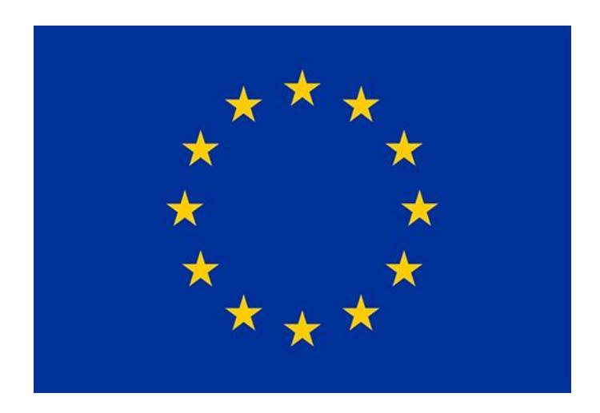
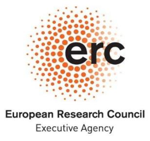
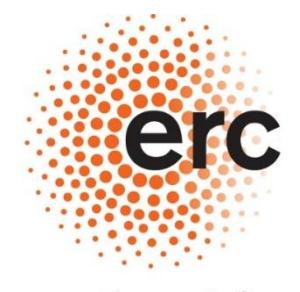
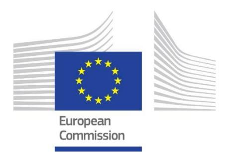
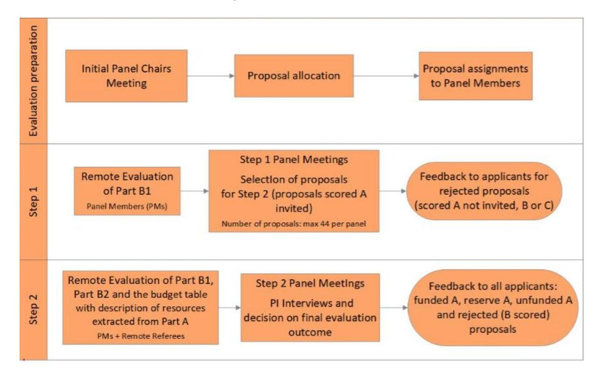
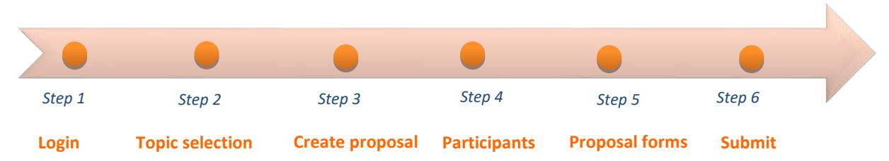

# Horizon Europe European Research Council (ERC) Frontier Research Grants

Information for Applicants to the Starting and Consolidator Grant Calls

Established by the European Commission

Version 10.0 30.09.2025

| Version | Publication Date | Description                                                                                                                                                     |  |  |
|---------|---------------------|-----------------------------------------------------------------------------------------------------------------------------------------------------------------|--|--|
| 1.0     | 25.02.2021          | ▪ Information for Applicants to the Starting and Consolidator Grant 2021 Calls                                                                               |  |  |
| 2.0     | 29.03.2021          | ▪ Updated version (clarifications added to the sections on Gender Equality Plan, Career stages and updated reference and hyperlink of the HE General MGA) |  |  |
| 3.0     | 21.09.2021          | ▪ Information for Applicants to the Starting and Consolidator Grant 2022 Calls                                                                               |  |  |
| 4.0     | 09.11.2021          | ▪ Updated version (the link to the Guide for Peer Reviewers on page 2 has been corrected)                                                                 |  |  |
| 5.0     | 12.07.2022          | ▪ Information for Applicants to the Starting and Consolidator Grant 2023 Calls                                                                               |  |  |
| 6.0     | 20.07.2022          | ▪ Updated version (clarifications added to the sections on Admissibility and Eligibility, and Supporting Documents for the PhD reference date)            |  |  |
| 7.0     | 11.07.2023          | ▪ Information for Applicants to the Starting and Consolidator Grant 2024 Calls                                                                               |  |  |
| 8.0     | 10.07.2024          | ▪ Information for Applicants to the Starting and Consolidator Grant 2025 Calls                                                                               |  |  |
| 9.0     | 09.07.2025          | ▪ Information for Applicants to the Starting and Consolidator Grant 2026 Calls                                                                               |  |  |
| 10.0    | 30.09.2025          | ▪ Updated version (instructions provided in part B2 are added to the sections on part B2, see p. 23)                                                      |  |  |

# **Information for Applicants to the Starting and Consolidator Grant 2026 Calls**

# **European Research Council (ERC) Frontier Research Grants**

#### *Main changes in 2026:*

- *Length and structure of the research proposal: The Extended Synopsis and the Scientific Proposal have been rethought in terms of focus and applicants are now requested to submit: Part I of the Scientific Proposal (setting out the background, the objectives, the overall research strategy) and Part II of the Scientific Proposal (focusing primarily on the implementation).*
- *Additional funding: for Principal Investigators who are re-locating to the EU or an Associated Country from elsewhere to take up their ERC grant the additional funding may be up to EUR 2 000 000.*
- *Eligibility extension: a new category for eligibility extensions (Gender-based Violence or Any Other Form of Violence) has been added.*

#### **IMPORTANT TO NOTE**

The present document is based on the legal documents setting the rules and conditions for the ERC frontier research grants, in particular:

- the <u>ERC Work Programme 20261</u>,
- the European Research Council rules of submission, and the related methods and procedures for peer review and proposal evaluation relevant to the specific programme implementing Horizon Europe (hereinafter ERC Rules of Submission and Evaluation under Horizon Europe), and
- ➤ the Model Grant Agreement used for ERC actions2.

This document complements and does not supersede the afore-mentioned documents, which are legally binding and prevail in case of discrepancies. The European Commission, the ERC Executive Agency or any person or body acting on their behalf cannot be held responsible for the use made of this document.

The <u>Guide for ERC Peer Reviewers</u> applicable to Starting and Consolidator grant calls, provides practical information on the evaluation process.

National Contact Points (ERC NCPs) have been set up across Europe3 by the national governments to provide information and personalised support to ERC applicants in their native language. The mission of the ERC NCPs is to raise awareness, inform and advise on ERC funding opportunities as well as to support potential applicants in the preparation, submission and follow-up of ERC grant applications. For details on the ERC NCP in your country, please consult the <a href="ERC website">ERC website</a> or the <a href="EU Funding & Tenders Portal">EU Funding & Tenders Portal</a>.

For any questions related to the call, please contact the relevant Call coordination team: ERC-2026-STG-APPLICANTS@ec.europa.eu or ERC-2026-COG-APPLICANTS@ec.europa.eu

#### **Abbreviations**

**AC** - Associated Country4

**ADG** - Advanced Grant

**COG** - Consolidator Grant

**ERC** - European Research Council

**ERC WP** - ERC Work Programme

**ERC panel** - ERC peer review evaluation panel

**ERC NCP - ERC National Contact Points** 

**ERCEA** - **ERC** Executive Agency

**EU MS - EU Member States** 

F&T Portal - EU Funding & Tenders Portal [Single

Electronic Data Interchange Area (SEDIA)]

**HE** - Horizon Europe Framework Programme

**HI** - Host institution

PI - Principal Investigator

PM - Panel Member

PIC - Participant Identification Code

**SEP** - Submission and Evaluation of Proposals (online tool)

**STG** - <u>Starting Grant</u>

SYG - Synergy Grant

ScC - ERC Scientific Council

&lt;sup>1 European Commission C(2025) 5000 of 8 July 2025.

&lt;sup>2 Specific rules for ERC actions are detailed in Annex 5 of the Horizon Europe General Model Grant Agreement.

&lt;sup>3 This applies to EU Member States and Associated Countries. Some other countries also provide this service.

&lt;sup>4 Please check the Horizon Europe Programme Guide on the <u>EU Funding & Tenders Portal</u> for up-to-date information on the current position for Associated Countries.

# **Content**

| 1. ERC STARTING AND CONSOLIDATOR GRANTS 2026                              | 3 |
|------------------------------------------------------------------------------|---|
| 1.1 ERC FUNDING PRINCIPLES                                                | 3 |
| 1.2 ADMISSIBILITY AND ELIGIBILITY                                      | 6 |
| 1.3 EVALUATION PROCESS                                                    | 9 |
| 1.4 ETHICS AND SECURITY  15                                         |   |
| 1.5 MEANS OF REDRESS, ENQUIRIES AND COMPLAINTS 16                      |   |
| 1.6 QUESTIONS RELATED TO THE CALL 18                                   |   |
| 2. COMPLETING AN APPLICATION  19                                       |   |
| 2.1 OVERVIEW OF AN ERC APPLICATION 19                                  |   |
| 2.2 THE ADMINISTRATIVE FORM  19                                     |   |
| 2.3 THE RESEARCH PROPOSAL  21                                       |   |
| 2.4 SUPPORTING DOCUMENTATION 27                                        |   |
| 3. SUBMITTING AN APPLICATION 29                                           |   |
| 3.1 IMPORTANT INFORMATION 29                                           |   |
| 3.2 HOW TO APPLY 30                                                    |   |
| 3.3 HOW TO WITHDRAW A PROPOSAL  33                                  |   |
| 4. ANNEXES  34                                                         |   |
| 4.1 ERC EVALUATION PANELS AND KEYWORDS 34                              |   |
| 4.2 HOST INSTITUTION SUPPORT LETTER TEMPLATE 2026 46                   |   |
| 4.3 PHD AND EQUIVALENT DOCTORAL DEGREES 49                             |   |
| 4.4 SUPPORTING DOCUMENTS FOR THE PHD REFERENCE DATE AND EXTENSION         |   |
| REQUESTS 52                                                               |   |
| 4.5 LIST OF BLOCKING FIELDS IN THE ONLINE SUBMISSION FORM 57           |   |
| 4.6 PROPOSAL BUDGET REPORT  58                                      |   |
| 4.7. TEMPLATE FOR REQUESTING ELIGIBILITY EXTENSION 60                     |   |
| 4.8. TEMPLATE TO BE FILLED IN BY THE PHD AWARDING INSTITUTION CONFIRMING THE |   |
| PHD DEFENCE DATE  61                                                   |   |

# **1. ERC STARTING AND CONSOLIDATOR GRANTS 2026**

# **1.1** ERC FUNDING PRINCIPLES

The ERC Starting and Consolidator Grants are part of the main ERC frontier research grants 2026 funded by the European Union's Horizon Europe Framework Programme for Research and Innovation.

The ERC's main frontier research grants aim to empower individual researchers and provide the best settings to foster their creativity. **Scientific excellence** is the sole criterion of evaluation. Please see below an overview of all ERC 2026 main frontier research calls.

**STG Starting Grants** (2-7 years after PhD) up to €1.5 Million for 5 years + up to €1 Million\*

**COG Consolidator Grants** (7-12 years after PhD) up to €2 Million for 5 years + up to €1 Million\*

**ADG Advanced Grants** up to €2.5 Million for 5 years + up to €1 Million\*

**SYG Synergy Grants** 2-4 PIs at any career stage up to €10 Million for 6 years + up to €4 Million

**\*Except for Principal Investigators in the Starting, Consolidator, or Advanced Grant calls re-locating to the EU or an Associated Country from elsewhere to take up their ERC grant. In this case, the additional funding may be up to €2 Million.**

#### **Single Principal Investigator (PI) heading a research team**

The ERC Starting and Consolidator grants support individual researchers that are starting or consolidating their own independent research team or programme, and who can demonstrate the ground-breaking nature, ambition and feasibility of their scientific proposal. In certain fields (e.g. in the humanities and mathematics), where research is often performed individually, the 'team' may consist solely of the Principal Investigator.

#### **Research fields – no predetermined priorities**

The ERC's frontier research grants operate on a 'bottom-up' basis and applications can be made in any field of research with an emphasis on the frontiers of science, scholarship and engineering5 [.](#page-5-2) In particular, the ERC welcomes proposals of interdisciplinary nature, which cross the boundaries between different fields of research, pioneering proposals addressing new and emerging fields of research or proposals introducing unconventional, innovative approaches and scientific inventions. The focus is on the Principal Investigator and on the individual team. Support for consortia[6](#page-5-3) is provided by other calls under Horizon Europe. Projects wholly or largely consisting of the collation and compilation of existing material in new databases, editions or collections are unlikely to constitute ground-breaking or frontier research, however useful such resources might be to subsequent original research. Such projects are therefore unlikely to be recommended for funding by

5 Research proposals within the scope of Annex I to the Euratom Treaty, namely those directed towards nuclear energy applications shall be submitted to relevant calls under th[e Euratom Research and Training Programme.](https://commission.europa.eu/funding-tenders/find-funding/eu-funding-programmes/euratom-research-and-training-programme_en)

6 Consortium agreements are not required for ERC multi-beneficiary grants, as the Starting, Consolidator, and Advanced Grants will support projects carried out by individual teams, which are headed by a single Principal Investigator. The ERC Synergy Grant Groups are neither networks nor consortia of undertakings, universities, research centres, or other legal entities. Even though Consortium agreements are not required, beneficiaries must have internal arrangements regarding their operation and coordination, to ensure that the action is implemented properly (article 7 of the MGA). These internal arrangements must cover the decision-making procedures for scientific and grant management issues, the distribution of the EU contribution, internal dispute settlement and division of responsibilities for cases of rejection of costs or reduction of the grant.

the ERC panels. As ERC funds frontier research, careful consideration should be given so to propose truly novel ideas, not just continuations of ongoing work or existing collaboration.

#### **Evaluation and peer review**

The ERC's evaluation process is conducted by peer review panels composed of independent external experts who are renowned scientists and scholars. The panel chair and members are selected by the ERC Scientific Council on the basis of their scientific merits. The panels may be assisted by other independent external experts working remotely.

#### **Open Science**

Open science is a general principle of the Horizon Europe programme, and a core principle of the ERC. The ERC is committed to the principle of open access to the published output of research, including, in particular, peer-reviewed articles and monographs. It also supports the basic principle of open access to research data and data-related products such as computer code, algorithms, software, workflows, protocols, electronic notebooks or any other forms of research output. The ERC considers that providing free online access to all these materials can be the most effective way of ensuring that the results of the research it funds can be accessed, read and used as the basis for further advancement.

Under Horizon Europe, beneficiaries of ERC grants must ensure immediate open access to all peerreviewed scientific publication[s](#page-6-0)7 related to their results as set out in the Annex 5 of the applicable [Model Grant Agreement](https://ec.europa.eu/info/funding-tenders/opportunities/docs/2021-2027/common/agr-contr/general-mga_horizon-euratom_en.pdf) used for ERC actions. Open access has to be provided with full re-use right[s](#page-6-1)8 . Beneficiaries must ensure that they or the authors retain sufficient intellectual property rights to comply with their open access requirements and the grant agreement obligations9 [.](#page-6-2) Publishing costs can be considered as eligible costs provided that the publishing venue (e.g. journal, book) is fully open access.

In addition, beneficiaries of ERC frontier research grants funded under the [ERC Work Programme](https://ec.europa.eu/info/funding-tenders/opportunities/docs/2021-2027/horizon/wp-call/2026/wp_horizon-erc-2026_en.pdf)  [2026](https://ec.europa.eu/info/funding-tenders/opportunities/docs/2021-2027/horizon/wp-call/2026/wp_horizon-erc-2026_en.pdf) will be covered by the provisions on research data management as set out in the Annex 5 of the applicable Model Grant Agreement used for ERC actions. In particular, whenever a project generates research data, beneficiaries are required to manage it in line with the principles of findability, accessibility, interoperability, and reusability as described by the FAIR principles' initiative[10](#page-6-3), and establish a data management plan within the first six months of project implementation. Open access to research data should be ensured under the principle 'as open as possible, as closed as necessary'. These provisions are designed to facilitate access, re-use and preservation of the research data generated during the ERC funded research work.

#### **Funding**

Starting Grants can be up to a maximum of EUR 1 500 000 for a period of 5 years. Consolidator Grants can be up to a maximum of EUR 2 000 000 for a period of 5 years. For projects of shorter duration, the maximum amount of the grant is reduced pro rata[11](#page-6-4) .

7 This includes peer-reviewed book chapters and long-text publications such as monographs, edited collections, critical editions, scholarly exhibition catalogues, or PhD theses.

8 For monographs and other long-text formats, commercial re-use and derivative works may be excluded (as specified in the [Annex 5 of the applicable Model Grant Agreement for ERC Actions under Horizon Europe\)](https://ec.europa.eu/info/funding-tenders/opportunities/docs/2021-2027/common/agr-contr/general-mga_horizon-euratom_en.pdf).

9 The granting authority may, up to four years after the end of the action, object to a transfer of ownership or to the exclusive licensing of results, as set out in the specific provision of Annex 5 of the applicable Model Grant Agreement used for ERC actions. If requested by the granting authority, additional obligations to grant non-exclusive licences for the exploitation of results apply to the beneficiaries of ERC frontier research grants in case of a public emergency (applicable up to four years after the end of the action).

10 [The FAIR Guiding Principles for scientific data management and stewardship.](https://doi.org/10.1038/sdata.2016.18)

11 This does not apply to ongoing projects.

Additional funding up to EUR 1 000 000 can be requested in the proposal for STG and COG by applicants already based in an EU Member State or associated country to cover further eligible costs (e.g. major equipment, access to large facilities, major experimental and field work costs) when these are necessary to carry out the proposed work.

Researchers currently based outside the EU or Associated Countries[4](#page-3-4) and applying for a Starting or Consolidator Grant will be able to request up to EUR 2 000 000 in additional funding to cover further eligible costs necessary for the project implementation. The requests for additional funding must be duly justified in the proposal. Additional funding is not subject to pro rata temporis reduction for projects of shorter duration[12](#page-7-0) . All funding requested is assessed during evaluation.

Eligible project costs will be reimbursed at a funding rate of 100% for direct costs plus a flat-rate of 25% for indirect costs[13](#page-7-1) .

### **Research integrity**

Cases of scientific misconduct such as fabrication, falsification, plagiarism or misrepresentation of data[14](#page-7-2) may result in the rejection of proposals from the current call and in a possible restriction on submission of proposals to future calls, as provided in the relevant ERC Work Programme[15](#page-7-3) . Please also note that a plagiarism detection software is used to analyse all submitted proposals in order to detect similar proposals submitted by different Principal Investigators. A procedure is in place to assess alleged or suspected cases of scientific misconduct. Scientific misconduct may result in the rejection of the proposal from the current call and in a possible restriction on submission of proposals to future calls, as provided in the relevant ERC Work Programme.

#### **Starting and Consolidator Grant profiles**

Principal Investigator must provide a list of achievements reflecting their track record. A short narrative describing the scientific importance of the research outputs, and the role played by the Principal Investigator in their production may also be included.

Applicants are encouraged to evaluate their track record and research independence against the below-mentioned benchmarks, in order to judge their likelihood for success and to avoid investing efforts in proposals that are very unlikely to succeed.

| Starting Grant                                                                                                                                                                                                                                                                                                                     | Consolidator Grant                                                                                                                                 |  |  |
|------------------------------------------------------------------------------------------------------------------------------------------------------------------------------------------------------------------------------------------------------------------------------------------------------------------------------------|----------------------------------------------------------------------------------------------------------------------------------------------------|--|--|
| A competitive Starting Grant Principal Investigator should have already shown evidence of the potential for research independence, for example by having produced at least one important publication as main author or without the participation of their PhD supervisor. | A competitive Consolidator Grant Principal Investigator should have already shown evidence of research independence. |  |  |

12 The maximum award is reduced pro rata temporis for projects of a shorter duration (e.g. for a Consolidator Grant project of 48 months duration the maximum requested EU contribution allowed is 1.600.000 €). Additional funding to cover major one-off costs is not subject to pro-rata temporis reduction for projects of shorter duration (e.g. with additional funding it is possible to request a maximum EU contribution of 2.600.000 € for a project of 48 months duration).

13 Excluding the direct eligible costs for subcontracting and internally invoiced goods and services.

14 For example, if (i) in the list of publications, the order of authors does not appear as indicated in the original publications; (ii) the written consent of the research collaborators mentioned in the proposal is not obtained before the call submission deadline.

15 See section 3.11 of th[e ERC Rules of submission and evaluation under Horizon Europe.](https://ec.europa.eu/info/funding-tenders/opportunities/docs/2021-2027/horizon/guidance/erc-rules-for-submission-and-evaluation_he-erc_en.pdf)

# **1.2** ADMISSIBILITY AND ELIGIBILITY

#### **Admissible and eligible proposals**

All proposals must be complete, readable, and accessible. They must be submitted electronically by eligible Principal Investigators before the relevant call deadlines. Please see [section 2.1](#page-21-1) for an overview of a complete ERC proposal. Proposals that do not meet these criteria may be declared inadmissible. All scientific fields are eligible for ERC funding[16](#page-8-1) .

All applications and the related supporting information are reviewed to ensure that all admissibility and eligibility criteria are met. The proposal's content should be related to the objectives of the Starting and Consolidator Grant calls and must meet all admissibility and eligibility requirements as defined in the [ERC Work Programme 2026.](https://ec.europa.eu/info/funding-tenders/opportunities/docs/2021-2027/horizon/wp-call/2026/wp_horizon-erc-2026_en.pdf) Where there is a doubt about the admissibility or eligibility of a proposal, the peer review evaluation may proceed pending a decision of the Responsible Authorising Officer following the opinion of the admissibility and eligibility review committee. The fact that a proposal is evaluated in such circumstances does not constitute a proof of its admissibility or eligibility. If it becomes clear before, during, or after the peer review evaluation phase, that one or more of the admissibility or eligibility criteria has not been met (for example, due to incorrect or misleading information), the proposal will be declared inadmissible or ineligible and it will be rejected.

#### **Host institution**

The host institution must engage the Principal Investigator for at least the duration of the project, as defined in the grant agreement[17](#page-8-2). It must either be established in an EU Member State (EU MS) or Associated Country (AC)[18](#page-8-3) as a legal entity created under national law, or it may be an international European research organisation (such as CERN, EMBL, etc.), or any other entity created under EU law. International organisations with headquarters in an EU MS or AC will be deemed to be established in this EU MS or AC. Any type of legal entity, public or private, including universities, research organisations and undertakings can host Principal Investigators and their teams.

To be eligible, legal entities from an EU MS or AC that are public bodies, research organisations or higher education institutions (including private research organisations and private higher education institutions) must have a gender equality plan (GEP) or an equivalent strategic document in place for the duration of the project. The GEP or equivalent must fulfil the mandatory requirements listed in Annex 5 of the [ERC WP 2026.](https://ec.europa.eu/info/funding-tenders/opportunities/docs/2021-2027/horizon/wp-call/2026/wp_horizon-erc-2026_en.pdf) The ERC welcomes applications from Principal Investigators hosted by private forprofit research centres, including industrial laboratories. Normally, the Principal Investigator will be employed by the host institution, but cases where, for duly justified reasons, the Principal Investigator's employer cannot become the host institution, or where the Principal Investigator is self-employed, can be accommodated. The specific conditions of engagement will be subject to clarification and approval during the granting procedure or during the amendment procedure for a change of host institution. During the granting process, the financial capacity of applicant legal entities will be assessed, if required[19](#page-8-4) .

18 See footnote 4.

16 Research proposals within the scope of Annex I to the Euratom Treaty, namely those directed towards nuclear energy applications shall be submitted to relevant calls under th[e Euratom Research and Training Programme.](https://research-and-innovation.ec.europa.eu/funding/funding-opportunities/funding-programmes-and-open-calls/horizon-europe/euratom-research-and-training-programme_en)

17 Model Grant Agreement used for ERC actions.

19 The applicant legal entity must have stable and sufficient resources ('financial capacity') to successfully implement the projects and contribute their share. Organisations participating in several projects must have sufficient capacity to implement all these projects. Information on financial capacity checks is provided in the ERC Rules of submission and evaluation under Horizon Europe. Applicants that are subject to the administrative sanction of exclusion or are in one of the exclusion situations set out in th[e Regulation \(EU, Euratom\) 2024/2509](https://eur-lex.europa.eu/eli/reg/2024/2509/oj/eng) of the European Parliament and of the Council ('the EU Financial Regulation') are banned from receiving EU grants and can NOT participate. Please see Articles 138 and 143 of the EU Financial Regulation, as well as important information on possible exclusion and registration of economic operators in the Commission's Early Detection and Exclusion System (EDES) on the final page of the ERC Work Programme 2026.

The HI must confirm its association with, and its support to, the project and the Principal Investigator through a binding statement of support (i.e. the Host Institution Support Letter). This statement must be provided at the time of application. Proposals that do not include a statement of support may be declared inadmissible.

#### **Principal Investigator**

ERC grants are open to researchers of any nationality who intend to conduct their research activity in any EU MS or an AC[20](#page-9-0). The research team may be of national or trans-national character. The Principal Investigator does not need to be employed by the host institution at the time when the proposal is submitted. If not already employed by the host institution, the Principal Investigator must be engaged by the latter at least for the duration of the grant. Grant proposals are submitted by the Principal Investigator who takes scientific responsibility for the project, on behalf of the host institution.

In order to be eligible to apply to the ERC Starting or Consolidator Grant, a Principal Investigator must hold a PhD or an equivalent doctoral degree. The reference date used for calculation of the eligibility period should be the date of the successful defence of the **first** PhD (or equivalent doctoral degree)[21](#page-9-1) . In case the Principal Investigator holds more than one PhD degree, the defence date of the first PhD is always considered as the starting point of the eligibility window, irrespective of the research field (see [Annex 4.3](file:///C:/Users/otcensl/Downloads/2024%20IfA-after%20D3%20consultation_clean.docx%234.3%20PHD%20AND%20EQUIVALENT%20DOCTORAL%20DEGREES) for further details). The ERC policy on PhD and equivalent doctoral degrees, including specific provisions for holders of medical degrees, is provided i[n Annex 4.3.](#page-51-0)

| Starting Grant                             | Consolidator Grant                         |  |
|--------------------------------------------|--------------------------------------------|--|
| The first PhD shall have been successfully | The first PhD shall have been successfully |  |
| defended                                   | defended                                   |  |
| > 2 and ≤ 7 years                          | > 7 and ≤ 12 years                         |  |
| prior to 1 January 2026                    | prior to 1 January 2026                    |  |
| Cut-off dates:                             | Cut-off dates:                             |  |
| Successful defence of first PhD            | Successful defence of first PhD            |  |
| from 1 January 2019 to 31 December 2023    | from 1 January 2014 to 31 December 2018    |  |
| (inclusive)                                | (inclusive)                                |  |

The eligibility periods set out in the table above can be extended beyond 7 and 12 years for the Starting and Consolidator Grants, respectively, for certain properly documented circumstances such as for maternity and paternity leaves, clinical training, long-term illness, disability, national service, major disaster, seeking asylum, gender-based violence or any other form of violence (see [Annex 4.4](#page-54-0) for further details).

#### **Expected time commitment[22](#page-9-2)**

With the support of the host institution, the successful Principal Investigators are expected to lead their individual teams and devote a significant amount of time to the project. They will be expected to spend a minimum of 50% for STG and 40% for COG of their working time on the ERC project and a

20 See footnote 4.

21 See section 2.4 Supporting documentation for cases where there was no defence of the PhD or if following the defence, corrections were required.

22 For further guidance, see th[e Annotated Grant Agreement](https://ec.europa.eu/info/funding-tenders/opportunities/docs/2021-2027/common/guidance/aga_en.pdf) on the EU Funding & Tenders Portal (Annex 5, section Specific rules for ERC Grants (HE), point 5. PI time commitments).

minimum of 50% of their working time in an EU MS or an AC[23](#page-10-0) . It is expected that the research project will be implemented within the territory of the Member States or Associated Countries. This does not exclude field work or other research activities in cases where these must necessarily be conducted outside the European Union or the Associated Countries in order to achieve the scientific objectives of the project/activity.

#### **Submission restrictions**

Thousands of high-quality proposals are received each year and only outstanding proposals are likely to be funded. In order to maintain the quality and integrity of ERC's evaluation process, restrictions on applications have been put in place.

The following general restrictions apply:

- − A researcher may participate as a Principal Investigator in only one ERC main frontier research grant project at any given time[24](#page-10-1) . A new main frontier research grant project may only start once the duration of the previous project (as stated in the Grant Agreement) has come to an end.;
- − An applicant, whose proposal has been selected for funding and who is preparing a grant agreement under a call of the ERC Work Programme 2024 or 2025, may not apply for a Starting, Consolidator, Advanced, or Synergy Grant under a call of the ERC Work Programme 2026;
- − A researcher participating as a Principal Investigator in one of the ERC main frontier research grants may not submit another proposal for an ERC main frontier research grant, unless the existing project ends[25](#page-10-2) less than two years following the call deadline[26](#page-10-3);
- − A researcher who is a serving Panel Member for an ERC call under the Work Programme 2026 or who served as a Panel Member for an ERC call under Work Programme 2024 may not apply to a call for the same type of main frontier research grant under the ERC Work Programme 2026[27](#page-10-4);
- − If a researcher applies to more than one main ERC frontier research grant call published under the same Work Programme (i.e. from the same 'call year'), only the first eligible proposal will be evaluated;

Additional restrictions are related to the outcome of the evaluation in previous calls (see table below). They are designed to allow unsuccessful Principal Investigators the time necessary to develop a stronger proposal. Inadmissible, ineligible or withdrawn proposals do not count against any of the restrictions listed below.

23 For Principal Investigators hosted and engaged by international European research organisations, any time spent working for these organisations may count as working time spent in a Member State or an Associated Country for the purpose of the Principal Investigator's time commitment.

24 Including all Principal Investigators supported under the Synergy Grant.

25 According to the duration of the project fixed in the previous grant agreement of the main frontier research grant.

26 The duration of the ongoing project may, exceptionally, be extended, without affecting the eligibility of the proposal, for properly documented circumstances constituting force majeure or other unforeseen events or circumstances, which: a) have presented themselves after the call deadline and thus could not be anticipated at the time of the call deadline, b) the extension is essential for the proper completion of the ongoing project, and c) the ongoing project will end within three years of the call deadline. This and any other extension is subject to the agreement of the Granting Authority.

27 The members of the ERC panels alternate to allow panel members to apply to the ERC calls in alternate years.

| Call to which the PI applied under previous ERC WPs and proposal evaluation outcome |                                                                 | 2026 Calls to which a PI is NOT eligible |  |
|----------------------------------------------------------------------------------------|-----------------------------------------------------------------|------------------------------------------|--|
| 2024 and 2025 Starting, Consolidator, Advanced Grant, or Synergy Grant           | Rejected on the grounds of a breach of research integrity | STG, COG, ADG, SYG                       |  |
| 2024 Starting, Consolidator, or Advanced Grant                                      | C at Step 1                                                     | STG, COG, ADG                            |  |
| 2025 Starting, Consolidator, or                                                        | A or B at Step 2                                                | No restrictions                          |  |
| Advanced Grant                                                                         | A not invited at Step1                                          | No restrictions                          |  |
|                                                                                        | B or C at Step 1                                                | STG, COG, ADG                            |  |
| 2024 Synergy Grant                                                                     | C at Step1                                                      | SYG                                      |  |
| 2025 Synergy Grant                                                                     | B or C at Step 1                                                | SYG                                      |  |

The year of an ERC call refers to the ERC WP under which the call was published and can be established by its call identifier. A 2026 ERC call is therefore one that was published under the ERC WP 2026 and will have 2026 in the call identifier (for example ERC-2026-STG).

# **1.3** EVALUATION PROCESS

The ERC's peer review evaluation process has been carefully designed to identify scientific excellence irrespective of gender, age, nationality or institution of the Principal Investigator and other potential biases, and to take career breaks as well as diverse research career paths into account[28](#page-11-1). The evaluations are monitored to guarantee transparency, fairness and impartiality in the treatment of proposals. ERC calls are expected to be highly competitive.

A single submission of the full proposal is followed by a two-step evaluation.

#### **ERC evaluation panels**

The peer review evaluation is handled by 28 peer review evaluation panels (ERC panels), covering all fields of science, engineering and scholarship (see panel details and ERC keywords in [Annex 4.1\)](#page-36-1). For operational reasons, they are subdivided into three main research domains:

- − Physical Sciences and Engineering (11 Panels)
- − Life Sciences (9 Panels)
- − Social Sciences and Humanities (8 Panels)

Before the deadline of a call, the names of the 28 panel chairs are published on the ERC website. The names of the panel members will be published after the call deadline and before Step 1 evaluation on the ERC website, provided that their consent for this publication has been obtained.

28 During the evaluation, the peer review panels will take into account the phase of the Principal Investigator's transition to independence, diverse research career paths and particularly noteworthy contributions to the research community, as well as possible breaks in the research career of the applicant and the effects of major life events or pandemic restrictions on the applicant's progression as a researcher.

#### **No Contact allowed with Peer Reviewers**

Please note that, in accordance with the [ERC Rules of Submission](https://ec.europa.eu/info/funding-tenders/opportunities/docs/2021-2027/horizon/guidance/erc-rules-for-submission-and-evaluation_he-erc_en.pdf) and Evaluation under Horizon Europe, any direct or indirect contact about the peer review evaluation of an ERC call between an applicant legal entity or a PI submitting a proposal on behalf of an applicant legal entity, and any independent external expert[29](#page-12-0) involved in the peer review evaluation under the same call, is strictly forbidden. If such contact attempts to influence the evaluation process, it will be considered as a breach of research integrity and may result in the rejection of the proposal from the call (see section 3.11 of the ERC Rules of Submission and Evaluation). It can also constitute an exclusion situation under Article 138(1) of the Financial Regulation.

In addition, any contact with Peer Reviewers to obtain confidential information on the evaluation process is prohibited. ERC Peer Reviewers are bound to confidentiality during the evaluation and afterwards. Hence, they are not allowed to communicate about the evaluation and/or specific proposal(s) with the Principal Investigators or potential team members or persons linked to them, even after the completion of the evaluation process.

#### **Panel allocation and panel budgets**

It is the applicant's responsibility to choose and indicate the most relevant ERC panel ('primary evaluation panel') for the evaluation of the proposed research and to indicate one or more ERC keywords representing the research fields involved. The Principal Investigator may indicate a secondary evaluation panel.

When choosing the panel, please take careful note of the panel details and ERC keywords in [Annex](#page-36-1)  [4.1.](#page-36-1)

The initial allocation of the proposal to a panel will be based on the preference expressed by the applicant. However, when necessary due to the expertise required for the evaluation, a proposal may be reallocated to a different panel with the agreement of both panel chairs concerned. In such cases, applicants are informed of the reallocation of the proposal at the latest through the notification for the invitation to the interview (if applicable) or in the Evaluation Report attached to the information letter with the final outcome of the evaluation of their respective proposal.

The composition of the ERC evaluation panels is by nature multi-disciplinary. The panel will determine if additional reviews by appropriate members of other panel(s) or additional remote experts are needed to evaluate the proposal.

An indicative budget is allocated to each panel in proportion to the budgetary demand of its assigned proposals. **This important principle ensures comparable success rates between the individual panels regardless of how many proposals each panel evaluates.** Based on the outcome of the evaluation at Step 1, up to 44 proposals per panel will be retained for Step 2 of the evaluation. Only proposals ranked *A invited* at Step 1 will be further evaluated at Step 2. Following the Step 2 evaluation, only proposals ranked *A* will be invited for grant preparation in priority order based on their rank in the consolidated call rank list and until the call budget is spent. The remaining proposals recommended for funding may be funded by the ERC if additional funds become available.

29 An independent external expert is an expert who is external to the ERC and the Commission and is working impartially in a personal capacity and without conflict of interest. Exceptionally, in duly justified cases, when relevant specialised knowledge is held by staff of Union institutions or bodies, and provided that these are not implementing Horizon Europe as a funding body, such staff may work as independent external experts in compliance with Article 29(1) of the Horizon Europe Regulation.

#### **Evaluation process and important dates**

An indicative evaluation timeline is available for the [Starting Grant](https://erc.europa.eu/funding/starting-grants) and [Consolidator Grant](https://erc.europa.eu/funding/consolidator-grants) Calls on the ERC website.

| STG COG | 14 Oct 2025 13 Jan 2026 | Feb 2026 Apr-May 2026 | 28 April 2026 17 July 2026 | June 2026 Sept-Oct 2026 | 25 Aug 2026 11 Dec 2026 |  |
|------------|----------------------------|--------------------------|-------------------------------|----------------------------|----------------------------|--|

At both evaluation steps, every proposal will be evaluated for each of the two main elements of the proposal: the Research Project and the Principal Investigator. The panels will primarily evaluate the ground-breaking nature and ambition of the research project. At the same time, the panels will evaluate the intellectual capacity and creativity of the Principal Investigator, with a focus on the extent to which the Principal Investigator has the required scientific expertise and capacity to successfully execute the project.

The ERC independent external experts deliver individual reviews in a remote evaluation phase at both Step 1 and Step 2. The ERC panels assess and score the proposals based on the individual reviews they have received, and on the panels' overall appreciation of their strengths and weaknesses.

A panel may decide that at Step 1 proposals with low scores in all individual reviews will not be discussed. In such cases, the threshold under which proposals would not be discussed will be decided independently by the panel in question. An applicant whose proposal is not of sufficient quality to pass to step 2 of the evaluation and receives score C will receive an Evaluation Report with a standard panel comment and individual comments.

Resubmitted proposals in a subsequent ERC call will be evaluated as new proposals without any reference or comparison to the previous score and/or with previous assessments. The score received by a proposal submitted in a previous ERC call will neither be considered in the current evaluation nor affect its outcome, as the two evaluations are independent from each other and the competition each year is different. In addition, the content of the reviews from an ERC call will not be made available to reviewers of the resubmitted proposal.

#### **ERC STG and ERC COG call evaluation procedure**

#### **STEP 1**

At Step 1, Part I of the Scientific Proposal together with the Principal Investigator's CV and Track Record will be evaluated (see [Section 2.](#page-23-1)3). After the remote evaluation phase, each panel meets to discuss all proposals assigned to the panel. Proposals will proceed to Step 2 based on the outcome of the Step 1 evaluation: up to 44 proposals per panel will be retained for Step 2 of the evaluation. At the end of Step 1 of the evaluation, the proposal will receive one of the following scores:

*A invited* - is of excellent quality and ranked sufficiently high to pass to Step 2 of the evaluation;

*A not invited* - is of excellent quality but not ranked sufficiently high[30](#page-14-0) to pass to Step 2 of the evaluation;

- *B* - is of high quality but not sufficient to pass to Step 2 of the evaluation[31](#page-14-1);
- *C*  is not of sufficient quality to pass to Step 2 of the evaluation[31](#page-14-2) .

The Step 1 evaluation outcome is provided to the applicants receiving an *A not invited*, a *B* or a *C* score through an information letter together with an evaluation report. It includes the final panel score and ranking range of their proposal, the panel comment explaining the panel decision as well as the individual comments given by each reviewer[32](#page-14-3). This communication is uploaded to the F&T Portal accounts of the Principal Investigator and host institution contacts (see [Section 3.2\)](#page-32-0). Applicants who receive an *A invited* score are invited for an interview to present their project at the Step 2 panel meeting. Each panel decides on the exact format of its interviews (number of slides allowed – if applicable, duration, time allocated to the presentation, and to the questions and answer session), which will be communicated to the applicants after Step 1. Applicants who pass to Step 2 do not receive a Step 1 evaluation report.

30 It exceeds the maximum threshold of proposals that can be passed to Step 2.

31 The applicants may be subject to restrictions on submitting proposals to future ERC calls based on the outcome of the evaluation. Applicants will need to check the restrictions in place for each call.

32 The pre-defined responses related to the questions regarding the Principal Investigator can be the following: Exceptional/ Excellent/Very Good/Good/Non-competitive

#### **STEP 2**

At Step 2, the complete Research Proposal (CV and Track Record, Part I and Part II of the Scientific Proposal, and Section 3 – Budget, present in the submission form) will be evaluated. After a remote evaluation phase, the panels meet again. Step 2 includes an interview of approximately 30 minutes of each applicant[33](#page-15-0) . During the Step 2 panel meeting, the applicants will be interviewed remotely, while the panel members will be present in the ERC premises. In exceptional and justified cases, if unable to attend a physical meeting in person, a panel member may participate in the panel meeting remotely by electronic means (videoconferencing or telephone-conferencing), subject to ERCEA's agreement.

The first part of the interview will be devoted to a presentation on the outline of the research project by the Principal Investigator. The remaining time will be devoted to a question-and-answer session. The PI may expect questions also related to the detailed budget table and resources, which is part of the application. The evaluation panels will review the requested budget for proposals recommended for funding and, if appropriate, recommend adjustments.

*In view of the confidentiality of the evaluation process, applicants should not share the identity of panel members within their scientific communities until their names have been published on the ERC website.*

The assessment by the panels will take into account the interview alongside the individual reviews. At the end of Step 2, following the timeline described above, applicants will be informed about the outcome of the evaluation. The score of their proposal can be either *A* or *B*:

*A* **–** the proposal fully meets the ERC's excellence criterion and is recommended for funding. Such project will be funded in priority order based on its rank if sufficient funds are available. This means that it is very likely that not all proposals scored '*A*' will eventually be funded by the ERC.

*B* **–** the proposal meets some but not all elements of the ERC's excellence criterion and will not be funded.

# **Evaluation outcome**

The Step 2 evaluation outcome is provided to all applicants through an information letter together with an evaluation report. It includes the final panel score and ranking range of their proposal, the panel comment explaining the panel decision as well as the individual comments given by each reviewer. This communication is uploaded to the F&T Portal accounts of the PI and host institution contacts (see [Section 3.2\)](#page-32-0).

#### **Panel comments**

Comments by the individual reviewers may reflect divergent views. Differences of opinions about the proposal are part of scientific debate and are legitimate. Furthermore, the ERC panel may take a position that is different from what could be inferred from the individual reviews. A panel discussion could reveal an important weakness that was not identified by the individual reviewers. The panel comment reflects the final decision taken by the panel either by consensus decision or by majority vote based on the individual assessments and discussion in the panel.

33 Should a planned interview not be possible due to exceptional circumstances beyond the control of the ERCEA, the panel will have to take its decision based on the written proposal.

#### **Evaluation criterion and elements**

"Excellence" is the sole criterion of evaluation.

The panels will primarily evaluate the ground-breaking nature and ambition of the research project. At the same time, the panels will evaluate the intellectual capacity and creativity of the Principal Investigator, with a focus on the extent to which the Principal Investigator has the required scientific expertise and capacity to successfully execute the project. The detailed evaluation elements applying to these two categories are set out below.

**Research Project.** The ground-breaking nature and ambition of the Research Project is assessed as follows:

#### **At Step 1:**

- To what extent does the research address important scientific questions?
- To what extent are the project's objectives ambitious and will it advance the frontier of knowledge?

#### **At Step 2:**

- To what extent does the research address important scientific questions?
- To what extent are the project's objectives ambitious and will it advance the frontier of knowledge?
- To what extent are the research methodology and working arrangements appropriate to achieve the goals of the project?
- To what extent are the timescales and resources adequate and properly justified?

**Principal Investigator.** The intellectual capacity and creativity of the Principal Investigator is assessed as follows:

At Step 1 and Step 2:

- To what extent has the PI demonstrated the ability to conduct groundbreaking research?
- To what extent does the PI provide evidence of creative and original thinking?
- To what extent does the PI have the required scientific expertise and capacity to successfully execute the project?

#### **Information to Programme Committee and NCPs**

After each peer review evaluation, a report is prepared by the ERCEA services and made available to the Programme Committee. The report provides information on the proposals received: it includes names of host institutions and personal data (i.e. names of applicant Principal Investigators), evaluation scores of proposals, as well as panel comments and individual reviews. A subset of information is also made available to the National Contact Points. The NCP report provides names of host institutions and personal data (i.e. names of applicant Principal Investigators) and evaluation scores of proposals. Applicants have various rights as regards the processing of their personal data[34](#page-16-0) .

34 Applicants have the right to access their personal data, the right to rectify them, if necessary, and/or to restrict their processing or erase them. They are also entitled to object to the processing of their personal data, where applicable. If they would like to exercise their rights under the Regulation 2018/1725, if they have comments, questions or concerns, regarding the collection and use of their personal data, applicants are free to contact the ERCEA Controller at [ERC-B2-CALL-](file://///net1.cec.eu.int/ERCEA/Public/02_RESEARCH_CONTRACTS/15_HE/20_10_Eval_Calls_General/Gen-2026/20_Call_Documents/2020_IfA/STG%20&%20COG_Ares(2025)5547131/ERC-B2-CALL-COORDINATION@ec.europa.eu)[COORDINATION@ec.europa.eu.](file://///net1.cec.eu.int/ERCEA/Public/02_RESEARCH_CONTRACTS/15_HE/20_10_Eval_Calls_General/Gen-2026/20_Call_Documents/2020_IfA/STG%20&%20COG_Ares(2025)5547131/ERC-B2-CALL-COORDINATION@ec.europa.eu)

# **1.4** ETHICS AND SECURITY

#### **Ethics**

Every project funded or placed on a reserve list by the ERC under Horizon Europe is subject to an ethics review process. The ethics review process is independent from the scientific evaluation.

**Please see Annex A to the [ERC Rules of Submission and Evaluation under Horizon Europe f](https://ec.europa.eu/info/funding-tenders/opportunities/docs/2021-2027/horizon/guidance/erc-rules-for-submission-and-evaluation_he-erc_en.pdf)or a detailed description of the ERC Ethics Review procedure.**

The process is aimed at ensuring that all the research and innovation activities under Horizon Europe comply with ethics principles and relevant national, Union and international legislation, including the [Charter of Fundamental Rights of the European Union](http://www.europarl.europa.eu/charter/pdf/text_en.pdf) and the [European Convention on Human](https://www.echr.coe.int/documents/convention_eng.pdf)  [Rights](https://www.echr.coe.int/documents/convention_eng.pdf) and its Supplementary Protocols (in line with Article 19 of the Horizon Europe Regulation).

The main areas that are addressed during the ethics review process include:

- 1. Human embryonic stem cells and human embryos
- 2. Human participants
- 3. Human cells/tissues
- 4. Personal data
- 5. Animals
- 6. Non-EU countries
- 7. Environment, health and safety
- 8. Artificial Intelligence

Other ethics issues may be identified as new ethical issues, or issues not fully covered by the above questions.

The proposed research and innovation activities must have an exclusive focus on civil applications.

When submitting their proposal, applicants must complete the ethics issues table as part of the online proposal submission form (Section 4), and if applicable, provide an ethics self-assessment (in the same section of the form) and upload supporting documentation as separate annex(es). Please see the [How to Complete your Ethics Self-Assessment](https://ec.europa.eu/info/funding-tenders/opportunities/docs/2021-2027/common/guidance/how-to-complete-your-ethics-self-assessment_en.pdf) document for guidance. In order to determine whether your proposal contains serious and complex ethics issues, please consult the guidance documents available on the following link: [ERC Ethics Guidance for Project Management | European](https://erc.europa.eu/manage-your-project/ethics-guidance)  [Research Council](https://erc.europa.eu/manage-your-project/ethics-guidance) Ethics guidance | ERC (europa.eu). In case the proposal involves the use of human embryonic stem cells, applicants may pay particular attention to the [Statement by the Commission](https://eur-lex.europa.eu/legal-content/EN/TXT/PDF/?uri=CELEX:32021C0512(01))  [on ethics/stem cells](https://eur-lex.europa.eu/legal-content/EN/TXT/PDF/?uri=CELEX:32021C0512(01)) that sets out a specific ethics framework.

It is important to provide a complete overview of all ethics issues during the submission phase in order to speed up the ethics review process (please also see section 2.2(4) of this document for further details). Additional information or documents may be requested from the applicants to finalise the ethics review. Applicants should be aware that no grant agreement will be signed by ERCEA prior to a satisfactory conclusion of the ethics review procedure.

#### **Security**

The Security Review Procedure is managed by the Directorate General for Migration and Home Affairs (DG HOME).

*The security appraisal procedure is designed to allow the funding entity to identify and assess possible security risks and propose mitigation measures.*

*It covers three main areas:*

- *The possible involvement of classified or security sensitive information.*
- *The possible involvement and development of materials, methods, technologies, knowledge or applications that could have, if misused, direct negative implications for the security of individuals, groups, or states.*
- *The possible applicability of national or third country security restrictions (such as technology restrictions, national security classification, etc.)*

Under Horizon Europe applicants are requested to identify if the proposed activity will use and/or generate information which might raise security concerns.

When submitting their proposal, applicants must complete the security issues table as part of the online proposal submission form (Section 4), and provide, if applicable, available supporting documentation as separate annex(es).

For proposals selected for funding, additional information regarding security issues may be requested at a later stage (for further information see Annex 4 to the ERC Work Programme 2026).

# **1.5** MEANS OF REDRESS, ENQUIRIES AND COMPLAINTS

**Please see section 3.9 of the [ERC Rules of Submission and Evaluation under Horizon Europe](https://ec.europa.eu/info/funding-tenders/opportunities/docs/2021-2027/horizon/guidance/erc-rules-for-submission-and-evaluation_he-erc_en.pdf) for a detailed description of the admissibility, eligibility and evaluation review procedures and enquiries and complaints.**

#### **Means of redress:**

Upon reception of the information letter with the evaluation report or with the results of the admissibility or eligibility review, the Principal Investigator and/or the host institution (applicant legal entity) may request for admissibility, eligibility or evaluation review if there is an indication that the results of the admissibility or eligibility checks were incorrect or that there has been a procedural shortcoming or a manifest error of assessment in the evaluation of the proposal.

A request for evaluation review can be made if the Principal Investigator and/or the host institution consider that the applicable evaluation procedure has not been correctly applied to its proposal. The evaluation review procedure is not meant to call into question the scientific judgement made by the peer review panel. It will look into procedural shortcomings and – in rare cases – into factual errors.

The information letter will provide information on the means of redress and how to introduce the request. The letter will specify a deadline for the receipt of any such requests, which will be 30 calendar days from the date of receiving the information letter[35](#page-18-1) . A formal notification is considered to have been accessed by the applicant 10 calendar days after sending, if not accessed before in the system[36](#page-18-2) .

The request must be:

- − related to the evaluation process, or admissibility/eligibility checks, for the call and grants in question;
- − set out using the online form, including a clear description of the grounds for complaint;
- − received within the time limit specified in the information letter;

35 Applicants of proposals selected for funding will normally not receive information on the means of redress in their information letter but if the applicant considers that there are grounds for such request, they can redress.

36 Evaluation result letters are formal notifications. This means that deadlines triggered by these letters (evaluation review request, etc.) must be counted accordingly (i.e. access date + 1 day (event) + 30 days (deadline) OR sending date + 1 day (event) + 10 days (embargo period) + 30 days (deadline), if the letter was not accessed in the system).

− sent by the Principal Investigator and/or the host institution.

Requests that do not meet the above-mentioned conditions, or do not deal with the admissibility, eligibility or evaluation of a specific proposal, will not be admitted.

A redress committee may be convened to examine the request for the review of the admissibility, eligibility or evaluation process. The redress committee will bring together staff of the ERC Executive Agency with the requisite scientific, technical and legal expertise. The committee shall be chaired by and include staff of ERCEA who were not involved in the evaluation of the proposals. The committee's role is to ensure a coherent interpretation of the requests, based on all available information related to the proposals and their evaluation, and fair and equal treatment of all applicants.

In the case of evaluation review procedure, the committee itself, however, does not re-evaluate the proposal. Depending on the nature of the complaint, the committee may review the evaluation report, the individual comments and examine the profile and expertise of the experts. The committee may also contact the panel chair/panel member(s) concerned. **The committee will not call into question the scientific judgement of appropriately qualified panels of experts**. In the light of its review, the committee will recommend a course of action to the Responsible Authorizing Officer (RAO) for the call. If there is clear evidence of a shortcoming that could have affected the eventual funding decision, it is possible that all or part of the proposal will be re-evaluated.

#### Please note that:

- − a partial or a total re-evaluation will only be carried out if there is evidence of a shortcoming that affects the quality of the assessment of a proposal;
- − the committee may uphold the initial outcome if it concludes that the errors identified would not substantially have affected the outcome of the evaluation nor the ranking of the proposal;
- − the evaluation score following any re-evaluation will be regarded as definitive. It may be lower than the original score;
- − only one request at the time for evaluation review per proposal will be considered by the committee;
- − all requests for evaluation review will be treated in confidence.

#### **Other means of redress:**

The above procedure does not prevent the applicants from resorting to other means of redress, such as:

- requesting a legal review of the Agency decision under Article 22 of Council Regulation 58/2003[37](#page-19-0) ('Article 22 request'), within 1 month of receiving the ERCEA's letter; or
- bringing an action for annulment under Article 263 of the TFEU[38](#page-19-1) ('Article 263 action') against the Agency, within 2 months of receiving the ERCEA's letter.

Applicants may choose which means of redress they wish to pursue[39](#page-19-2). Applicants are asked not to take more than one formal action at a time. Once the Agency/Commission communicates the final

37 [Council Regulation \(EC\) No 58/2003 of 19 December 2002 laying down the statute for executive agencies to be entrusted.](https://eur-lex.europa.eu/legal-content/EN/TXT/?uri=celex%3A32003R0058) [with certain tasks in the management of Community programmes](https://eur-lex.europa.eu/legal-content/EN/TXT/?uri=celex%3A32003R0058) (O J L 11, 16.01.2003, p.1).

38 Treaty on the Functioning of the European Union (OJ C 326, 26.10.2012, p. 47–390).

39 Even though applicants may freely choose which means of redress to pursue, first submitting a request for evaluation review will ensure that the applicants' case can be heard on all the above-mentioned possible instances.

decision on an action, applicants can take a further action against that decision. Deadlines for further action will start to run from when applicants receive the final decision[40](#page-20-1) .

#### **Other types of complaints on decisions affecting the involvement of applicants in the programme:**

Any other complaint against a decision affecting the involvement of applicants in Horizon Europe shall be addressed to the Agency Director within 30 calendar days from the receipt of the communication of the Agency decision[41](#page-20-2) .

# **1.6** QUESTIONS RELATED TO THE CALL

You can find useful information on the [ERC website](https://erc.europa.eu/) and more specifically on the pages dedicated to the [Starting Grant Call](https://erc.europa.eu/funding/starting-grants) and [Consolidator Grant Call.](https://erc.europa.eu/funding/consolidator-grants)

An extended set of Frequently Asked Questions for the ERC calls is available on the [EU Funding &](https://ec.europa.eu/info/funding-tenders/opportunities/portal/screen/home)  [Tenders Portal](https://ec.europa.eu/info/funding-tenders/opportunities/portal/screen/home) on the relevant call page (ERC-2026-STG or ERC-2026-COG). They can be filtered by calls or categories and answer the most common questions on how to prepare and submit an ERC application.

For additional questions related to the call, please contact the relevant Call coordination team: [ERC-2026-STG-APPLICANTS@ec.europa.eu](mailto:ERC-2026-STG-APPLICANTS@ec.europa.eu) OR [ERC-2026-COG-APPLICANTS@ec.europa.eu.](mailto:ERC-2026-COG-APPLICANTS@ec.europa.eu)

For questions related to the ethics issues of the proposal, please contact the Ethics Support team: [ERC-ETHICS-REVIEW@ec.europa.eu.](mailto:ERC-ETHICS-REVIEW@ec.europa.eu)

For questions on open access to scientific publications and research data management, please see the section on Open Science in the Horizon Europe Model Grant Agreement used for ERC actions or contact [ERC-OPEN-ACCESS@ec.europa.eu.](mailto:ERC-OPEN-ACCESS@ec.europa.eu)

40 Please be aware that, as per Article 22 of Regulation 58/2003, reaching a final decision on an Article 22 request may generally take more than 30 days. Therefore, if you first file an Article 22 request you may not be able afterwards to submit an evaluation review request within the 30 days deadline. Please note as well that applicants of proposals put on the reserve list may not file an Article 22 request because their information letter does NOT constitute a final position concerning funding.

41 A formal notification that has not been accessed within 10 calendar days after sending is considered to have been accessed by the applicant.

# **2. COMPLETING AN APPLICATION**

# **2.1** OVERVIEW OF AN ERC APPLICATION

An ERC application is composed of:

- the administrative form (Part A) including the detailed budget table, description of resources (Section 3 – Budget) and time commitment (Section 5 – Other questions);
- completed Part B1 template (composed of Part I of the Scientific Proposal, Curriculum Vitae and Track Record);
- completed Part B2 template (composed of Part II of the Scientific Proposal and funding ID table);
- mandatory documentation (PhD certificate, Host institution support letter, and, if relevant, any documentation needed to support a request for eligibility extension);
- if applicable, additional supporting documentation related to ethics and security issues.

# **2.2** THE ADMINISTRATIVE FORM

The submission form is accessed via the call submission link in the [EU Funding & Tenders Portal.](https://ec.europa.eu/info/funding-tenders/opportunities/portal/screen/home) The electronic form has 5 sections (approximately 25 pages in total), which need to be completed before a submission can take place. Many fields are mandatory and specific to the ERC calls, and we therefore advise you to create your draft proposal well in advance of the submission deadline. **All mandatory fields are marked in red if left empty. Failure to fill in any mandatory field will block submission (see [Annex 4.5\)](#page-59-0).**

- **1 – 'General Information':** This section contains information about the research proposal, including the project acronym, title, duration and abstract. Furthermore, in this section you will select the ERC evaluation panel which you believe is best suited to evaluate the research proposal (for further details, see section [1.3 Evaluation process](#page-11-0) of this guide). If the proposal covers several scientific disciplines, you may indicate a 'secondary review panel'. You may indicate up to four ERC keywords as listed in [Annex 4.1](#page-36-1) that cover your proposal subject. The abstract should provide a clear understanding of the objectives of the research proposal and how they will be achieved. The abstract will be used as a short description of your research proposal in the evaluation process. Please note that in case your proposal is funded this abstract will be published. It must therefore be short and precise and should not contain confidential information. The section 'General Information' also contains general declarations related to the proposal and participation in Horizon Europe. They have to be filled in by the Principal Investigator on behalf of the host institution and "We" has to be understood as both "the Principal Investigator" and "the host institution".
- **2 – 'Participants':** This section contains information about the Principal Investigator, the host institution and additional beneficiaries where relevant[42](#page-21-3). One section will appear for each beneficiary. The name and e-mail of contact persons -including the Principal Investigator and host institution contact- are **read-only.** Further details such as ORCID number, researcher ID, other ID, last name at birth, gender, nationality etc., should be filled for the Principal Investigator as well as the

42 Where they bring scientific added value to the project, additional team members may also be hosted by additional legal entities, which may be established anywhere, including outside the European Union or Associated Countries, or international organisations, subject to any restrictions provided in Annex 3 to the ERC Work Programme 2026.

address and telephone number of each contact person. The Principal Investigator mobile number is an essential information for the Step2 interview logistics.

This section contains also the following fields:

- *-* Gender Equality Plan (GEP): 'yes/no' tick box question to be filled in by the host institution contact person. Only Public bodies, higher education institutions (including private research organisations and private higher education institutions) must answer this question. This answer and the absence of GEP at submission stage will not affect the evaluation of the proposal. In case the proposal is selected for funding, the host institution must have a Gender Equality Plan or an equivalent strategic document in place for the duration of the project. The GEP or equivalent must fulfil the mandatory requirements[43](#page-22-0) listed in Annex 5 of the [ERC WP 2026](https://ec.europa.eu/info/funding-tenders/opportunities/docs/2021-2027/horizon/wp-call/2026/wp_horizon-erc-2026_en.pdf) and will be necessary before the signature of the grant agreement.
- *-* Departments carrying out the proposed work: the data field "Links with other proposal participating organisations" is optional and only to be filled if there are dependencies with other participating host institutions (for example, team members from another host institution). This field should not be filled for mono-beneficiary grants.
- Person in charge of the proposal (Principal Investigator): on this page, there is a field on the 'career stage' of the Principal Investigator. This information will not be provided to the evaluators and it will not be evaluated. The field on the career stages refers to the ones defined in Frascati 2015 manual (see below). Please choose the appropriate option.

Category A – Top grade researcher: the single highest grade/post at which research is normally conducted. Example: 'full professor' or 'director of research'.

Category B – Senior researcher: Researchers working in positions not as senior as top position but more senior than newly qualified doctoral graduates (IsCED level 8). Examples: 'associate professor', or 'senior researcher' or 'principal investigator'.

Category C – Recognised researcher: the first grade/post into which a newly qualified doctoral graduate would normally be recruited. Examples: 'assistant professor', 'investigator' or 'post-doctoral fellow'.

Category D – First stage researcher: Either doctoral students at the IsCED level 8 who are engaged as researchers, or researchers working in posts that do not normally require a doctorate degree. Examples: 'PhD students' or 'junior researchers' (without a PhD).

**3 – 'Budget':** This section contains the proposal budget including the total eligible project costs and the requested EU contribution for the project. The costs are given in whole Euros (**not kilo Euro or percentages**). A description and justification of the resources should be provided in the text box (Section C. Resources) under the budget table. **The budget table and description of resources will be made available to the experts evaluating the proposal. The Resources section has a maximum length of 8000 characters (including spaces). Please note that all information related to the budget needs to appear in the budget table and no additional information (e.g. in an annex) will be accepted. Please refer t[o Section 2.3](#page-23-1) for further instruction on how to draw up the budget.**

- *-* Publication: formal document published on the institution's website and signed by the top management.
- *-* Dedicated resources: commitment of resources and gender expertise to implement it.
- *-* Data collection and monitoring: sex/gender disaggregated data on personnel (and students for institutions concerned) and annual reporting based on indicators.
- *-* Training: Awareness raising/training on gender equality and unconscious gender biases for staff and decisionmakers.

Content-wise, recommended areas to be covered and addressed via concrete measures and targets are the following:

- work-life balance and organisational culture.
- gender balance in leadership and decision-making.
- gender equality in recruitment and career progression.
- integration of the gender dimension into research and teaching content.
- measures against gender-based violence including sexual harassment.

Other strategic documents such as a development plan, an inclusion strategy or a diversity strategy are considered as equivalent if they meet the requirements listed above.

43 A Gender Equality Plan of an Applicant Legal Entity must cover the following minimum process-related requirements:

**4 – 'Ethics and security':** This section has two parts: the ethics issues table and the security issues table.

**The ethics issues table** serves to identify any ethical aspects of the proposed work. This table has to be completed even if there are no issues (simply confirm that none of the ethical issues applies to the proposal). In case you answer YES to any of the questions, you are requested to provide an ethics self-assessment (and available supporting documentation as annexes), as detailed in the '[How to](https://ec.europa.eu/info/funding-tenders/opportunities/docs/2021-2027/common/guidance/how-to-complete-your-ethics-self-assessment_en.pdf)  [Complete your Ethics Self-Assessment](https://ec.europa.eu/info/funding-tenders/opportunities/docs/2021-2027/common/guidance/how-to-complete-your-ethics-self-assessment_en.pdf) guidance'. Please refer to section 1.4 for further details.

**The security issues table** serves to identify if the proposed activity will use and/or generate information which might raise security concerns. The table provided must be completed by answering YES or NO to all questions. Where necessary and applicable, you are requested to provide available documentation as separate annexes. For proposals selected for funding, additional information regarding security issues may be requested at a later stage.

**5 – 'Other questions':** This section contains information on the academic training of the Principal Investigator (collected for statistical purposes only), as well as declarations related to eligibility and expected working time in EU or in an AC. Here, you are also asked to specify your commitment in terms of percentage of working time you are willing to devote to the proposed project. You are expected to spend a minimum of 50% for STG and 40% for COG of your working time on the ERC project, and a minimum of 50% of your working time in an EU MS or an AC. The personnel cost for the Principal Investigator provided in section "3-Budget" cannot be higher than the percentage indicated here. This information will be provided to the experts at Step 2 together with the section "3-Budget" (see [Annex 4.6\)](#page-59-1). This section also contains permission statements on sharing evaluation data. These data-related consents are entirely voluntary. In addition, this section contains a specific declaration as regards the consent obtained from participants and researchers. **The Principal Investigator will have to declare that they have the written consent of all participants on their involvement and the content of their proposal, as well as of any researcher mentioned in the proposal on their participation in the project** (either as team member, collaborator, other Principal Investigator or member of the advisory board). Please note that the ERCEA may request the applicant Principal Investigator at any time during the evaluation, to provide proof of the written consent obtained prior to the call submission deadline.

As established in section 3.3 of the [ERC Rules of Submission](https://ec.europa.eu/info/funding-tenders/opportunities/docs/2021-2027/horizon/guidance/erc-rules-for-submission-and-evaluation_he-erc_en.pdf) and Evaluation under Horizon Europe, Principal Investigators may identify up to three reviewers to be excluded from the evaluation of their proposal and indicate their details in this section. Applicants must complete all the required information in relation to the reviewer concerned (first and last name, institution, town, country, webpage) in the electronic submission form (Form A, section 5 "other related questions") for their request to be considered. This information must be complete and correct, otherwise the request for the reviewer's exclusion may not be considered.

# **2.3** THE RESEARCH PROPOSAL

The "research proposal" consists of Part I of the Scientific Proposal, Curriculum Vitae and Track Record (Part B1 of the application form), Part II of the Scientific Proposal (Part B2 of the application form) and Resources and Time Commitment (Part A of the application form, i.e. Section 3 – Budget and time commitment from section 5 – Other questions). **The templates of Part B1 and Part B2 that are provided in the submission system (zip-file) should be used.** Each proposal page shall carry a **header** presenting the Principal Investigator **'s last name**, the **acronym of the proposal**, and the reference to the respective proposal section (**Part B1** or **Part B2**).

The following parameters **must** be respected for the layout:

| Page Format | Font Type                           | Font Size   | Line Spacing | Margins                 |
|-------------|-------------------------------------|-------------|--------------|-------------------------|
| A4          | Times New Roman Arial or similar | At least 11 | Single       | 2 cm side 1.5 bottom |

In fairness to all applicants, the **page limits will be strictly applied**. References and the Funding ID section are not counted towards these page limits. Only the material that is presented within these limits will be evaluated. Peer reviewers will be asked to read the material presented within the page limits only (provided that the instructions regarding font type and size are respected) and will not be under any obligation either to read beyond them, or to read any information provided by the links to webpages44.

Be aware that at **Step 1 only** Part I of the Scientific Proposal and the Curriculum Vitae and Track Record, are evaluated by the panel members (they have no access to other parts and sections).

At **Step 2**, the complete proposal which also includes Part II of the Scientific Proposal, Resources and Time Commitment are evaluated by panel members and remote reviewers.

Part I of the Scientific Proposal is the part that will be seen by the evaluation panel in the first step of the evaluation and that forms the basis for the panel's decision whether they want to assess your project and interview you in the second step of the evaluation. Therefore, when drafting pay particular attention to Part I of the Scientific Proposal and do not think of it as simply complementing Part II of the Scientific Proposal. It is important that Part I of the Scientific Proposal contains all essential information.

During the Step 1 evaluation, the panel members' expertise covers a wide range of proposals within a research field. The panel members are asked to act as generalists when evaluating the proposals. Further expertise on each proposal retained to Step 2 is brought to the evaluation by Remote Reviewers. Remote Reviewers are scientists and scholars who do not participate in the panel meetings and who deliver their individual reviews before the Step 2 panel meeting.

#### Part B1 of the application form

The Part B1 cover page should list the name of the Principal Investigator and the host institution, the title, acronym and abstract of the proposal as well as the project duration (in months). The abstract should be half a page and must be a copy/paste of the abstract from the submission form (section 1 General Information). For inter-disciplinary/cross-panel proposals, please indicate the additional ERC review panel(s) and explain why the proposal needs to be considered by more than one panel.

Part I of the Scientific Proposal (max. 5 pages) should make a compelling case why your proposal is an original, creative idea about an important question in your research field(s) and how the project will advance the frontier of knowledge. It should, in any order and format you choose, (1) lay out the current state of knowledge, (2) explain the scientific question and the objectives of the project and (3) present the overall approach or research strategy you propose to use to reach the project goals. It should present the contribution of your proposal to the research field(s) and indicate what you expect may be changed, opened, challenged or how the current understanding will be different after your work has been undertaken.

Part I should convince the evaluation Panel that the proposal presents an original and creative idea addressing an important question in the research field(s). It should explain how the project will

&lt;sup>44 An application can be submitted in any official language of the EU. The working language of the ERC evaluation panels is English. Therefore, the evaluation reports will be available in English only. If the proposal is not in English, the ERCEA will provide the evaluation panels with a raw machine translation version of the proposal. Such a translated version will not be verified by the ERCEA. An English translation of the abstract must be included in the proposal.

advance the frontier of knowledge, and what contribution it will make to the research field(s) i.e. what may be changed, opened, challenged or how the results of the work will alter the current understanding of the field. **Only those who have presented a convincing proposal at Step 1 will advance to the next stage of the evaluation.**

References should be included (they do not count towards the page limits).

**Curriculum Vitae and Track Record** are presented in one single template of up to four pages. The applicant is expected to include their personal details, education, key qualifications, current position(s) and relevant previous positions. It should also include the names of their PhD supervisor(s) and postdoctoral mentor(s), a list of up to ten research outputs that demonstrate how the applicant has advanced knowledge in their field with an emphasis on more recent achievements and a list of selected examples of significant peer recognition. The applicant may include a short, *factual* explanation of the significance of the selected outputs, the applicant's role in producing each of them, and how they demonstrate the applicant's capacity to successfully carry out their proposed project may be included, as well as a short explanation of the importance of the listed examples of significant peer recognition*.*

The applicant may also include relevant additional information on career breaks, diverse career paths, and life events, as well as any particularly noteworthy contributions to the research community they have made other than research achievements and peer recognition and a short explanation of these contributions. The purpose of this section is to allow the panels to take a more rounded view of the applicant's career and achievements and to ensure that any additional responsibilities, commitments, and leadership roles that the applicants have taken on beyond their individual research activities are recognised and taken into account.

Applicants are expected to report their publications, patents and any other research outputs correctly, including all authors in the same order as published. Joint authorships (e.g. co-first author, multiple corresponding author) must also be properly indicated.

#### **Part B2 of the application form**

**Part II of the Scientific Proposal (max 7 pages):** This should be a detailed explanation of the project implementation, including research methodology, work plan, risk assessment, and mitigating measures, justification for the requested budget and resources, and any further necessary background not included in Part I. Applicants should keep in mind the evaluation criterion and elements when drafting their Scientific Proposal (see [Section 1.3](#page-11-0) – Evaluation Process). Please note that the justification for the requested budget and resources should be explained under the "Resources" Section in the online submission form (Part A, Section 3 - Budget). **Part II of the Scientific Proposal cannot deviate from the Resources section but can include additional justification where necessary when describing the methodology, workplan etc.**

**The length of "Part II of the Scientific Proposal" is limited to 7 pages.** References should be included (they do not count towards the page limits).

**The panel and the external reviewers will review Parts I and II together for the Step 2 evaluation. Therefore, Part II should not be a repetition of Part I.**

**Funding ID:** a succinct "Funding ID" should be included and must specify any current research grants and their subject, and any on-going application for work related to the proposal. **The Funding ID section does not count towards the page limits.** 

#### **Budget and description of resources (included in the online submission form)**

**PLEASE NOTE: The Budget Table and description of resources are part of the online submission form (part A, Section 3 – Budget).** 

**The Resources text box (under the budget table) should provide a clear description and justification of the proposal budget and, if applicable, of the additional funding. If additional funding is requested, the costs must be indicated in the budget table in the appropriate cost category.**

**With the exception of clear mistakes (detected cases of obvious clerical errors [45](#page-26-0)), in case of inconsistency between the budget table and the description of resources, the figures entered in the budget table will prevail.** 

#### **Budget table**

The ERC funds up to 100% of the total eligible costs. The costs cover the full project duration[46](#page-26-1). This includes the direct costs of the project plus a flat-rate financing of indirect costs calculated as 25% of the total eligible direct costs excluding the direct eligible costs for subcontracting and internally invoiced goods and services, which already include indirect costs. The flat rate is automatically calculated by the system.

#### **The budget is subdivided in different cost categories**:

- A. **Direct personnel costs** (Principal Investigator, senior staff, post docs, students, other personnel costs).
- B. **Subcontracting costs** (no indirect costs).
- C. **Purchase costs** [travel and subsistence, equipment (including major equipment), consumables (including fieldwork and animal costs), publications (including any costs related to Open Access fees) and dissemination, and other additional direct costs].
- D. **Internally invoiced goods and services** (no indirect costs).
- E. **Indirect costs.**

**If additional funding[47](#page-26-2) above the ceiling** of 1.500.000 € for STG and 2.000.000 € for COG **is requested** to cover further eligible costs (e.g. start-up costs, major equipment, access to large facilities, major experimental and field work costs, including personnel costs), **then it needs to be fully justified it in the description of resources**. Additional funding request may also be subject to 25% overhead, depending on the cost category (as for costs budgeted within the standard STG/COG ceiling). The 25% flat-rate does not apply to costs related to subcontracting or internally invoiced goods and services.

45 See Articles 154 and 203 (3) of the Financial Regulation and section 2.3 of the [ERC Rules of Submission and Evaluation](https://www.google.com/url?sa=t&rct=j&q=&esrc=s&source=web&cd=&ved=2ahUKEwjGjP64hfz_AhVUxgIHHSwDDnwQFnoECA4QAQ&url=https%3A%2F%2Fec.europa.eu%2Finfo%2Ffunding-tenders%2Fopportunities%2Fdocs%2F2021-2027%2Fhorizon%2Fguidance%2Ferc-rules-for-submission-and-evaluation_he-erc_en.pdf&usg=AOvVaw3Rt0e7RUQUmor8j7eWC_1c&opi=89978449)  [under Horizon Europe.](https://www.google.com/url?sa=t&rct=j&q=&esrc=s&source=web&cd=&ved=2ahUKEwjGjP64hfz_AhVUxgIHHSwDDnwQFnoECA4QAQ&url=https%3A%2F%2Fec.europa.eu%2Finfo%2Ffunding-tenders%2Fopportunities%2Fdocs%2F2021-2027%2Fhorizon%2Fguidance%2Ferc-rules-for-submission-and-evaluation_he-erc_en.pdf&usg=AOvVaw3Rt0e7RUQUmor8j7eWC_1c&opi=89978449)

46 The maximum award is reduced pro rata temporis for projects of a shorter duration (e.g. for a Consolidator Grant project of 48 months duration the maximum requested EU contribution allowed is 1.600.000 €). Additional funding to cover major one-off costs is not subject to pro-rata temporis reduction for projects of shorter duration (e.g. for COG PIs already residing in EU/AC with additional funding it is possible to request a maximum EU contribution of 2.600.000 € for a project of 48 months duration).

47 Additional funding costs of ERC frontier research grants are a separate cost category in the Model Grant Agreement used for ERC actions. These costs will be eligible if they fulfil the eligibility conditions set out in the Model Grant Agreement for this cost category, if they are incurred for the activities and objectives for which the additional funding may be awarded, and if they are in line with the specific eligibility conditions for the other relevant cost categories as set out in the Model Grant Agreement (e.g. costs related to a purchase of major equipment must also fulfil the specific eligibility conditions for the cost category for "Equipment").

Additional funding is meant to cover relatively large costs that would exceed the normal grant maximum. Any cost requested under additional funding must be necessary for the implementation of the proposed research activities.

Please note that for 'start-up' costs that can be incurred by applicants relocating to the EU or an AC as a consequence of receiving and ERC grant, the cost of the Principal Investigator's one-way ticket to EU or AC country may be requested, only if in line with the normal practice and the accounting policy of the host institution, and within the duration of the project; other personal costs (e.g. tickets of family members and all relocation costs related to them) incurred because of moving to the EU or AC cannot be claimed on the grant.

Purchases of equipment, infrastructure, or other assets used for the action must be declared as depreciation costs. Moreover, an applicant can request to include in the Grant Agreement equipment, infrastructure or other assets purchased specifically for the action (or developed as part of the action tasks) that may exceptionally be declared as full capitalised costs[48](#page-27-0) . These items should be clearly listed and justified in the proposal.

In case the 'total eligible costs' differ from the 'requested EU contribution', specify in the Resources section what exactly is funded from other sources. Please carefully check all values of the budget table. Use only Euro integers when preparing the budget table. **Please note that while the 'total eligible costs' in the budget table are calculated automatically based on the figures inserted in the individual columns, the 'requested EU contribution' has to be filled manually. Please make sure to update the 'Requested EU contribution' if updates are made in any of the cost categories.**

For more information on eligible- and ineligible direct and indirect costs as well as the different cost categories, applicants should consult the [Model Grant Agreement](https://ec.europa.eu/info/funding-tenders/opportunities/docs/2021-2027/common/agr-contr/general-mga_horizon-euratom_en.pdf) used for ERC actions.

The Principal Investigator will have the flexibility to modify the budgetary breakdown during the course of the project. Requests to modify the budgetary breakdown of additional funding may be accepted only provided that such modifications remain within the objectives for which the additional funding was awarded.

#### **Section C. Resources** (text box below the budget table)

To facilitate the assessment of resources by the panels:

- **1.** State the amount of funding considered necessary to fulfil the research objectives. The project cost estimation should be as accurate as possible. The requested budget should be fully justified and in proportion to the actual needs. Describe all the cost categories considered necessary for the project. The evaluation panels assess the estimated costs carefully; **unjustified budgets will be reduced**.
- **2.** Describe the size and nature of the team, indicating, where appropriate, the key team members and their roles. In case one or more team members are engaged by another host institution, their participation has to be fully justified with respect to the scientific added value they bring to the project and in relation to the additional cost this may impose. When estimating your personnel costs take into account the working time dedicated to the project.
- **3.** Explain and describe in detail any additional funding requested for the project, indicating the budget items for which you are requesting the additional funding for (the requested additional funding must be included in the budget table).
- **4.** Include a short technical description of any requested equipment, why you need it and how much you plan to use it for the project.

48 Where needed for the viability of the action (including its financial viability) and recorded under a fixed asset account of the beneficiary in compliance with international accounting standards and the beneficiary's usual cost accounting practices.

- **5.** Include a realistic estimation of the costs for Open Access to project outputs. Costs for providing immediate Open Access to publications are eligible if the publishing venue is fully open access (i.e. a fully open access journal, book or publishing platforms) and if they are incurred during the lifetime of the project. This concerns article processing charges, book processing charges and other publishing fees such as page charges or colour charges.
- **6.** Describe any existing resources not requiring EU funding that will be used for the project, such as infrastructure and equipment.
- **7.** If applicable, specify the cost items covered by your 'Other personnel costs' category (e.g. technician, etc.) and the cost items covered by your 'Other additional direct costs' category (e.g. certificate on the financial statement).

The information entered in section 3 - Budget (including "Section C. Resources") of the administrative form (Part A) together with the time commitment entered in section 5 of the administrative form (Part A) will be provided to the independent external experts in the form of Proposal Budget Report for their assessment. An example of Proposal Budget Report is shown in [Annex 4.6.](#page-59-1) It shows how experts will see the information entered in section 3 - Budget (including "Section C. Resources") and the time commitment in section 5 of the administrative form (Part A).

# **2.4** SUPPORTING DOCUMENTATION

A scanned copy of the following supporting documentation needs to be submitted with the proposal by uploading them electronically in PDF format:

**1. PhD certificate.** You must submit scanned copies of documents proving your eligibility for the grant, i.e. the PhD certificate (or equivalent doctoral degree, see [Annex 4.3](#page-51-0) to this document) **clearly indicating** the date of the successful defence of PhD.

If:

- the PhD certificate does not explicitly state the date of the successful defence of PhD, the applicant should provide a written confirmation from the awarding institution stating the said date;
- the PhD defence was not successful or following the PhD defence, corrections were required, the applicant should provide an official document indicating that the defence was not successful and a date when the corrections to the PhD thesis were approved;
- no defence was organised in the awarding institution, the applicant should provide a written confirmation from the awarding institution stating that no defence was organised and indicating the date when the PhD was approved.

[Annex 4.8](#page-63-0) provides a template which can be filled in by the PhD awarding institution.

If you request an **extension of the eligibility window** (beyond 7 years after PhD for STG applicants and beyond 12 years after PhD for COG applicants), the relevant documented evidence must be provided as a single PDF document. Please indicate, on a cover page, the duration of the requested extension together with an explanation of how the extension has been calculated. To further clarify your calculation, supporting documents should be added to this cover page. The cover page with all supporting documentation should be uploaded as one single PDF under "Annex 1 – Extension Request".

[Annex 4.4](#page-53-0) provides further details and [Annex 4.7](#page-62-0) provides a template for the "Eligibility extension" cover page.

- **2. Host institution support letter -** As the applicant's legal entity, the host institution must confirm its support to the project and to the Principal Investigator. As part of the application, the host institution must provide a binding statement that the conditions of independence are already fulfilled or will be provided to the Principal Investigator if the application is successful. The template letter is part of the zip-file available in the submission system (see [Annex 4.2\)](#page-48-0). The complete wording should be transcribed with the official letterhead of the HI, signed with a legally binding signature according to the practices of the institution (e.g. blue-ink, digital), stamped and dated by the institution's legal representative. In case it is digitally signed[49](#page-29-1) , there is no need to stamp it. A PDF version must be uploaded in the submission system. **Proposals that do not include this institutional statement may be declared inadmissible.**
- **3.** Documents related to the **ethics** issues (i.e. supporting documentation). Where necessary, the applicant(s) shall provide any available documentation, such as: (a) favourable opinion(s) of relevant ethics committee(s); (b) regulatory approval(s) or authorisation(s) of the competent national or local authority(ies) in the country(ies) in which the research is to be carried out; (c) templates of information sheets and informed consent forms, etc. The supporting documentation must be provided to the ERCEA at the latest during the ethics review. If such documentation is available and provided with the application at submission

49 If the letter is digitally signed, please do not lock it.

stage, it may help speed up the ethics review process following evaluation. **Please note that the ethics self-assessment is included in section 4 of the online proposal submission form.**

**4.** Documents related to the **security** issues (i.e. supporting documentation). Where necessary, the applicant(s) shall provide available documentation at submission stage. For proposals selected for funding, additional information regarding security issues may be requested at a later stage. **Please note that the security self-assessment is included in section 4 of the online proposal submission form.**

Copies of official documents can be submitted in any of the EU official languages. **Document(s) in any other language must be provided together with a certified translation into English or into any other official EU language**.

Please provide only the documents requested above. Unless specified in the call, any hyperlinks to other documents, embedded material, and any other documents (company brochures, support letters, reports, audio, video, multimedia, etc.) will be disregarded. **Experts will not have access to any supporting documentation during the evaluation.**

**All annexes, including the PhD documentation, the host institution support letter (and where relevant, documentation related to ethics and security issues or documentation for requesting an eligibility extension) should be provided and uploaded as separate PDF documents. They do not count towards the maximum page limits for the proposal.**

# **3. SUBMITTING AN APPLICATION**

# **3.1** IMPORTANT INFORMATION

- ➢ Regularly consult th[e F&T](https://ec.europa.eu/info/funding-tenders/opportunities/portal/screen/home) Portal call page for updated information on the calls.
- ➢ Make sure that the personal information added in the Submission Form is accurate as this information is used to personalise the communications to applicants and the Evaluation Reports.
- ➢ In case of technical problems with the submission system, please contact **[EC-FUNDING-TENDER-](mailto:EC-FUNDING-TENDER-SERVICE-DESK@ec.europa.eu)[SERVICE-DESK@ec.europa.eu](mailto:EC-FUNDING-TENDER-SERVICE-DESK@ec.europa.eu)** or get in touch with the **helpdesk** directly on **+32 (2) 29 92222** to receive immediate assistance.
- ➢ Registration and submission via the F&T Portal submission system should be done as early as possible and well in advance of the call deadline. **Applicants, who wait until shortly before the close of the call to start uploading their proposal, take a serious risk that the uploading will not be concluded in time and thus the 'SUBMIT' button will not be active anymore in order to conclude the submission process**.
- ➢ Only the person creating the draft proposal will have the right to manage the access rights of other people to the proposal and will be able to modify any parts of the proposal and to submit it, whereas the other contacts will only be able to edit the parts related to their personal data.
- ➢ Be aware that only one person should work on the forms at any given time. If two persons work on the forms at the same time, in case of a save conflict, the last save wins, which means that you risk overwriting changes made by another person if you are working in parallel. We therefore recommend that you give 'read-only' access to your partners/additional contact persons (other contacts) unless it is absolutely necessary to grant full access. Please remember that the host institution main contact person has full access – it is not possible to grant them 'read-only access'.
- ➢ Up to the call deadline, it is possible to re-edit, download or withdraw a proposal. **ONLY the last updated version of your proposal submitted before the deadline will be evaluated**; no later version can be accepted and no earlier version can be recovered from the submission system. Once the deadline has passed, no further additions, corrections or resubmissions are accepted. However, a read-only access to the submitted proposal is available for 90 days after the call deadline.
- ➢ **Do submit your proposal as early as possible** (at least 48 hours prior to the deadline of the call) to avoid being confronted with last minute issues shortly before the call deadline. There is no reason in delaying the submission for confidentiality concerns as the system does not allow any access to the proposals before call deadline (other than to selected data that is part of the Submission and Evaluation of Proposals Assent Disclaimer).
- ➢ In some rare occasions, the proposal may be altered while converted into a PDF file. Before uploading the file, please check that everything is correct. Additionally, please download and verify all uploaded files in due time before the submission deadline.

Submission is deemed to occur only if the sequence described in point 3.2 below has been followed and not when the applicant starts uploading the proposal.

# **3.2** HOW TO APPLY

The ERC grant applications can only be submitted in response to a 'call for proposals' and only via the Electronic Submission Service. Calls announced in the ERC WP 2026 are published on th[e ERC website](http://erc.europa.eu/) and th[e F&T](https://ec.europa.eu/info/funding-tenders/opportunities/portal/screen/home) Portal.

#### **USER GUIDANCE**

- proposals must be submitted electronically using the electronic submission service of the webbased [F&T](https://ec.europa.eu/info/funding-tenders/opportunities/portal/screen/home) Portal[50](#page-32-1);
- the [user manual](https://ec.europa.eu/info/funding-tenders/opportunities/docs/2021-2027/common/it-manuals/user-manual_sep_en.pdf) of the Submission Service is available online;
- the F&T Portal [Online Manual](https://ec.europa.eu/info/funding-tenders/opportunities/docs/2021-2027/common/guidance/om_en.pdf) describes the standard process of proposal submission.

The electronic submission system is an online wizard that guides you step-by-step through the preparation of your proposal. The submission of an ERC proposal includes 6 steps as described below.

#### **Steps 1 & 2: "Login" and "Topic Selection"**

To be able to submit a proposal and, in general, to login to the F&T Portal, you must first register an EU Login account (Step 1). Each time you access the proposal for editing, this user ID is requested. The same user ID is used for all later interactions with the ERCEA, including notification of the results of the evaluation[51](#page-32-2) . Under 'Search Topics' you may search for 'ERC' to select an open ERC call (Step 2). Soon after the opening of the call, you may access the Electronic Submission Service via the F&T Portal call page. The 'Start Submission' button is available in the 'Submission Service' section of the call. When you click 'Start Submission' and confirm the call selection, you will arrive to Step 3 – Create a Draft proposal.

#### **Step 3: "Create proposal"**

At this step, you fill in pre-registration data for the proposal. These details will be used by the ERCEA in order to plan the evaluation. You will not have access to this page again once it is completed and you have progressed to Step 4, but certain data such as Acronym (maximum 20 characters) and Short Summary (abstract) can be modified at a later stage (at Step 5, when editing the submission form). **Be careful to choose the correct Participant Identification Code (PIC) number for your host institution.** An [online tool](https://ec.europa.eu/info/funding-tenders/opportunities/portal/screen/how-to-participate/participant-register) is available to search for existing PICs and the related organisations. Organisations not yet having a PIC must self-register (via the same page) before starting the application process.

50 In duly justified exceptional circumstances, the ERCEA may authorise submission by other means than the electronic submission system.

51 Further details are available here: [https://webgate.ec.europa.eu/cpnp/.](https://webgate.ec.europa.eu/cpnp/)

#### **Step 4: "Participants"**

At this step, you MUST enter the name and e-mail of the Principal Investigator and the Main host institution Contact person[52](#page-33-0). You may also add the LEAR as a contact person (e.g. as a team member with read-only rights). **Please note that these contact details are saved directly from this step into the administrative form. Hence, this data is not editable in the application form itself. Still, you can at any point return to Step 4 to add or delete any contact person or to change the access rights**. **Remember to save your data before leaving Step 4 and to open and save the form as well** (Step 5 below)**.** Once the coordinator saves the changes, an automatic invitation is sent to all contacts' e-mail addresses. The invited persons can access the proposal after logging in to the F&T Portal – with the EU login account linked to the given e-mail address – under the 'My Proposals' tab.

If they have not yet registered an EU login account, the Principal Investigator or the applicant legal entity's contact person will receive an activation e-mail inviting them to activate their EU login account. Following to this first activation, the EU login account will be maintained for following communications or feedback. **In order to be able to submit your proposal after saving changes made in Step 4, you have to re-open the administrative form ('edit forms' button), revise the changes, validate and save the form.** Failure to do so will prevent you from submitting your proposal. Further details are available in the Submission Service [user manual.](https://ec.europa.eu/info/funding-tenders/opportunities/docs/2021-2027/common/it-manuals/user-manual_sep_en.pdf)

#### **Step 5: "Proposal forms"**

This step is the core of the submission process, as from this step, you **can edit** the online administrative **forms** ('edit forms' button), you can go back to the 'Participants' step, you can view the 'history', 'print preview' the draft proposal, 'download' **Part B templates**, '**upload' files, 'validate' the forms** and '**submit' the proposal** by clicking on the relevant buttons. Guidance on how to fill in the administrative forms is provided directly in the form as ghost text for the single entries or as additional help text hidden behind question-marks . Some parts of the form will be prefilled based on the data entered at pre-registration or in the Beneficiary Register. **Please use the functionality 'Validate' button to check the validity and completeness of your data.** Any warning or error will be listed at the end of the validated form. Please see [Annex](#page-59-0) 4.5 for a list of mandatory fields. **If one or several mandatory fields are not filled, it will prevent you from submitting your proposal.**

Further information on the preparation of the application (the online administrative forms and Proposal Parts B1 and B2) is given in [section](#page-20-3) 2 of this document.

- **All files must be uploaded in the submission system as PDF ('portable document format'). Other file formats will not be accepted by the system.** Irrespective of any page limits specified in this document, there is an **overall limit of 10 Mbytes to the size of each uploaded document (Part B1, Part B2, and supporting documentation)**. However, it is advised to limit the size of Parts B1 and B2 to 2 Mbytes each.
- Unless specified in the call, embedded material and any other documents (company brochures, scientific papers, reports, audio, video, multimedia, links, etc.) sent either electronically or by post to the ERCEA or uploaded directly in the F&T Portal will be disregarded.

There are also restrictions to the name given to the Part B files: use alphanumeric characters; special characters and spaces must be avoided. You are advised to clean your document before converting it to PDF (e.g. accept all tracked changes, delete notes). Check that your conversion software has successfully converted all the pages of your original document (e.g. there is no problem with page limits or page view), and that captions and labels have not been lost from your diagrams.

52 Be careful to type the correct e-mail address of the Principal Investigator and all contact persons at this step. Please note that if the Principal Investigator and the administrative contact person is the same person (because the Principal Investigator is self-employed), you must use two different e-mail addresses as the system does not allow two identical email addresses to be entered.

**Completing the Proposal submission forms in the submission system and uploading all the necessary files does not yet mean that your proposal is submitted (mandatory files: Part B1, Part B2, PhD certificate, host institution support letter** and -if applicable- supporting documentation for eligibility extension and/or ethics and security issues). Once there is a consolidated version of the proposal, **the 'SUBMIT' button must be pressed**. The system performs a limited automatic validation of the proposal. Any problems such as missing data, wrong file format or excessive file size will appear as a list of warnings and/or errors on the screen. You may submit your proposal with warnings (marked in yellow), but it is not possible to submit a proposal until all errors (marked in red) are corrected**.** Please note that the electronic checks by the submission system do not replace the formal admissibility and eligibility review and do not confirm that the contents of these files respond to the requirements of the call.

#### **[Step](https://webgate.ec.europa.eu/fpfis/wikis/pages/viewpage.action?pageId=213237624) 6: "Submit"**

By hitting the 'Submit' button, the proposal is submitted (i.e. sent to the ERCEA for evaluation). It does not mean that the proposal is valid, admissible and eligible in all respects. Within a few minutes of submission, your proposal will be available for download with an e-receipt in the system. You will receive a confirmation e-mail with the summary data of the submitted proposal. The mail can end up in the spam folder or be blocked by the anti-spam system of your organisation. This automatic message is not the official acknowledgement of receipt. In Step 6, you can re-edit the proposal, going back to Step 5. **You may continue to modify the proposal and submit revised versions overwriting the previous one right up until the call deadline.** The sequence above must be repeated each time. The most recent version of your proposal submitted before the deadline is the one which will be evaluated. No earlier version can be recovered from the submission system.

**Check if the proposal is complete.** Once submitted, it is recommended to verify the proposal and its content by downloading all the submitted files. We strongly advise that you submit a first version of your proposal at least 48 hours in advance of the call deadline. Incomplete proposals (where parts or sections of the proposal and/or the host institution's commitment statement are missing) may be declared inadmissible and will not be evaluated[53](#page-34-0). The proposal must be submitted **before the relevant deadline of the call** to the appropriate primary ERC panel (i.e. the panel which covers the main scientific areas of the research proposed).

**Warning: Please note that in the last hours prior to call closure, the download option of checking your submitted proposal may be disabled due to a high pressure on the system.** In this case, the ERCEA will inform the applicants via the call page on the [F&T](https://ec.europa.eu/info/funding-tenders/opportunities/portal/screen/home) Portal (under 'call summary') that the function has been disabled. **If the e-receipt and download option have been disabled, you may review your submitted proposal by going back to Step 5 in order to check the data in the administrative forms and click on 'View History' to verify which attachments have been uploaded.** 

53 See also section 2.4 'Admissibility and eligibility check' in th[e ERC Rules of Submission](https://ec.europa.eu/info/funding-tenders/opportunities/docs/2021-2027/horizon/guidance/erc-rules-for-submission-and-evaluation_he-erc_en.pdf) and Evaluation under Horizon Europe and in the section "Proposal submission and description" of the [ERC WP](https://ec.europa.eu/info/funding-tenders/opportunities/docs/2021-2027/horizon/wp-call/2025/wp_horizon-erc-2025_en.pdf) 2025.

# **3.3** HOW TO WITHDRAW A PROPOSAL

To withdraw a proposal **before the call deadline,** use the "withdraw proposal" button from the 'My proposals' tab when logged in at the F&T Portal. After the call deadline, proposals may be withdrawn at any moment **until the day preceding the panel meeting[54](#page-35-1)** where a final decision on the outcome of the evaluation of the proposal is established. A withdrawn proposal will not be considered for evaluation nor count against possible re-application restrictions as set out in the ERC Work Programme 2026.

To withdraw a proposal **after the call deadline,** please send a message/letter indicating a clear and unambiguous intention to withdraw the proposal, to the call-specific mailbox [ERC-2026-STG-](mailto:ERC-2026-STG-APPLICANTS@ec.europa.eu)[APPLICANTS@ec.europa.eu](mailto:ERC-2026-STG-APPLICANTS@ec.europa.eu) or [ERC-2026-COG-APPLICANTS@ec.europa.eu.](mailto:ERC-2026-COG-APPLICANTS@ec.europa.eu) The message/letter should mention the name of the Principal Investigator, the proposal number and the acronym of the proposal as well as the call identifier (for example ERC-2026-STG). The applicant Principal Investigator should use an e-mail address indicated in their application. If the message/letter is sent by the host institution representative, the applicant Principal Investigator should be in copy of an email containing such a message/letter.

In the case of two or more proposals submitted by the same Principal Investigator, the ERCEA services may ask the Principal Investigator to withdraw one or more of those proposals. In the case of absence of reaction by the Principal Investigator to this request, only the first eligible submitted proposal will be evaluated.

33

54 Please refer to the indicative dates provided in 'Evaluation process and important dates' under section '1.3 EVALUATION PROCESS'

# **4. ANNEXES**

# **4.1** ERC EVALUATION PANELS AND KEYWORDS

# **Physical Sciences and Engineering**

#### **PE1 Mathematics**

All areas of mathematics, pure and applied, plus mathematical foundations of computer science, mathematical physics and statistics

- PE1\_1 Logic and foundations
- PE1\_2 Algebra
- PE1\_3 Number theory
- PE1\_4 Algebraic and complex geometry
- PE1\_5 Lie groups, Lie algebras
- PE1\_6 Geometry and global analysis
- PE1\_7 Topology
- PE1\_8 Analysis
- PE1\_9 Operator algebras and functional analysis
- PE1\_10 ODE and dynamical systems
- PE1\_11 Theoretical aspects of partial differential equations
- PE1\_12 Mathematical physics
- PE1\_13 Probability
- PE1\_14 Mathematical statistics
- PE1\_15 Generic statistical methodology and modelling
- PE1\_16 Discrete mathematics and combinatorics
- PE1\_17 Mathematical aspects of computer science
- PE1\_18 Numerical analysis
- PE1\_19 Scientific computing and data processing
- PE1\_20 Control theory, optimisation and operational research
- PE1\_21 Application of mathematics in sciences
- PE1\_22 Application of mathematics in industry and society

#### **PE2 Fundamental Constituents of Matter**

Particle, nuclear, plasma, atomic, molecular, gas, and optical physics

- PE2\_1 Theory of fundamental interactions
- PE2\_2 Phenomenology of fundamental interactions
- PE2\_3 Experimental particle physics with accelerators
- PE2\_4 Experimental particle physics without accelerators
- PE2\_5 Classical and quantum physics of gravitational interactions
- PE2\_6 Nuclear, hadron and heavy ion physics
- PE2\_7 Nuclear and particle astrophysics
- PE2\_8 Gas and plasma physics
- PE2\_9 Electromagnetism
- PE2\_10 Atomic, molecular physics
- PE2\_11 Ultra-cold atoms and molecules
- PE2\_12 Optics, non-linear optics and nano-optics
- PE2\_13 Quantum optics and quantum information
- PE2\_14 Lasers, ultra-short lasers and laser physics
- PE2\_15 Thermodynamics
- PE2\_16 Non-linear physics
- PE2\_17 Metrology and measurement
- PE2\_18 Equilibrium and non-equilibrium statistical mechanics: steady states and dynamics

#### **PE3 Condensed Matter Physics**

Structure, electronic properties, fluids, nanosciences, biological physics

- PE3\_1 Structure of solids, material growth and characterisation
- PE3\_2 Mechanical and acoustical properties of condensed matter, lattice dynamics
- PE3\_3 Transport properties of condensed matter
- PE3\_4 Electronic properties of materials, surfaces, interfaces, nanostructures
- PE3\_5 Physical properties of semiconductors and insulators
- PE3\_6 Macroscopic quantum phenomena, e.g. superconductivity, superfluidity, quantum Hall effect
- PE3\_7 Spintronics
- PE3\_8 Magnetism and strongly correlated systems
- PE3\_9 Condensed matter beam interactions (photons, electrons, etc.)
- PE3\_10 Nanophysics, e.g. nanoelectronics, nanophotonics, nanomagnetism, nanoelectromechanics
- PE3\_11 Mesoscopic quantum physics and solid-state quantum technologies
- PE3\_12 Molecular electronics
- PE3\_13 Structure and dynamics of disordered systems, e.g. soft matter (gels, colloids, liquid crystals), granular matter, liquids, glasses, defects
- PE3\_14 Fluid dynamics (physics)
- PE3\_15 Statistical physics: phase transitions, condensed matter systems, models of complex systems, interdisciplinary applications
- PE3\_16 Physics of biological systems

#### **PE4 Physical and Analytical Chemical Sciences**

Analytical chemistry, chemical theory, physical chemistry/chemical physics

- PE4\_1 Physical chemistry
- PE4\_2 Spectroscopic and spectrometric techniques
- PE4\_3 Molecular architecture and Structure
- PE4\_4 Surface science and nanostructures
- PE4\_5 Analytical chemistry
- PE4\_6 Chemical physics
- PE4\_7 Chemical instrumentation
- PE4\_8 Electrochemistry, electrodialysis, microfluidics, sensors
- PE4\_9 Method development in chemistry
- PE4\_10 Heterogeneous catalysis
- PE4\_11 Physical chemistry of biological systems
- PE4\_12 Chemical reactions: mechanisms, dynamics, kinetics and catalytic reactions
- PE4\_13 Theoretical and computational chemistry
- PE4\_14 Radiation and Nuclear chemistry
- PE4\_15 Photochemistry
- PE4\_16 Corrosion
- PE4\_17 Characterisation methods of materials
- PE4\_18 Environment chemistry

#### **PE5 Synthetic Chemistry and Materials**

New materials and new synthetic approaches, structure-properties relations, solid state chemistry, molecular architecture, organic chemistry

- PE5\_1 Structural properties of materials
- PE5\_2 Solid state materials chemistry
- PE5\_3 Surface modification
- PE5\_4 Thin films
- PE5\_5 Ionic liquids
- PE5\_6 New materials: oxides, alloys, composite, organic-inorganic hybrid, nanoparticles
- PE5\_7 Biomaterials synthesis
- PE5\_8 Intelligent materials synthesis self assembled materials
- PE5\_9 Coordination chemistry
- PE5\_10 Colloid chemistry

- PE5\_11 Biological chemistry and chemical biology
- PE5\_12 Chemistry of condensed matter
- PE5\_13 Homogeneous catalysis
- PE5\_14 Macromolecular chemistry
- PE5\_15 Polymer chemistry
- PE5\_16 Supramolecular chemistry
- PE5\_17 Organic chemistry
- PE5\_18 Medicinal chemistry

#### **PE6 Computer Science and Informatics**

Theoretical and experimental computer science, information processing, intelligent systems

- PE6\_1 Computer architecture, high-performance computing, real-time and embedded systems
- PE6\_2 Operating and distributed systems, computer networks and performance evaluation, mobile computing
- PE6\_3 Software engineering, programming languages
- PE6\_4 Theory of computation, semantics of computation, formal methods
- PE6\_5 Algorithms, complexity theory, algorithmic game theory and computational economics
- PE6\_6 Security, privacy, cryptology
- PE6\_7 Databases, web and information systems, information retrieval
- PE6\_8 Artificial intelligence, autonomous agents, knowledge representation
- PE6\_9 Machine learning, statistical data processing, computing with artificial neural networks
- PE6\_10 Natural language processing, large language and other foundation models
- PE6\_11 Computer vision, computer graphics, visualization
- PE6\_12 Human computer interaction, multimedia and virtual reality, computer games
- PE6\_13 Numerical and scientific computing, computational modelling and simulation methods, bioinformatics
- PE6\_14 New computational paradigms, quantum computing, bio-inspired computing

#### **PE7 Systems and Communication Engineering**

Electrical, electronic, communication, optical and systems engineering

- PE7\_1 Control engineering
- PE7\_2 Electrical engineering: power components and/or systems
- PE7\_3 Simulation engineering and modelling
- PE7\_4 (Micro- and nano-) systems engineering
- PE7\_5 (Micro- and nano-) electronic, optoelectronic and photonic components
- PE7\_6 Communication systems, wireless technology, high-frequency technology
- PE7\_7 Signal processing
- PE7\_8 Networks, e.g. communication networks and nodes, Internet of Things, sensor networks, networks of robots
- PE7\_9 Man-machine interfaces
- PE7\_10 Robotics
- PE7\_11 Components and systems for applications (in e.g. medicine, biology, environment)
- PE7\_12 Electrical energy production, distribution, applications

#### **PE8 Products and Processes Engineering**

Product and process design, chemical, civil, environmental, mechanical, vehicle engineering, energy processes and relevant computational methods

- PE8\_1 Aerospace engineering
- PE8\_2 Chemical engineering, technical chemistry
- PE8\_3 Civil engineering, architecture, offshore construction, lightweight construction, geotechnics
- PE8\_4 Computational engineering
- PE8\_5 Fluid mechanics
- PE8\_6 Energy processes engineering
- PE8\_7 Mechanical engineering

- PE8\_8 Propulsion engineering, e.g. hydraulic, turbo, piston, hybrid engines
- PE8\_9 Production technology, process engineering
- PE8\_10 Manufacturing engineering and industrial design
- PE8\_11 Environmental engineering, e.g. sustainable design, waste and water treatment, recycling, regeneration or recovery of compounds, carbon capture & storage
- PE8\_12 Naval/marine engineering
- PE8\_13 Automotive and rail engineering; multi-/inter-modal transport engineering

#### **PE9 Universe Sciences**

Astro-physics/-chemistry/-biology; solar system; planetary systems; stellar, galactic and extragalactic astronomy; cosmology; space sciences; astronomical instrumentation and data

- PE9\_1 Solar physics the Sun and the heliosphere
- PE9\_2 Solar system science
- PE9\_3 Exoplanetary science, formation and characterization of extrasolar planets
- PE9\_4 Astrobiology
- PE9\_5 Interstellar medium and star formation
- PE9\_6 Stars stellar physics, stellar systems
- PE9\_7 The Milky Way
- PE9\_8 Galaxies formation, evolution, clusters
- PE9\_9 Cosmology and large-scale structure, dark matter, dark energy
- PE9\_10 Relativistic astrophysics and compact objects
- PE9\_11 Gravitational wave astronomy
- PE9\_12 High-energy and particle astronomy
- PE9\_13 Astronomical instrumentation and data, e.g. telescopes, detectors, techniques, archives, analyses

#### **PE10 Earth System Science**

Physical geography, geology, geophysics, atmospheric sciences, oceanography, climatology, cryology, ecology, global environmental change, biogeochemical cycles, natural resources management

- PE10\_1 Atmospheric chemistry, atmospheric composition, air pollution
- PE10\_2 Meteorology, atmospheric physics and dynamics
- PE10\_3 Climatology and climate change
- PE10\_4 Terrestrial ecology, land cover change
- PE10\_5 Geology, tectonics, volcanology
- PE10\_6 Palaeoclimatology, palaeoecology
- PE10\_7 Physics of earth's interior, seismology, geodynamics
- PE10\_8 Oceanography (physical, chemical, biological, geological)
- PE10\_9 Biogeochemistry, biogeochemical cycles, environmental chemistry
- PE10\_10 Mineralogy, petrology, igneous petrology, metamorphic petrology
- PE10\_11 Geochemistry, cosmochemistry, crystal chemistry, isotope geochemistry, thermodynamics
- PE10\_12 Sedimentology, soil science, palaeontology, earth evolution
- PE10\_13 Physical geography, geomorphology
- PE10\_14 Earth observations from space/remote sensing
- PE10\_15 Geomagnetism, palaeomagnetism
- PE10\_16 Ozone, upper atmosphere, ionosphere
- PE10\_17 Hydrology, hydrogeology, engineering and environmental geology, water and soil pollution
- PE10\_18 Cryosphere, dynamics of snow and ice cover, sea ice, permafrosts and ice sheets
- PE10\_19 Planetary geology and geophysics
- PE10\_20 Geohazards
- PE10\_21 Earth system modelling and interactions

#### **PE11 Materials Engineering**

Advanced materials development: performance enhancement, modelling, large-scale preparation, modification, tailoring, optimisation, novel and combined use of materials, etc.

- PE11\_1 Engineering of biomaterials, biomimetic, bioinspired and bio-enabled materials
- PE11\_2 Engineering of metals and alloys

- PE11\_3 Engineering of ceramics and glasses
- PE11\_4 Engineering of polymers and plastics
- PE11\_5 Engineering of composites and hybrid materials
- PE11\_6 Engineering of carbon materials
- PE11\_7 Engineering of metal oxides
- PE11\_8 Engineering of alternative established or emergent materials
- PE11\_9 Nanomaterials engineering, e.g. nanoparticles, nanoporous materials, 1D & 2D nanomaterials
- PE11\_10 Soft materials engineering, e.g. gels, foams, colloids
- PE11\_11 Porous materials engineering, e.g. covalent-organic, metal-organic, porous aromatic frameworks
- PE11\_12 Semi-conducting and magnetic materials engineering
- PE11\_13 Metamaterials engineering
- PE11\_14 Computational methods for materials engineering

# **Life Sciences**

#### **LS1 Molecules of Life: Biological Mechanisms, Structures and Functions**

#### *For all organisms:*

Molecular biology, biochemistry, structural biology, molecular biophysics, synthetic and chemical biology, drug design, innovative methods and modelling

- LS1\_1 Macromolecular complexes including interactions involving nucleic acids, proteins, lipids and carbohydrates
- LS1\_2 Biochemistry
- LS1\_3 DNA and RNA biology
- LS1\_4 Protein biology
- LS1\_5 Lipid biology
- LS1\_6 Glycobiology
- LS1\_7 Molecular biophysics, biomechanics, bioenergetics
- LS1\_8 Structural biology
- LS1\_9 Molecular mechanisms of signalling processes
- LS1\_10 Synthetic biology
- LS1\_11 Chemical biology
- LS1\_12 Protein design
- LS1\_13 Early translational research and drug design
- LS1\_14 Innovative methods and modelling in molecular, structural and synthetic biology

#### **LS2 Integrative Biology: from Genes and Genomes to Systems**

#### *For all organisms:*

Genetics, epigenetics, genomics and other 'omics studies, bioinformatics, systems biology, genetic diseases, gene editing, innovative methods and modelling, 'omics for personalised medicine

- LS2\_1 Genetics
- LS2\_2 Gene editing
- LS2\_3 Epigenetics
- LS2\_4 Gene regulation
- LS2\_5 Genomics
- LS2\_6 Metagenomics
- LS2\_7 Transcriptomics
- LS2\_8 Proteomics
- LS2\_9 Metabolomics
- LS2\_10 Glycomics/Lipidomics
- LS2\_11 Bioinformatics and computational biology
- LS2\_12 Biostatistics
- LS2\_13 Systems biology
- LS2\_14 Genetic diseases
- LS2\_15 Integrative biology for personalised medicine
- LS2\_16 Innovative methods and modelling in integrative biology

#### **LS3 Cell Biology, Development, Stem Cells and Regeneration**

#### *For all organisms:*

Structure and function of the cell, cell-cell communication, embryogenesis, tissue differentiation, organogenesis, growth, development, evolution of development, organoids, stem cells, regeneration, therapeutic approaches

- LS3\_1 Cell cycle, cell division and growth
- LS3\_2 Cell senescence, cell death, autophagy, cell ageing
- LS3\_3 Cell behaviour, including control of cell shape, cell migration
- LS3\_4 Cell junctions, cell adhesion, the extracellular matrix, cell communication
- LS3\_5 Cell signalling and signal transduction, exosome biology

- LS3\_6 Organelle biology and trafficking
- LS3\_7 Mechanobiology of cells, tissues and organs
- LS3\_8 Embryogenesis, pattern formation, morphogenesis
- LS3\_9 Cell differentiation, formation of tissues and organs
- LS3\_10 Developmental genetics
- LS3\_11 Evolution of developmental strategies
- LS3\_12 Organoids
- LS3\_13 Stem cells
- LS3\_14 Regeneration
- LS3\_15 Development of cell-based therapeutic approaches for tissue regeneration
- LS3\_16 Functional imaging of cells and tissues
- LS3\_17 Theoretical modelling in cellular, developmental and regenerative biology

#### **LS4 Physiology in Health, Disease and Ageing**

Organ and tissue physiology, comparative physiology, physiology of ageing, pathophysiology, interorgan and tissue communication, endocrinology, nutrition, metabolism, interaction with the microbiome, non-communicable diseases including cancer (and except disorders of the nervous system and immunity-related diseases)

- LS4\_1 Organ and tissue physiology and pathophysiology
- LS4\_2 Comparative physiology
- LS4\_3 Physiology of ageing
- LS4\_4 Endocrinology
- LS4\_5 Non-hormonal mechanisms of inter-organ and tissue communication
- LS4\_6 Microbiome and host physiology
- LS4\_7 Nutrition and exercise physiology
- LS4\_8 Impact of stress (including environmental stress) on physiology
- LS4\_9 Metabolism and metabolic disorders, including diabetes and obesity
- LS4\_10 The cardiovascular system and cardiovascular diseases
- LS4\_11 Haematopoiesis and blood diseases
- LS4\_12 Cancer
- LS4\_13 Other non-communicable diseases (except disorders of the nervous system and immunity-related diseases)

#### **LS5 Neuroscience and Disorders of the Nervous System**

Nervous system development, homeostasis and ageing, nervous system function and dysfunction, systems neuroscience and modelling, biological basis of cognitive processes and of behaviour, neurological and mental disorders – *In humans and all other organisms*

- LS5\_1 Neuronal cells
- LS5\_2 Glial cells and neuronal-glial communication
- LS5\_3 Neural development and related disorders
- LS5\_4 Neural stem cells
- LS5\_5 Neural networks and plasticity
- LS5\_6 Neurovascular biology and blood-brain barrier
- LS5\_7 Sensory systems, sensation and perception, including pain
- LS5\_8 Neural basis of behaviour (e.g. sleep, consciousness, addiction)
- LS5\_9 Neural basis of cognition (e.g. learning, memory, attention, emotions, speech)
- LS5\_10 Ageing of the nervous system
- LS5\_11 Neurological and neurodegenerative disorders
- LS5\_12 Mental disorders
- LS5\_13 Nervous system injuries and trauma, stroke
- LS5\_14 Repair and regeneration of the nervous system
- LS5\_15 Neuroimmunology, neuroinflammation
- LS5\_16 Systems and computational neuroscience (e.g. modelling, simulation, brain oscillations, connectomics)
- LS5\_17 Imaging in neuroscience
- LS5\_18 Innovative methods and tools for neuroscience

#### **LS6 Immunity, Infection and Immunotherapy**

The immune system, related disorders and their mechanisms, biology of infectious agents and infection, biological basis of prevention and treatment of infectious diseases, innovative immunological tools and approaches, including therapies

- LS6\_1 Innate immunity
- LS6\_2 Adaptive immunity
- LS6\_3 Regulation of the immune response
- LS6\_4 Immune-related diseases
- LS6\_5 Biology of pathogens (e.g. bacteria, viruses, parasites, fungi)
- LS6\_6 Infectious diseases
- LS6\_7 Mechanisms of infection
- LS6\_8 Biological basis of prevention and treatment of infection
- LS6\_9 Antimicrobials, antimicrobial resistance
- LS6\_10 Vaccine development
- LS6\_11 Innovative immunological tools and approaches, including therapies

#### **LS7 Prevention, Diagnosis and Treatment of Human Diseases**

Medical technologies and tools for prevention, diagnosis and treatment of human diseases, therapeutic approaches and interventions, pharmacology, preventative medicine, epidemiology and public health, digital medicine

- LS7\_1 Medical imaging for prevention, diagnosis and monitoring of diseases
- LS7\_2 Medical technologies and tools (including genetic tools and biomarkers) for prevention, diagnosis, monitoring and treatment of diseases
- LS7\_3 Nanomedicine
- LS7\_4 Regenerative medicine
- LS7\_5 Applied gene, cell and immune therapies
- LS7\_6 Other medical therapeutic interventions, including transplantation
- LS7\_7 Pharmacology and toxicology
- LS7\_8 Effectiveness of interventions, including resistance to therapies
- LS7\_9 Public health and epidemiology
- LS7\_10 Preventative and prognostic medicine
- LS7\_11 Environmental health, occupational medicine
- LS7\_12 Health care, including care for the ageing population
- LS7\_13 Palliative medicine
- LS7\_14 Digital medicine, e-medicine, medical applications of artificial intelligence
- LS7\_15 Medical ethics

#### **LS8 Environmental Biology, Ecology and Evolution**

#### *For all organisms:*

Ecology, biodiversity, environmental change, evolutionary biology, behavioural ecology, microbial ecology, marine biology, ecophysiology, theoretical developments and modelling

- LS8\_1 Ecosystem and community ecology, macroecology
- LS8\_2 Biodiversity
- LS8\_3 Conservation biology
- LS8\_4 Population biology, population dynamics, population genetics
- LS8\_5 Biological aspects of environmental change, including climate change
- LS8\_6 Evolutionary ecology
- LS8\_7 Evolutionary genetics
- LS8\_8 Phylogenetics, systematics, comparative biology
- LS8\_9 Macroevolution and paleobiology
- LS8\_10 Ecology and evolution of species interactions
- LS8\_11 Behavioural ecology and evolution
- LS8\_12 Microbial ecology and evolution
- LS8\_13 Marine biology and ecology

- LS8\_14 Ecophysiology, from organisms to ecosystems
- LS8\_15 Theoretical developments and modelling in environmental biology, ecology, and evolution

#### **LS9 Biotechnology and Biosystems Engineering**

Biotechnology using all organisms, biotechnology for environment and food applications, applied plant and animal sciences, bioengineering and synthetic biology, biomass and biofuels, biohazards

- LS9\_1 Bioengineering for synthetic and chemical biology
- LS9\_2 Applied genetics, gene editing and transgenic organisms
- LS9\_3 Bioengineering of cells, tissues, organs and organisms
- LS9\_4 Microbial biotechnology and bioengineering
- LS9\_5 Food biotechnology and bioengineering
- LS9\_6 Marine biotechnology and bioengineering
- LS9\_7 Environmental biotechnology and bioengineering
- LS9\_8 Applied plant sciences, plant breeding, agroecology and soil biology
- LS9\_9 Plant pathology and pest resistance
- LS9\_10 Veterinary and applied animal sciences
- LS9\_11 Biomass production and utilisation, biofuels
- LS9\_12 Ecotoxicology, biohazards and biosafety

# **Social Sciences and Humanities**

#### **SH1 Individuals, Markets and Organisations**

Economics, finance, management

- SH1\_1 Macroeconomics; monetary economics; economic growth, labour economics
- SH1\_2 International trade; international business; spatial economics
- SH1\_3 Development economics political economics
- SH1\_4 Finance; financial markets
- SH1\_5 Corporate finance; international finance
- SH1\_6 Banking, insurance
- SH1\_7 Accounting, asset prices, auditing
- SH1\_8 Econometrics, game theory, decision theory
- SH1\_9 Behavioural economics; experimental economics; neuro-economics
- SH1\_10 Microeconomics, industrial organisation, applied microeconomics
- SH1\_11 Innovation, research & development, entrepreneurship
- SH1\_12 Management; operations management, international management
- SH1\_13 Human resource management; organisational behaviour
- SH1\_14 Strategy, operation research
- SH1\_15 Marketing, consumer behaviour
- SH1\_16 Quantitative economic history, economic systems, institutional economics

#### **SH2 Institutions, Governance and Legal Systems**

Political science, international relations, law

- SH2\_1 Political systems, governance
- SH2\_2 Democratisation and social movements
- SH2\_3 Conflict resolution, war, peace building
- SH2\_4 Legal studies, comparative law, law and economics
- SH2\_5 Constitutions, human rights, international law
- SH2\_6 International relations, global and transnational governance
- SH2\_7 Humanitarian assistance and development
- SH2\_8 Political and legal philosophy
- SH2\_9 Digital approaches to political science and law

#### **SH3 The Social World and Its Interactions**

Sociology, social psychology, education sciences, communication studies

- SH3\_1 Social structure, social mobility, social innovation
- SH3\_2 Inequalities, discrimination, prejudice
- SH3\_3 Aggression and violence, antisocial behaviour, crime
- SH3\_4 Social integration, exclusion, prosocial behaviour
- SH3\_5 Social attitudes and beliefs
- SH3\_6 Social influence; power and group behaviour
- SH3\_7 Social policies, welfare, work and employment
- SH3\_8 Poverty and poverty alleviation
- SH3\_9 Social aspects of teaching and learning, curriculum studies, education and educational policies
- SH3\_10 Communication and information, networks, media
- SH3\_11 Digital social research
- SH3\_12 Social studies of science and technology

#### **SH4 The Human Mind and Its Complexity**

Cognitive science, psychology, linguistics

- SH4\_1 Cognitive basis of human development, developmental disorders; comparative cognition
- SH4\_2 Personality and social cognition; emotion
- SH4\_3 Clinical and health psychology
- SH4\_4 Neurocognitive psychology
- SH4\_5 Attention, perception, action, consciousness

- SH4\_6 Learning, memory; cognition in ageing
- SH4\_7 Reasoning, decision-making; intelligence
- SH4\_8 Language learning and processing (first and second languages)
- SH4\_9 Theoretical linguistics; computational linguistics
- SH4\_10 Language typology; historical linguistics
- SH4\_11 Pragmatics, sociolinguistics, linguistic anthropology, discourse analysis

#### **SH5 Texts and Concepts**

Literary studies, literature, philosophy

- SH5\_1 Classics, ancient literature
- SH5\_2 Theory and history of literature, comparative literature
- SH5\_3 Book studies
- SH5\_4 Philology; text and image studies
- SH5\_5 Palaeography and codicology
- SH5\_6 Philosophy of mind, philosophy of language
- SH5\_7 Philosophy of science, epistemology, logic
- SH5\_8 Metaphysics, philosophical anthropology; aesthetics
- SH5\_9 Ethics and its applications; social philosophy
- SH5\_10 History of philosophy
- SH5\_11 Digital humanities; digital approaches to literary studies and philosophy

#### **SH6 The Study of the Human Past**

Archaeology and history

- SH6\_1 Archaeological methods and theory, history of archaeology
- SH6\_2 Prehistoric archaeology, archaeology of non-literate societies
- SH6\_3 Archaeology of early literate societies and early civilizations
- SH6\_4 Medieval and post-medieval archaeologies
- SH6\_5 Archaeological science, bioarchaeology, environmental archaeology, geoarchaeology
- SH6\_6 Digital, computational, virtual and geospatial archaeologies
- SH6\_7 Historiography, theory and methods of history, including the analysis of digital data
- SH6\_8 Ancient history, medieval history
- SH6\_9 Early modern, modern, and contemporary history
- SH6\_10 Colonial and post-colonial history
- SH6\_11 Global, transnational, and comparative history
- SH6\_12 Social and economic history
- SH6\_13 Cultural history, intellectual history
- SH6\_14 History of science and technologies, environmental history

### **SH7 Human Mobility, Environment, and Space**

Human geography, demography, health, sustainability science, territorial planning, spatial analysis

- SH7\_1 Human, economic and social geography
- SH7\_2 Migration
- SH7\_3 Population dynamics: households, family and fertility
- SH7\_4 Social aspects of health, ageing and society
- SH7\_5 Sustainability sciences, environment and resources, ecosystem services
- SH7\_6 Environmental and climate change, societal impact and policy
- SH7\_7 Cities; urban, regional and rural studies
- SH7\_8 Land use and planning
- SH7\_9 Energy, transportation and mobility
- SH7\_10 GIS, spatial analysis; digital geography

#### **SH8 Studies of Cultures and Arts**

Social anthropology, studies of cultures, studies of arts

- SH8\_1 Kinship; diversity and identities, gender, interethnic relations
- SH8\_2 Religious studies, ritual; symbolic representation
- SH8\_3 Cultural studies and theory, cultural identities and memories, cultural heritage
- SH8\_4 Museums, exhibitions, conservation and restoration
- SH8\_5 History of art and of architecture
- SH8\_6 Architecture, design, craft, creative industries
- SH8\_7 Music and musicology; history of music
- SH8\_8 Visual and performing arts, screen, arts-based research
- SH8\_9 Digital approaches to anthropology, cultural studies and art

# **4.2** HOST INSTITUTION SUPPORT LETTER TEMPLATE 2026

# **Commitment of the host institution for ERC Calls 2026[55,](#page-48-1) [56,](#page-48-2) [57](#page-48-3)**

The <<please fill in here the name of the legal entity that is associated to the proposal and may host the principal investigator and the project (action) in case the application is successful>>, which is the applicant legal entity,

confirms its intention to sign a supplementary agreement with <<please fill in here the name of the principal investigator>>

in which the obligations listed below will be addressed should the proposal be retained.

**Performance obligations of the** *applicant legal entity* **(host institution) that will become the coordinator of the HE ERC Grant Agreement (hereafter referred to as the Agreement), should the proposal be retained and the preparation of the Agreement be successfully concluded:**

The applicant legal entity (host institution) commits itself to ensure that the action tasks described in Annex 1 of the Agreement are performed under the guidance of the principal investigator who is expected to devote:

- − in the case of a Starting Grant at least 50% of her/his working time to the ERC-funded project (action) and spend at least 50% of her/his working time in an EU Member State or Associated Country;
- − in the case of a Consolidator Grant at least 40% of her/his working time to the ERCfunded project (action) and spend at least 50% of her/his working time in an EU Member State or Associated Country;
- − in the case of an Advanced Grant at least 30% of her/his working time to the ERCfunded project (action) and spend at least 50% of her/his working time in an EU Member State or Associated Country.

The applicant legal entity (host institution) commits itself to respect the following conditions for the principal investigator and their team:

- a) host and engage the principal investigator for the whole duration of the action;
- b) take all measures to implement the principles set out in the Commission recommendation on the European Charter for Researchers and the Code of Conduct for the Recruitment of Researchers[58](#page-48-4) *—* in particular regarding working conditions,

55 A scanned copy of the signed statement should be uploaded electronically via the EU [Funding & Tenders Portal](https://ec.europa.eu/info/funding-tenders/opportunities/portal/screen/home) Submission Service in PDF format.

56 The statement of commitment of the host institution refers to most obligations of the host institution, which are stated in the Model Grant Agreement used for ERC actions (MGA). Th[e MGA](https://ec.europa.eu/info/funding-tenders/opportunities/docs/2021-2027/common/agr-contr/general-mga_horizon-euratom_en.pdf) is available on the EU Funding & Tenders Portal. The reference to the time commitment of the principal investigator is stated in the ERC Work Programme 2026.

57 This statement (on letterhead paper) shall be signed with a legally binding signature (e.g. blue ink or digital signature) by the institution's legal representative indicating their name, function, email address and, in case of blue ink signature, along with the stamp of the institution.

58 [Commission Recommendation 2005/251/EC of 11 March 2005](https://euraxess.ec.europa.eu/sites/default/files/am509774cee_en_e4.pdf) on the European Charter for Researchers included in Annex II to the Council Recommendation of 18 December 2023 on a European framework to attract and retain research,

transparent recruitment processes based on merit and career development *—* and ensure that the principal investigator, researchers and third parties involved in the action are aware of them;

- c) enter *—* before grant signature*—* into a Supplementary Agreement with the principal investigator, that specifies the obligation of the applicant legal entity to meet its obligations under the Agreement;
- d) provide the principal investigator with a copy of the signed Agreement;
- e) guarantee the principal investigator scientific independence, in particular for the:
  - i) use of the budget to achieve the scientific objectives;
  - ii) authority to publish as senior author and invite as co-authors those who have contributed substantially to the work;
  - iii) preparation of scientific reports for the action;
  - iv) selection and supervision of the other team members, in line with the profiles needed to conduct the research and in accordance with the beneficiary's usual management practices;
  - v) possibility to apply independently for funding;
  - vi) access to appropriate space and facilities for conducting the research;
- f) provide *—* during the implementation of the action *—* research support to the principal investigator and the team members (regarding infrastructure, equipment, access rights, products and other services necessary for conducting the research);
- g) support the principal investigator and provide administrative assistance, in particular for the:
  - i) general management of the work and their team;
  - ii) scientific reporting, especially ensuring that the team members send their scientific results to the principal investigator;
  - iii) financial reporting, especially providing timely and clear financial information;
  - iv) application of the beneficiary's usual management practices;
  - v) general logistics of the action;
  - vi) access to the electronic exchange system;
- h) inform the principal investigator immediately (in writing) of any events or circumstances likely to affect the Agreement;
- i) ensure that the principal investigator enjoys adequate:
  - i) conditions for annual, sickness and parental leave;
    - ii) occupational health and safety standards;
  - iii) insurance under the general social security scheme, such as pension rights;
- j) allow the transfer of the Agreement to a new beneficiary, if requested by the principal investigator and provided that the objectives of the action remain achievable (portability; see Article 41 of the Agreement);
- k) respect the fundamental principle of research integrity and ensure that persons carrying out research tasks under the action follow the good research practices and refrain from the research integrity violations described in the European Code of Conduct for Research Integrity**[59](#page-49-0)**. If any such violations or allegations occur, verify and pursue them and bring them to the attention of the Agency.

innovation and entrepreneurial talents in Europe and on a Code of Conduct for the Recruitment of Researchers (OJ L 75, 22.3.2005, p. 67).

59 [The European Code of Conduct for Research Integrity](https://ec.europa.eu/info/funding-tenders/opportunities/docs/2021-2027/horizon/guidance/european-code-of-conduct-for-research-integrity_horizon_en.pdf) – Revised Edition 2023. All European Academies, Berlin. DOI 10.26356/ECOC

# **For the applicant legal entity (host institution):**

| Date                                                        |
|-------------------------------------------------------------|
|                                                             |
| Name and Function                                           |
|  ;                                                       |
| Email and legally binding signature of legal representative |
|  ;                                                       |
| Stamp of the applicant legal entity (host institution)60    |

#### **IMPORTANT NOTE:**

**In order to be complete, all the above-mentioned items are mandatory and shall be included in the commitment of the host institution.**

**If the letter is digitally signed, please do NOT lock it.**

48

60 No need to stamp this letter of support when it is digitally signed.

# **4.3** PHD AND EQUIVALENT DOCTORAL DEGREES

The ERC Policy on PhD and equivalent doctoral degrees is detailed in Annex 2 of the [ERC Work](https://ec.europa.eu/info/funding-tenders/opportunities/docs/2021-2027/horizon/wp-call/2026/wp_horizon-erc-2026_en.pdf)  [Programme 2026](https://ec.europa.eu/info/funding-tenders/opportunities/docs/2021-2027/horizon/wp-call/2026/wp_horizon-erc-2026_en.pdf) 'ERC Policy on PhD and equivalent doctoral degrees':

#### **1. The necessity of ascertaining PhD equivalence**

In order to be eligible to apply to the ERC Starting or Consolidator Grant, a Principal Investigator must have successfully defended a PhD or equivalent doctoral degree. First-professional degrees will not be considered in themselves as PhD-equivalent, even if recipients carry the title "Doctor". See below for further guidelines on PhD degree equivalency.

#### **2. PhD Degrees**

The research doctorate is the highest earned academic degree. It is always awarded for **independent research** at a professional level in either academic disciplines or professional fields. Regardless of the entry point, doctoral studies involve several stages of academic work. These may include the completion of preliminary course, seminar and laboratory studies and/or the passing of a battery of written examinations. The PhD candidate selects an academic adviser and a subject for the dissertation, is assigned a dissertation committee, and designs their research (some educators call the doctoral thesis a dissertation to distinguish it from lesser theses). The dissertation committee consists usually of 3-5 faculty members in the candidate's research field, including the adviser.

#### **3. Independent research**

Conducting the research and writing the dissertation usually requires one to several years depending upon the topic selected and the research work necessary to prepare the dissertation. In defending their thesis, **the PhD candidate must establish mastery of the subject matter, explain and justify their research findings, and answer all questions put by the committee**. A successful defence results in the award of the PhD degree.

#### **4. Degrees equivalent to the PhD:**

It is recognised that there are some other doctoral titles that enjoy the same status and represent variants of the PhD in certain fields. All of them have **similar content requirements**. Potential applicants are invited to consult the following for useful references on degrees that will be considered equivalent to the PhD:

- EURYDICE: "Examinations, qualifications and titles Second edition, Volume 1, European glossary on education" published in 2004[61](#page-51-1) . Please note that some titles that belong to the same category with doctoral degrees (ISCED 6 – 1997 classification or ISCED 8 – 2011 classification [62](#page-51-2)) may correspond to the intermediate steps towards the completion of doctoral education and they should not be therefore considered as PhD-equivalent.
- List of research doctorate titles awarded in the United States that enjoy the same status and represent variants of the PhD within certain fields. These doctorate titles are also recognised as PhD-equivalent by the U.S. National Science Foundation (NSF).

61 [http://bookshop.europa.eu/en/european-glossary-on-education-pbEC3212292/.](http://bookshop.europa.eu/en/european-glossary-on-education-pbEC3212292/)

62 [http://uis.unesco.org/sites/default/files/documents/international-standard-classification-of-education-isced-2011](http://uis.unesco.org/sites/default/files/documents/international-standard-classification-of-education-isced-2011-en.pdf) [en.pdf.](http://uis.unesco.org/sites/default/files/documents/international-standard-classification-of-education-isced-2011-en.pdf)

#### **5. First Professional Degrees (for applicants holding a degree in medicine please see below):**

It is important to recognise that the initial professional degrees in various fields are **first degrees, not graduate research degrees**. Several degree titles in such fields include the term "Doctor", **but they are neither research doctorates nor equivalent to the PhD**.

#### **6. Applicants holding a degree in medicine:**

**A first degree in medicine will not be accepted by itself as equivalent to a PhD degree**. To be considered an eligible Principal Investigator, applicants holding a degree in medicine need to provide **the certificates of both the medical degree and the PhD or proof of an appointment that requires doctoral equivalency** (e.g. post-doctoral fellowship, professorship appointment). Additionally, candidates must also provide information on their research experience (including peer reviewed publications) in order to further substantiate the equivalence of their overall training to a PhD.

In these cases, the certified date of the medical degree completion plus two years is the reference date used for the calculation of the eligibility period established for Starting and Consolidator Grants in the section "Eligible Principal investigator(s)" of the ERC Work programme 2026.

For applicants holding both a degree in medicine and a PhD, **the date used for the calculation of the eligibility period** (i.e. medical degree plus two years or the date of the successful defence of their PhD degree) **is the date of the earliest degree that makes the applicant eligible.**

\_\_\_\_\_\_\_\_\_\_\_\_\_\_\_\_\_\_\_\_\_\_\_\_\_\_\_\_\_\_\_

#### **Further explanation on point 6 for applicants holding several degrees:**

A medical degree[63](#page-52-0) takes precedence over a PhD degree **only** when an applicant has held an appointment that requires doctoral equivalency (e.g. post-doctoral fellowship, professorship appointment) **before** the date of successful defence of a PhD.

#### *Example 1*

A Principal Investigator who was awarded a degree in medicine in 2010, completed clinical specialty training in 2015 and then defended a PhD on 1 January 2020, is eligible to apply to the Starting Grant 2026 call based on the date of the successful defence of the PhD. As the medical degree by itself is not accepted as equivalent to a PhD award, the earliest eligible degree is the PhD – defended 5 years prior to 1 January 2026 and within the eligibility window (2 – 7 years after PhD).

#### *Example 2*

A Principal Investigator who was awarded a degree in medicine on 1 January 2007, completed clinical training in 2010 and held one or several research positions (e.g. post-doctoral fellowship or professorship appointment) prior to successfully defending a PhD in 2020, is ineligible for both the Starting and Consolidator Grant 2026 calls. The medical degree together with the research experience acquired during the research position(s) is considered equivalent to a PhD. Therefore, the earliest eligible degree is the medical degree – awarded 19 years prior to 1 January 2026 and not within the eligibility window (the date of the medical degree + 2 years = 1 January 2009, is used for the calculation of the eligibility window of 2-7 years for STG and 7-12 years for COG). An extension for three years of clinical training is not enough to make the applicant eligible for the Consolidator grant call.

63 The basic medical degree (first graduate degree in medicine) applicable to all countries.

#### *Example 3*

A Principal Investigator who was awarded a medical degree on 1 January 2018, followed by a Dr. Med. degree awarded on 11 July 2019 and who then held one or several research positions requiring PhD equivalence (e.g. post-doctoral fellowship or professorship appointment) is eligible to apply to the Starting Grant 2026 call based on the award date of the medical degree. As the Dr. Med. degree by itself is not accepted as equivalent to a PhD degree, the earliest eligible degree is the MD degree – awarded 8 years prior to 1 January 2026 and within the eligibility window (the date of the medical degree + 2 years = 1 January 2020, is used for the calculation of the eligibility window of 2-7 years for STG and 7-12 years for COG). The certified date of the MD degree completion plus two years is the time reference for calculation of the eligibility time-window and thus 1 January 2020 is the PhD equivalence date, which should be entered in the application form for this applicant.

#### *Example 4*

A Principal Investigator who was awarded an MD Univ. degree on 8 August 2012, followed by a Dr. Med. degree awarded on 25 October 2013 and then defended a PhD on 1 January 2016 is eligible to apply to the Consolidator Grant 2026 call based on the defence date of the PhD degree. As the Dr. Med. degree by itself is not accepted as equivalent to a PhD award, and as the applicant has not held any research positions requiring PhD equivalence between the MD Univ. degree and the PhD, the earliest eligible degree is the PhD degree – awarded 10 years prior to 1 January 2026 and within the eligibility window (7 – 12 years past PhD) for Consolidator grant applicants.

# **4.4** SUPPORTING DOCUMENTS FOR THE PHD REFERENCE DATE AND EXTENSION REQUESTS

*The date of the PhD considered for the calculation of the eligibility period is the date of the successful defence of the first PhD degree.* 

*The eligibility periods for STG and COG calls can be extended beyond 7 and 12 years for the Starting and Consolidator Grants, respectively, for the following properly documented circumstances[64](#page-54-1) or events.*

*Unless otherwise specified, extensions to the eligibility period can only be granted for circumstances or events that have occurred or were present in the period following the Principal Investigator's PhD Defence Date up until the deadline of the respective call for proposals.*

- *- Maternity: an 18-month extension per child[65](#page-54-2) born before or after the Principal Investigator's PhD Defence Date. If an applicant can demonstrate a longer period of leave (i.e. maternity leave or maternity leave combined with parental leave), the eligibility period shall be extended by the total duration of actual leave taken.*
- *- Paternity or parental leave: extension by the documented amount of paternity or parental leave (or a combination thereof) taken for each child*[65](#page-54-3) *born before or after the Principal Investigator's PhD Defence Date.*
- *- Long-term illness[66](#page-54-4) or national service: extension by the documented amount of leave taken by the Principal Investigator for each occurrence.*
- *- Disability*[67](#page-54-5): *Extension corresponding to the reduced amount of working time (including leave taken) and/or the degree of disability of the Principal Investigator.*
- *- Clinical training: extension by the documented duration of clinical training (up to a maximum of 4 years) received by the Principal Investigator.*
- *- Major disasters[68](#page-54-6): extension by the documented duration of the Principal Investigator's inability to work[69](#page-54-7) resulting from a major disaster.*
- *- Seeking Asylum: extension by the documented time of the Principal Investigator's inability to work due to seeking asylum[70](#page-54-8) .*
- *- Gender-based Violence or Any Other Form of Violence[71](#page-55-0): extension by the documented duration of the Principal Investigator's inability to work*[69](#page-54-9) *due to being a victim of violence.*

64 For applicants whose first eligible degree is their medical degree such circumstances or events can be considered from the date of completion of their medical degree.

65 This equally applies to cases where the applicant is the main caregiver of an adopted child.

66 Long-term illness is understood as a period over 90 days for the Principal Investigator or a close family member.

67 Persons with disabilities include those who have long-term physical, mental, intellectual or sensory impairments which in interaction with various barriers may hinder their full and effective participation in society on an equal basis with others [\(UN Convention on the Rights of Persons with Disabilities \(CRPD\)\).](https://www.ohchr.org/en/instruments-mechanisms/instruments/convention-rights-persons-disabilities) Request for eligibility extension for disability-related reasons can also be indicated for cases where working capacity was reduced due to disability.

68 Major disasters include large-scale geological (e.g. earthquakes), meteorological (e.g. floods) or human-caused (e.g. armed conflicts) events that cause loss of life or property.

69 For a minimum of 90 days.

70 The possible period of extension runs from the start date of asylum/refugee application to the date of decision on the applicant Principal Investigator's refugee status or the receipt of the residence permit.

In case the PhD certificate does not show the date of defence of the PhD, the applicant should provide an official confirmation from the awarding institution of the date of the successful defence of their PhD. If the PhD defence was not successful and following the PhD defence, corrections were required, applicants should provide an official document indicating that the defence was not successful and a date when the corrections to the PhD thesis were approved.

In case no defence was organised, the Principal Investigator should provide an official confirmation from the awarding institution that no defence was required (not part of the PhD programme) and stating a date when the PhD was approved (similar to a defence date; i.e. an approval date before the PhD was awarded).

The official transcript of the PhD course noting any of the dates above is also acceptable.

All applicants are entitled to an extension of their eligibility window if properly documented and related to the specific circumstances defined in the annual ERC work programme[72](#page-55-1) . Please note that any such circumstance must have started before the call deadline. The reference date for calculating the eligibility window is the reference date of the first eligible degree according to the national rules of the awarding country. The extension time is calculated based on the supporting documentation submitted with the application. There is no limit to the total extension timeframe. Please note however, that a maximum of 4 years has been introduced for extensions due to clinical training. The individual extensions for different periods are additive and the total extension time can thus be based on several reasons.

#### **Maternity leave**

For maternity[73](#page-55-2) , a flat rate of 18 months extension is granted for each child born **before or after** the PhD defence. In case of one child, if a maternity leave or the combined maternity and parental leave was longer than 18 months, an extension will be granted for the documented leave actually taken. In case of more than one child, if the maternity leaves or the combined maternity and parental leaves were longer than the total flat rate, an extension will be granted for the documented leave(s) actually taken. The eligibility period shall be calculated based either on the flat rate or on the actual duration, whichever is longest; thus, where an extension is requested for several children, the calculation will be based either on the flat rate or the total duration of actual leave taken (i.e. one cannot claim a flat rate for one child and the actual duration for another).The same principle also applies for child adoption.

*Supporting documents:* any official document that links the mother and the child(ren), i.e. birth certificate(s) or passport(s) of the child(ren) or family book. For extension requests above the flat rate, an official signed document[74](#page-55-3) from the employer certifying start and end dates of the individual leave(s) must be submitted. Any document should mention the reason for the leave. If the leave was conducted as a part-time leave, this should be stated. It is acceptable if the time off work happened over several periods.

A couple of examples are provided below to further clarify the guidance for maternity leave-based extension requests:

#### *Example 1:*

A Principal Investigator has two children. She took a maternity leave of 4 months for the first child and 6 months for the second child. She also took part-time parental leave at 50% during two years. In

71 Any action with the intention to cause physical or psychological harm to another person.

72 E.g. no extension to the eligibility window can be accepted for periods of unemployment.

73 Different family and couple scenarios can be considered provided they are properly documented

74 The certificate should be issued by a person within the employing organisation empowered to certify the actual leave taken (i.e. an authorised officer from the HR Department).

this case, the total documented leave would be 4 months + 6 months + 12 months (2 years \* 50 %) = 22 months. The flat rate, which is 18 months per child born before or after the PhD award, would be 2 \* 18 months = 36 months. As the flat rate gives a longer extension than the accumulated documented leaves taken, the Principal Investigator would be given the 36 months of flat rate as an extension to the eligibility reference date.

#### *Example 2:*

A Principal Investigator has two children. She took a maternity leave of 6 months for the first child and 10 months for the second child. She also took full-time parental leave during two years. In this case, the total documented leave would be 6 months + 10 months + 24 months = 40 months. The flat rate, which is 18 months per child born before or after the PhD award, would be 2 \* 18 months = 36 months. As the total documented leaves taken corresponds to a longer extension than the flat rate, the Principal Investigator would be given the 40 months of documented leaves taken as an extension to the eligibility reference date.

#### **Paternity or parental leave**

For paternity leave or parental leave, an extension will be granted corresponding to the documented time of paternity and/or parental leave actually taken for each child born **before or after** the PhD defence (counting up until the call deadline). Both full time and part time leaves can be accepted if properly documented[75](#page-56-0) . The same principle also applies for child adoption.

*Supporting documents:* an official signed document[74](#page-55-4) from the employer certifying start and end dates of the individual leave(s). Any document should mention the reason for the leave. If the leave was conducted as a part-time leave, this should be stated. It is acceptable if the time off work happened over several periods.

#### **Long-term illness**

For long-term illness (more than 90 days for the Principal Investigator or a close family member such as a child, spouse, parent or sibling), an extension can be granted corresponding to the documented time of leave actually taken after the PhD defence (counting up until the call deadline). Full time and part time leaves as well as reduced working capacity can be accepted if properly documented.

#### *Supporting documents:*

- For the Principal Investigator: an official, signed document from the employer certifying start and end dates of the individual leave(s) or a medical record that indicates work incapability with the start and end dates of the illness period(s). Any document should mention the reason for the leave. If the leave was conducted as a part-time leave, this should be stated. It is acceptable if the time off work happened over several periods, as long as the leaves were related to the same illness or condition. Furthermore, the request should be supported by an official document explaining the long-term nature of the illness or condition (e.g. from a hospital, a doctor or an insurance company).
- For taking care of close family members: an official signed document from the employer certifying start and end dates of the individual leave(s). Any document should mention the reason for the leave. If the leave was conducted as a part-time leave, this should be stated. It is acceptable if the time off work happened over several periods, as long as the leaves were related to the same illness or condition. Furthermore, the request should be supported by an official document explaining the long-term nature of the illness or condition of the close family member (e.g. from a hospital, a doctor or an insurance company). The supporting

75 An official document proving the Principal Investigator's right to social paternity benefits can also be accepted.

documents should also prove the family relationship in case the extension request relates to caring for a seriously ill close family member.

#### National (military) service

For national military service, an extension can be granted corresponding to the documented amount of leave actually taken after the PhD defence (counting up until the call deadline).

Supporting documents: document signed by official authority with start and end date of the service.

#### Disability

For disabilities, an extension may be granted corresponding to the documented period during which a Principal Investigator was unable to work or had reduced working capacity after their PhD defence (counting up to the call deadline).

**Supporting documents:** an official document confirming the disability together with documentation certifying leave/part-time working/reduced working capacity resulting from the disability, with relevant start and end dates (if applicable). Any document should mention the reason for the leave.

#### **Clinical training**

For clinical training, an extension can be granted corresponding to the documented time of clinical training received by the Principal Investigator after the first eligible degree up to a maximum of 4 years (counting up until the call deadline). For applicants whose first eligible degree is a medical degree, clinical training can be accepted from the date of the completion of their medical degree. No extension will be accepted for serving as a house doctor or hospital doctor unless it is part of a clinical training programme. In case of part-time clinical training, the exact total training time will be accepted on a pro-rata basis to extend the eligibility window of the applicant.

**Supporting documents:** an official document signed by the employer (usually a hospital) certifying start and end dates of the individual training period(s). Any document should mention the type of training. If the training was conducted part-time, this should be stated. It is acceptable if the training happened over several periods and for different clinical specialties.

#### **Major disasters**

An extension can be granted corresponding to the documented time of a Principal Investigator's inability to work for a minimum of 90 days before the call deadline for events related to major disasters (large-scale geological (e.g. earthquakes), meteorological (e.g. floods) or human-caused (e.g. armed conflicts) events that cause loss of life or property)76. This inability must have occurred after the date of the successful defence of their PhD degree and before the call deadline.

**Supporting documents:** An official, signed document from the employer certifying start and end date(s) of the inability or reduced capacity to work due to a major disaster. Any document should mention the reason for the interruption.

&lt;sup>76 Please note that inability to work due to Covid-19- related lockdown and constraints per se is not considered as a reason for extension.

#### **Seeking Asylum:**

An extension can be granted corresponding to the documented time of the Principal Investigator's inability to work before the call deadline due to seeking asylum, which occurred after the date of the successful defence of their PhD degree. The possible period of extension runs from the start date of asylum/refugee application to the date of decision on the applicant Principal Investigator's refugee status and/or receipt of specific residence permit.

*Supporting documents:* an official, signed document from the competent authorities confirming the Principal Investigator's inability to work due to seeking asylum indicating a start date of asylum/refugee application and a date of the decision on the applicant Principal Investigator's refugee status and/or receipt of specific residence permit. This information can be provided within several documents. An official document proving the Acknowledgement of receipt of the request/application for the asylum /refugee status could be also accepted.

#### **Gender-based Violence or any other form of violence:**

An extension can be granted corresponding to the documented time of the Principal Investigator's inability to work before the call deadline due to gender-based violence or any other form of violence71 , which occurred after the date of the successful defence of their PhD degree.

*Supporting documents:* an official, signed document from a competent authority (e.g. hospital, Police, employer) confirming the Principal Investigator's inability to work due to any form of violence indicating start and end dates of full-time incapacity to work or reduced working capacity.

# **4.5** LIST OF BLOCKING FIELDS IN THE ONLINE SUBMISSION FORM

| Section 1 – General Information                                                                                                                         |
|---------------------------------------------------------------------------------------------------------------------------------------------------------|
| Acronym                                                                                                                                                 |
| Title                                                                                                                                                   |
| Duration                                                                                                                                                |
| Primary ERC Review Panel                                                                                                                                |
| ERC Keyword 1                                                                                                                                           |
| Abstract                                                                                                                                                |
| Declaration on written consent of all participants                                                                                                      |
| Section 2 – Participants                                                                                                                                |
| PI: First name, Last name and e-Mail (can only be entered at Step 4/Participants in the submission system)                                           |
| PI: Nationality, Date of birth, Gender, Country of birth, Place of birth, Town and Country.                                                             |
| Main contact person (for ERC HI contact person): contact First name, Last name and e-Mail (can only be entered at Step 4/ in the submission system). |
| Section 3 - Budget                                                                                                                                      |
| Total Eligible Costs and Requested EU contribution per beneficiary                                                                                      |
| Section 4 – Ethics and security                                                                                                                         |
| No blocking fields                                                                                                                                      |
| Section 5 – Other questions                                                                                                                             |
| Date of earliest award (PhD or equivalent)                                                                                                              |
| Percentage of working time in an EU Member State or Associated Country over the period of the grant                                                  |
| Percentage of working time the PI dedicates to the project over the period of the grant                                                                 |
| Eligibility declaration                                                                                                                                 |

Consent obtained from participants and researchers

# **4.6** PROPOSAL BUDGET REPORT[77](#page-60-1)

| Proposal number        | 999999                                                                                  |  |
|------------------------|-----------------------------------------------------------------------------------------|--|
| Acronym                | ERC proposal                                                                            |  |
| Title                  | Title describing the ERC proposal                                                       |  |
| Evaluation panel       | XXx                                                                                     |  |
| Principal Investigator | First Name, Last Name                                                                   |  |
| Host institution       | Name of host institution, country                                                       |  |
|                        | xx months (this information will be extracted from the administrative form, section 1 - |  |
| Project duration       | General information)                                                                    |  |
| Time commitment of the | xx% (this information will be extracted from the administrative form, section 5 - Other |  |
| PI to the project      | questions)                                                                              |  |

#### **Budget summary**

| Beneficiary organisation(s)     |              | Total cost (€) Requested AMT (€) |
|---------------------------------|--------------|----------------------------------|
| 1. Name of Institution, country | x,xxx,xxx.00 | xxx,xxx.00                       |

#### **Budget details**

| Cost Category / Beneficiary                                   |                                        |                                                            | Name of Institution | Total     |
|---------------------------------------------------------------|----------------------------------------|------------------------------------------------------------|---------------------|-----------|
| A. Personnel costs                                            | PI                                     |                                                            | xx                  | Xx        |
|                                                               | Senior Staff                           |                                                            | xx                  | Xx        |
|                                                               | Postdocs                               |                                                            | xx                  | Xx        |
|                                                               | Students                               |                                                            | xx                  | Xx        |
|                                                               | Other Personnel costs                  |                                                            | xx                  | Xx        |
| Total Personnel costs                                         |                                        |                                                            | Xxx                 | Xxx       |
| B. Subcontracting costs (no indirect costs)                   |                                        |                                                            | xx                  | Xx        |
| C. Purchase costs                                             | C.1 Travel and subsistence             |                                                            | xx                  | Xx        |
|                                                               | C.2. Equipment incl. major equipment   |                                                            | xx                  | Xx        |
|                                                               | C.3 Other goods, works and services | Consumables incl. fieldwork and animal costs            | xx                  | Xx        |
|                                                               |                                        | Publications (incl. Open Access fees) and dissemination | xx                  | Xx        |
|                                                               |                                        | Other additional direct costs                              | xx                  | Xx        |
|                                                               |                                        | C.3 Total other goods, works and services               | Xx                  | Xx        |
| Total Purchase costs (C1 + C2 + C3)                           |                                        |                                                            | Xxx                 | Xxx       |
| D. Internally invoiced goods and services (no indirect costs) |                                        |                                                            | Xx                  | Xx        |
| E. Indirect costs (= 25% * (A + C1 + C2 + C3))                |                                        |                                                            | Xxx                 | Xxx       |
| Total eligible costs (A + B + C + D + E)                      |                                        |                                                            | X.xxx.xxx           | X.xxx.xxx |
| Requested EU contribution                                     |                                        |                                                            | X.XXX.XXX           | X.XXX.XXX |

77 This is an example of how the Proposal Budget Report looks like for the experts. Please note that the layout may be further adapted when needed.

# **Section C. Resources**

I plan to allocate …. (one to max. two descriptive text pages) – max. 8000 characters.

*This section and the budget table will be made available to the experts evaluating the proposal at Step 2. Important: your description of resources will be truncated once it exceeds the maximum allowed characters. Please make sure that your description is complete within the characters limit before submitting.*

*State and fully justify the amount of funding considered necessary to fulfil the objectives for the duration of the project. The project cost estimation should be as accurate as possible. The evaluation panels assess the estimated costs carefully; unjustified budgets will be consequently reduced. Please specify if you will use third parties giving in-kind contributions to the action.* 

*If applicable, please specify the cost items covered by your 'Other personnel costs' category and the cost items covered by your 'Other additional direct costs' category.* 

*Request for additional funding if applicable (All items MUST be included in the overall budget table above, in the appropriate cost category): xxx (Cost in EUR).*

*Justification:*

# **4.7. TEMPLATE FOR REQUESTING ELIGIBILITY EXTENSION**

If you are requesting an extension of the eligibility period, this request should be uploaded as Annex 1 of the application (**in a single PDF document containing a cover page and all supporting documents**). For information on the circumstances that could justify such an extension and the type of documents supporting this request please see page 50 of this document.

The cover page should include the following information:

#### **ELIGIBILITY EXTENSION REQUEST**

|   | In connection with my proposal [call identifier: STG 2026/ COG 2026] acronym [indicate acronym], I am requesting an extension of the eligibility window period due to: |  |  |  |  |
|---|---------------------------------------------------------------------------------------------------------------------------------------------------------------------------|--|--|--|--|
| ☐ | Maternity /parental leave                                                                                                                                                 |  |  |  |  |
| ☐ | Paternity / parental leave                                                                                                                                                |  |  |  |  |
| ☐ | Long-term illness78                                                                                                                                                       |  |  |  |  |
| ☐ | National service                                                                                                                                                          |  |  |  |  |
| ☐ | Disability                                                                                                                                                                |  |  |  |  |
| ☐ | Clinical training                                                                                                                                                         |  |  |  |  |
| ☐ | Major disaster79                                                                                                                                                          |  |  |  |  |
| ☐ | Seeking asylum                                                                                                                                                            |  |  |  |  |
| ☐ | Gender-based Violence or any other form of Violence79                                                                                                                     |  |  |  |  |

Calculation of the extension period for the applicable circumstances *[each event should be listed separately]:*

| No. | Leave/event | [if applicable] Short                | Start date   | End date     | Calculated   | Supporting  |
|-----|-------------|--------------------------------------|--------------|--------------|--------------|-------------|
|     |             | description (e.g.                    | (not         | (not         | number of    | document(s) |
|     |             | taking care of a sick                | needed for   | needed for   | days/months/ | (type)      |
|     |             | family member)                       | a flat rate) | a flat rate) | years        |             |
| 1.  |             |                                      |              |              |              |             |
| 2.  |             |                                      |              |              |              |             |
| 3.  |             |                                      |              |              |              |             |
|     |             | Total extension request [1+2+3+(…)]: |              |              |              |             |

60

78 Over 90 days for the Principal Investigator or a close family member (child, spouse, parent or sibling).

79 For a minimum of 90 days.

# **4.8. TEMPLATE TO BE FILLED IN BY THE PHD AWARDING INSTITUTION CONFIRMING THE PHD DEFENCE DATE**

Please use this template to attest to the date of your first PhD successful defence/viva, if it is not clearly mentioned in the diploma or any other official document and upload it with your application. Please note that if the PhD defence date is the same as the award date but this is not clearly stated, the defence date must still be confirmed by the awarding Institution. The template should be filled in and signed with a legally binding signature (e.g. blue ink or digital signature) by the awarding institution.

| Confirmation of PhD defence date                                                                                                                                                                                                                                                                                                                                                                                                                                                             |
|----------------------------------------------------------------------------------------------------------------------------------------------------------------------------------------------------------------------------------------------------------------------------------------------------------------------------------------------------------------------------------------------------------------------------------------------------------------------------------------------|
|  PhD defence took place and it was successful:                                                                                                                                                                                                                                                                                                                                                                                                                                           |
| The < <please awarding="" fill="" in="" institution="" name="" of="" phd="" the="">&gt;, which is the PhD awarding institution, confirms that &lt;<please fill="" in="" investigator="" name="" of="" principal="" the="">&gt; successfully defended their doctoral degree on &lt;<please date="" defence="" fill="" in="" of="" phd="" successful="" the="">&gt;.</please></please></please>                                                                                        |
|  PhD defence took place, but it was unsuccessful or its approval was conditional on the completion of corrections. The date indicated below is when the corrections to the PhD thesis were approved.                                                                                                                                                                                                                                                                               |
| The < <please awarding="" fill="" in="" institution="" name="" of="" phd="" the="">&gt;, which is the PhD awarding institution, confirms that the PhD thesis/PhD degree of &lt;<please fill="" here="" in="" name="" of="" principal<br="" the="">investigator&gt;&gt; was approved on &lt;<please absence="" by="" date="" fill="" in="" institution="" of<br="" recorded="" the="">a defence&gt;&gt;, following the completion of the required corrections.</please></please></please> |
|  No PhD defence took place, as it is not part of the PhD programme.                                                                                                                                                                                                                                                                                                                                                                                                                      |
| The < <please awarding="" fill="" in="" institution="" name="" of="" phd="" the="">&gt;, which is the PhD awarding institution, confirms that the PhD thesis/PhD degree of &lt;<please fill="" here="" in="" name="" of="" principal<br="" the="">investigator&gt;&gt; was approved on &lt;<please absence="" by="" date="" fill="" in="" institution="" of<br="" recorded="" the="">a defence&gt;&gt;.</please></please></please>                                                       |
| In case any further information must be provided by the awarding institution, they can do so below in free text.                                                                                                                                                                                                                                                                                                                                                                          |
| Date                                                                                                                                                                                                                                                                                                                                                                                                                                                                                         |
|                                                                                                                                                                                                                                                                                                                                                                                                                                                                                              |
| Name and Function                                                                                                                                                                                                                                                                                                                                                                                                                                                                            |
|                                                                                                                                                                                                                                                                                                                                                                                                                                                                                              |
| Email and legally binding signature                                                                                                                                                                                                                                                                                                                                                                                                                                                          |

……………….