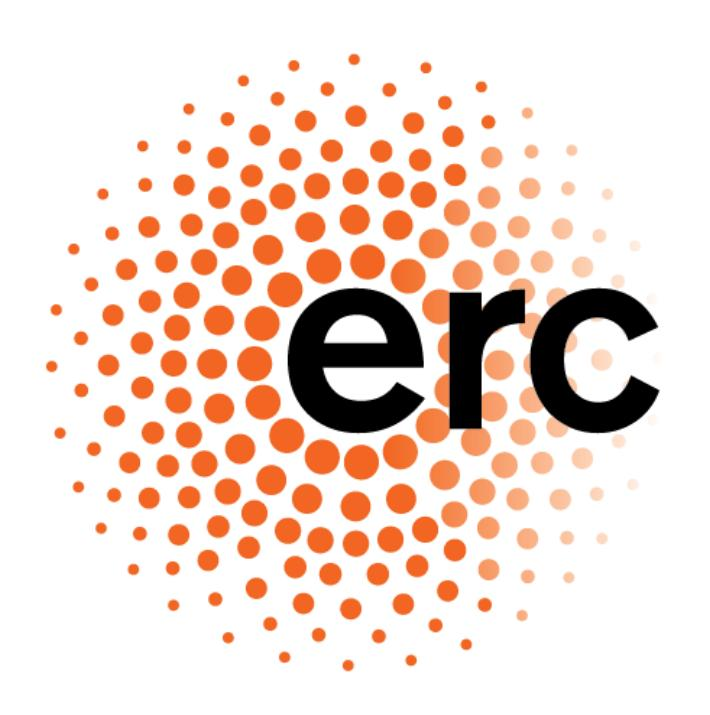

#### **EN ANNEX**

*European Commission Decision C(2026) 62 amending Decision C(2025) 5000*

# ERC Work Programme 2026

# **Table of Contents**

| About   | this Document                                                      | 4  |
|---------|--------------------------------------------------------------------|----|
| How to  | Apply for ERC Grants                                               | 4  |
| Novelt  | ies in 2026                                                        | 4  |
| Glossa  | ry                                                                 | 6  |
| Introdu | uction                                                             | 8  |
| Object  | ives and Principles of ERC Funding                                 | 8  |
| 1. ER   | RC Frontier Research Grants                                        | 9  |
| 1.1     | Objectives of ERC Grant Schemes                                    | 11 |
| 1.2     | Grant Size and Duration                                            | 14 |
| 1.3     | Ethical Principles, Security, and Research Integrity               | 15 |
| 1.4     | Admissibility, Eligibility, Resubmission Restrictions              | 17 |
| 1.5     | Proposal Submission and Description                                | 23 |
| 1.6     | Evaluation Criterion, Elements, and Procedure                      | 27 |
| 1.7     | Grant Award, Funding, and Management                               | 33 |
| 2. Ac   | dditional Funding Actions Available to ERC Principal Investigators | 37 |
| 2.1     | Proof of Concept Grant                                             | 38 |
| 2.2     | Public Engagement with Research Award                              | 45 |
| 3. Ot   | ther Actions                                                       | 48 |
| 3.1     | Call and Programme Monitoring and Evaluation                       | 48 |
| 3.2     | Support to the ERC Scientific Council                              | 49 |
| 4. Pu   | ıblic Procurement                                                  | 53 |
| 4.1     | IT Services Related to ERC Call Management                         | 53 |
| 4.2     | ERC Dynamic Evaluation Panels                                      | 54 |
| 4.3     | IT & Data Services for ERC Programme Monitoring and Evaluation     | 54 |
| 4.4     | Engagement with Stakeholders and Communication                     | 54 |
| 5. Inc  | dicative Budget 2026                                               | 56 |
| 6. Ar   | nnexes                                                             | 57 |
| 6.1     | Annex 1                                                            | 58 |
| 6.2     | Annex 2                                                            | 61 |
| 6.3     | Annex 3                                                            | 63 |

| 6.4 | Annex 4                                                                                | 69 |
|-----|----------------------------------------------------------------------------------------|----|
| 6.5 | Annex 5                                                                                | 71 |
|     |                                                                                        |    |
|     | Prior Information of Candidates, Tenderers, Grant Applicants, and Remunerated Experts: |    |
|     | Registration of Information in the Early Detection and Exclusion System (EDES)72       |    |

# About this Document

This document represents the annual Work Programme of the European Research Council (ERC) funded by the European Union's Horizon Europe Framework Programme for Research and Innovation. It sets out the various actions and the funding allocated to these actions by the ERC in the corresponding year.

The annual Work Programme of the ERC is established by the ERC Scientific Council and subsequently adopted by the European Commission (EC)[1](#page-3-0) .

The rules applying to the submission, peer review and evaluation of proposals, and to the awarding of grants, as well as the available means of redress are set out in the [ERC Rules of](https://ec.europa.eu/info/funding-tenders/opportunities/docs/2021-2027/horizon/guidance/erc-rules-for-submission-and-evaluation_he-erc_en.pdf)  [Submission and Evaluation under Horizon Europe.](https://ec.europa.eu/info/funding-tenders/opportunities/docs/2021-2027/horizon/guidance/erc-rules-for-submission-and-evaluation_he-erc_en.pdf)

# How to Apply for ERC Grants

Principal Investigators who wish to apply for ERC grants need to do so through the [EU Funding](https://ec.europa.eu/info/funding-tenders/opportunities/portal/screen/home)  [& Tenders Portal,](https://ec.europa.eu/info/funding-tenders/opportunities/portal/screen/home) which contains all the information on each call, as well as details of National Contact Points, who can provide information and personalised support in different languages.

More information on the ERC in general, including its mission and organisation, a description of its funding schemes, a step-by-step application guide, and details on funded projects is available on its [website.](https://erc.europa.eu/)

# Novelties in 2026

The ERC Work Programme 2026 text has received a general update; it has been streamlined to provide a succinct yet comprehensive overview of the funding initiatives and the proposal submission and evaluation process. Annex 3 on the Participation of Associated Countries and Special Eligibility Conditions Applicable to Entities from Certain Countries has also been revised.

A new grant scheme – the ERC Plus Grant – has been introduced in this Work Programme as part of the "Choose Europe" initiative proposed by Commission President von der Leyen and Commissioner Zaharieva. With a grant size of up to seven million euros for seven years the scheme will support outstanding Principal Investigators with a vision to transform their

1 In accordance with Article 9 (2) (b) in conjunction with Article 13 (2) (a) of the Council Decision (EU) 2021/764 establishing the [Specific Programme implementing Horizon Europe.](https://eur-lex.europa.eu/legal-content/EN/TXT/?uri=celex%3A32021D0764)

current field or to open new avenues in research. Further details on the proposal structure and the evaluation procedures can be found below.

Changes have been made to the length and structure of the research proposal. The Extended Synopsis and the Scientific Proposal have been rethought in terms of focus and applicants are now requested to submit Part I of the Scientific Proposal (setting out the background, the objectives, and the overall research strategy) and Part II of the Scientific Proposal (focusing primarily on the implementation). The evaluation elements have also been adapted to reflect the abovementioned changes. ERC Plus Grant applicants will also have to include a Statement of Vision in their application. For more information see sections [1.5](#page-22-0) [Proposal Submission and](#page-22-0)  [Description](#page-22-0) and [1.6](#page-26-0) [Evaluation Criterion, Elements,](#page-26-0) and Procedure.

In addition, the ERC is introducing a new extension for the eligibility period of Starting and Consolidator Grant applicants who have been victims of gender-based violence or any other form of violence. Concurrently, a reference to parental leave has now been added to the grounds for extension of the eligibility period alongside maternity and paternity leave.

An additional resubmission restriction will apply to Synergy Grant applicants who have obtained a score of 'B' in Step 1 of the Synergy Grant 2025 call. These applicants are not eligible to apply to the Synergy Grant call of 2026. At the same time, current ERC grantees who have applied for a new main frontier research grant may, under certain circumstances, remain eligible for this grant even if their current grant needs to be extended beyond the two-year period after the call deadline.

Finally, to further encourage the submission of excellent proposals by Principal Investigators currently based in non-associated third countries, the ERC has decided to double the maximum amount of additional funding that can be awarded to Starting, Consolidator, and Advanced Grant applicants moving to the EU or an Associated Country to take up their ERC grant.

# Glossary

**Applicant** – an individual or an organisation applying for EU funding. Unless otherwise specified, the term 'applicant' refers to both the Principal Investigator and the Host Institution applying for funding under this Work Programme.

**Associated Country** – a non-EU country that has entered into a specific agreement with the EU allowing it to participate (wholly or in part) in the Framework Programme for Research and Innovation under similar conditions as EU Member States.

**Beneficiary** – a natural person or an entity with or without a legal personality with whom a Grant Agreement has been signed.

**Eligibility Period** (or eligibility window) – a timespan during which a Principal Investigator is eligible to apply to either an ERC Starting or Consolidator Grant, as determined by the date of their PhD defence, the cut-off date, as well as any eligibility extensions the Principal Investigator is entitled to.

**Eligible Costs and Contributions** – costs and contributions that meet the specific conditions laid down in the financial rules governing EU funding, in particular Article 189 of the Financial Regulation.

**ERC Frontier Research Action** – a Principal Investigator-led research action hosted by a single or multiple beneficiaries receiving funding from the ERC.

**Grant** – a financial contribution made by way of a donation by the Granting Authority to one or more beneficiaries to carry out a specific activity or a project.

**Grant Agreement** – a legal document setting out the rights and obligations of the beneficiary, on the one hand, and the Granting Authority on the other.

**Granting Authority** – a body or entity empowered to conclude Grant Agreements with the objective of providing EU funding in the form of grants. In the case of ERC grants the Granting Authority is the European Research Council Executive Agency (ERCEA).

**Host Institution** – a legal entity hosting a Principal Investigator applying for a grant or being the beneficiary of a grant, responsible for providing the Principal Investigator with the necessary support to carry out the project.

**Independent External Expert** – a professional (external to the ERC and the EC) appointed to provide impartial and unbiased judgement or advice.

**Legal Entity** – a natural person, or a legal person created and recognised as such under Union, national or international law, which has legal personality and the capacity to act in its own name, exercise rights and be subject to obligations, or an entity which does not have legal personality as referred to in point (c) of Article 197(2) of the Financial Regulation.

**Lump Sum** – a type of financial contribution, which covers in global terms all or certain specific categories of eligible costs which are clearly identified in advance.

**Panel** – a committee of independent external experts responsible for evaluating research proposals.

**Panel Chair** – a member of a panel tasked with overseeing and guiding the evaluation process in the panel.

**Panel Member** – an independent external expert appointed to serve on a panel.

**Portability** – a feature of ERC grants that enables the transfer of a grant to another Host Institution.

**Principal Investigator** – a researcher applying for ERC funding, on behalf of the Host Institution, and assuming primary responsibility for the scientific and technical aspects of a research project funded under the Grant Agreement.

**Responsible Authorising Officer** – an employee of the Granting Authority empowered to take decisions or authorise transactions in accordance with the Financial Regulation.

**Supplementary Agreement** – an agreement concluded between the Principal Investigator and the Host Institution before grant signature, outlining the obligations of both parties towards each other in the context of the Grant Agreement.

**Time Commitment** – a commitment of the Principal Investigator to dedicate a certain amount of time and maintain a sufficient presence to effectively carry out the research project.

# Introduction

The European Research Council (ERC) was set up to support excellence in research through grants that tackle issues at the frontiers of existing knowledge. It provides flexible longer-term, portable funding, and independence for researchers and their teams to pursue ambitious and high-risk research.

An ERC grant is awarded to a Host Institution that commits to engage and host a Principal Investigator(s)[2](#page-7-0) and their team(s), and to offer them appropriate conditions to manage the ERC funded research[3](#page-7-1) .

# Objectives and Principles of ERC Funding

The ERC strives to achieve the following objectives:

- to promote scientific excellence in research by funding ground-breaking, high-risk, and ambitious frontier research;
- to attract the best talent and skill to Europe, to support early-career researchers, and to promote exchange of ideas and knowledge;
- to increase Europe's competitiveness in the international research arena.

To achieve the abovementioned objectives, the ERC has established a competitive peer review and funding model that subscribes to the following core principles:

- scientific excellence at the heart of the evaluation process;
- openness to researchers of any age, nationality, gender, career stage, and research field, residing in any country in the world at the time of application;
- autonomy and independence of researchers and their teams to pursue frontier research;
- transparency, fairness, and impartiality in carrying out its mission;
- upholding ethical principles and ensuring research integrity and security;
- acknowledging the diversity of applicants and their research career paths;
- commitment to open science, including open access to the published output of research, as well as access to research data and related products.

2 Normally the Principal Investigator shall be employed by the Host Institution, but cases where, for duly justified reasons, the Principal Investigator's employer cannot become the Host Institution, or where the Principal Investigator is self-employed, can be accommodated. The specific conditions of engagement shall be subject to clarification and approval during the granting procedure, or during the amendment procedure for a change of Host Institution.

3 The mutual rights and obligations of the Host Institution and the Principal Investigator are set out in the Supplementary Agreement signed by both parties.

The ERC uses procedures that maintain the focus on excellence, encourage initiative, and combine simplicity with accountability.

# 1. ERC Frontier Research Grants

The ERC supports research via the following main frontier research grant (main grant) schemes[4](#page-8-1) :

- Starting Grant,
- Consolidator Grant,
- Advanced Grant,
- ERC Plus Grant, and
- Synergy Grant.

It also provides further funding for ERC grant holders through its Proof of Concept Grant scheme.

The grants are selected for funding following a call for proposals and a rigorous peer review evaluation procedure. A summary containing provisional details on the main calls for proposals, i.e. the indicative budget, and the relevant opening and closing dates is provided in *[Table 1](#page-9-0)* below.

4 The main frontier research grants together with the Proof of Concept Grant, are also collectively referred to as 'ERC frontier research actions'.

*Table 1: Provisional Details on the Main Calls for Proposals under Work Programme 2026[5,](#page-9-1)[6](#page-9-2)[,7](#page-9-3)*

|                                       | Starting Grant Call | Consolidator Grant Call | Advanced Grant Call | Synergy Grant Call | ERC Plus Grant Call8 |
|---------------------------------------|---------------------|----------------------------|------------------------|--------------------|-------------------------|
| Call Identifier                       | ERC-2026-StG        | ERC-2026-CoG               | ERC-2026-AdG           | ERC-2026-SyG       | ERC-2026-PLUS           |
| Opening Date                          | 9 July 2025         | 25 September 2025          | 28 May 2026            | 10 July 2025       | 2 June 2026             |
| Deadline                              | 14 October 2025     | 13 January 2026            | 27 August 2026         | 5 November 2025    | 2 September 2026     |
| Budget (EUR, m)                    | 705                 | 673                        | 747                    | 500                | 210                     |
| Estimated Number of Grants            | 450                 | 328                        | 294                    | 49                 | 30                      |
| Date to Inform Applicants – Step 1 | 28 April 2026       | 17 July 2026               | 29 January 2027        | 13 April 2026      | 16 February 2027  |
| Date to Inform Applicants – Step 2 | 25 August 2026      | 11 December 2026           | 11 June 2027           | 14 August 2026     | 15 June 2027         |
| Date to Inform Applicants – Step 3 | -                   | -                          | -                      | 27 October 2026    | -                       |
| Grant Agreement Signature Date        | 22 December 2026    | 12 April 2027              | 16 November 2027       | 24 March 2027      | 13 October 2027         |

5 These dates are provisional. The Director of the European Research Council Executive Agency may open a call up to one month prior to or after the envisaged opening date or delay the call deadline by up to two months. The budget amounts for 2026 are subject to the availability of the appropriations after the adoption of the EU Budget by the Budgetary Authority, or if the budget is not adopted, as provided for in the system of provisional twelfths.

6 In addition to the indicative amount from the ERC 2026 budget, ERCEA may use Union funds allocated to Member States under shared management and transferred to the Horizon Europe budget to fund, exclusively, proposals that have received a score of 'A' but cannot be funded due to budget constraints, and have their Host Institution – and, where relevant, any additional beneficiary requesting EU funding – established in the Member State that has requested such transfer (in accordance with Article 15 (5) Regulation (EU) 2021/695 of the European Parliament and of the Council).

7 The deadlines for the 2026 calls fall both in 2025 and 2026. The year of the Work Programme under which a call is published is included in the Call Identifier (e.g. ERC-2026- StG). Therefore, while an applicant who submits a proposal for the Synergy Grant 2026 with a deadline of 5 November 2025 may also submit a proposal to the Advanced Grant 2026 with a deadline of 27 August 2026 (i.e. nine months later), only the first eligible proposal will be evaluated.

8 The ERC Plus Grant call is part of the "Choose Europe" initiative as proposed by Commission President von der Leyen and Commissioner Zaharieva.

# 1.1 Objectives of ERC Grant Schemes

The Starting, Consolidator, Advanced, and ERC Plus Grant schemes support projects carried out by individuals or teams headed by a single Principal Investigator. The Synergy Grant scheme funds projects involving two to four Principal Investigators and their teams with a designated Corresponding Principal Investigator being the administrative contact point for the Synergy Grant Group. The Principal Investigator(s) bear the responsibility for the scientific aspects of the project.

Principal Investigators applying to the Starting, Consolidator, Advanced Grant, ERC Plus, or Synergy Grant schemes must demonstrate the ground-breaking nature and ambition of their research proposal. In addition, Principal Investigators applying to the Synergy Grant must demonstrate that their Group can successfully bring together the scientific elements (i.e. skills, knowledge, experience, expertise, disciplines, methods, approaches, teams, and infrastructure) necessary to address the scope and complexity of the proposed research question (see section [1.6](#page-26-0) [Evaluation Criterion, Elements,](#page-26-0) and Procedure below).

# 1.1.1 Starting Grant

The Starting Grant supports excellent Principal Investigators starting or having recently started their own independent research team or programme. A Starting Grant Principal Investigator should have already shown evidence of the potential for research independence, for example, by having produced at least one important publication as its main author or a publication without the participation of their PhD supervisor.

# 1.1.2 Consolidator Grant

The Consolidator Grant supports excellent Principal Investigators who are consolidating their own independent research team or programme. A Consolidator Grant Principal Investigator should have already shown evidence of research independence.

# 1.1.3 Advanced Grant

The objective of the Advanced Grant is to support excellent Principal Investigators that are established research leaders. An ERC Advanced Grant Principal Investigator is expected to be an active researcher with a track record of significant research achievements.

# 1.1.4 ERC Plus Grant

The ERC Plus Grant supports outstanding Principal Investigators who address a major scientific challenge. Applications for ERC Plus Grants should be for projects that could not be carried out with a regular ERC grant. Applicants should explain how the proposed project aims go beyond those of a regular ERC project, for example, because they have a vision to transform their field or open a new field of research. Scholars at all career stages can apply for an ERC Plus Grant if they have an outstanding record of scientific achievement at the forefront of their field. Their intellectual leadership will be evaluated in comparison to peers at their own career stage. It is expected that a researcher may be the Principal Investigator of only one ERC Plus Grant in their lifetime.

Applicants should be aware that every year, only some 30 ERC Plus Grants can be awarded across all fields and all career stages, compared to approximately 1000 Starting, Consolidator and Advanced Grants. This level of competitiveness should be taken into account when considering whether to submit an application.

# 1.1.5 Synergy Grant

The aim of the Synergy Grant is to support a small group (hereafter, the Synergy Grant Group) of two to four innovative and active Principal Investigators jointly addressing ambitious research problems that cannot be tackled by any single Principal Investigator and their team alone. Principal Investigators of any professional seniority, and with a competitive track record matching their career stage can apply. One of the Principal Investigators (except the Corresponding Principal Investigator) of the Synergy Grant Group may be hosted and engaged by an institution outside of the EU or an Associated Country (see section [1.4.2.4](#page-19-0) [Eligible Host](#page-19-0)  [Institution](#page-19-0) below).

*Table 2: Main Features of the ERC Grant Schemes*

|                        | Target Audience                                                                                  | Maximum Grant Amount (EUR) | Maximum Additional Funding Amount (EUR)9 | Minimum Duration (months) | Maximum Duration (months) | Working Time on Project per Principal Investigator (%) | Working Time in a Member State or Associated Country (%) | Type of Funding Model |
|------------------------|--------------------------------------------------------------------------------------------------|-------------------------------------|------------------------------------------------------|---------------------------------|---------------------------------|--------------------------------------------------------------------------|----------------------------------------------------------------------------|-----------------------------|
| Starting Grant         | Researchers that have defended their PhD > 2 and <= 7 years ago on 1st January 2026  | 1 500 000                           | 1 000 000                                            | -                               | 60                              | 50                                                                       | 50                                                                         | Actual Cost              |
| Consolidator Grant     | Researchers that have defended their PhD > 7 and <= 12 years ago on 1st January 2026 | 2 000 000                           | 1 000 000                                            | -                               | 60                              | 40                                                                       | 50                                                                         | Actual Cost              |
| Advanced Grant         | Open to all researchers                                                                       | 2 500 000                           | 1 000 000                                            | -                               | 60                              | 30                                                                       | 50                                                                         | Lump Sum                    |
| ERC Plus Grant         | Open to all researchers                                                                       | 7 000 000                           | -                                                    | 48                              | 84                              | 30                                                                       | 50                                                                         | Lump Sum                    |
| Synergy Grant          | Open to all researchers                                                                       | 10 000 000                          | 4 000 000                                            | -                               | 72                              | 30                                                                       | 5010                                                                       | Actual Cost              |
| Proof of Concept Grant | Open to grantees                                                                                 | 150 000                             | -                                                    | -                               | 18                              | -                                                                        | -                                                                          | Lump Sum                    |

9 Except for Principal Investigators in Starting, Consolidator, or Advanced Grant re-locating to the EU or an Associated Country from elsewhere to take up their ERC grant. In this case, the maximum additional funding shall be EUR 2 000 000.

10 This applies to Principal Investigators engaged and hosted by an institution in an EU Member State or an Associated Country only.

# 1.2 Grant Size and Duration

ERC grants are awarded following a call for proposals and a peer-review evaluation. For a detailed description of the evaluation process see section [1.6.3](#page-27-0) [Evaluation Procedure](#page-27-0) below.

The maximum grant size[11](#page-13-1) for the main frontier research grants ranges from EUR 1.5 million to EUR 10 million and varies by grant type; applicants can also request additional funding if needed (see *[Table 3](#page-14-1)* below). The maximum amount of the grant is reduced *pro rata temporis* for proposals of shorter duration for Starting, Consolidator, Advanced, and Synergy Grants[12](#page-13-2) . Additional funding is not subject to *pro rata temporis* reduction for projects of shorter duration.

Starting, Consolidator, Advanced Grants are awarded for up to five years or sixty months, Synergy Grants – for up to six years or seventy-two months, and ERC Plus Grants - for a minimum of four years or forty-eight months and up to seven years or eighty-four months.

Starting, Consolidator, and Synergy Grants reimburse actual costs. The Advanced Grant and the ERC Plus Grant, on the other hand, are awarded as a single lump-sum contribution[13](#page-13-3) for the entire project.

Grants falling under the actual-cost funding model shall have their eligible costs reimbursed at a rate of 100% for direct costs plus a flat rate of 25% for indirect costs[14](#page-13-4) . The grant amount awarded represents the maximum amount of funding available for carrying out the project. The amount to be paid out at the end of the project must be justified based on the costs actually incurred during the implementation of the project and may be lower than the EU contribution requested.

For lump sum grants, one lump sum contribution (broken down by beneficiaries - where applicable) based on a realistic estimate of the actual cost of the project[15](#page-13-5), and fully covering the work to be implemented in the proposed action, shall be awarded. For more information on eligible costs and other aspects of funding see section [1.7](#page-32-0) [Grant Award, Funding,](#page-32-0) and [Management](#page-32-0) below.

11 i.e. the maximum European Union contribution that can be requested.

12 *Pro rata temporis* does not automatically apply in case of early termination of funded projects.

13 In accordance with the [Decision of 7 July 2021 authorising the use of lump sum contributions under the](https://ec.europa.eu/info/funding-tenders/opportunities/docs/2021-2027/horizon/guidance/ls-decision_he_en.pdf)  [Horizon Europe Programme](https://ec.europa.eu/info/funding-tenders/opportunities/docs/2021-2027/horizon/guidance/ls-decision_he_en.pdf) – the Framework Programme for Research and Innovation (2021-2027) – and in actions under the Research and Training Programme of the European Atomic Energy Community (2021-2025)

14 Excluding the direct eligible costs for subcontracting and internally invoiced goods and services.

15 Applicants to the Advanced or ERC Plus Grant call shall prepare their budget by including only those costs that would be considered eligible under an actual cost grant, i.e. the project eligible direct costs, plus a flat rate of 25% of the direct cost categories that qualify for the calculation of indirect costs under the rules of Horizon Europe.

Additional funding up to the amounts set out in *[Table](#page-14-1)* 3 [below](#page-14-1) can be requested for Starting, Consolidator, Advanced, and Synergy Grants. No additional funding is provided for ERC Plus Grants.

Additional funding is intended to cover further eligible costs (e.g. start-up costs, major equipment, access to large facilities, major experimental and field work costs) when these are necessary to carry out the proposed work. The requests for additional funding must be duly justified in the proposal.

Both the grant amount requested, as well as any additional funding are assessed during evaluation.

*Table 3: Maximum Grant Duration, Grant Amount, and Additional Funding*

|                    | Maximum  | Maximum Grant | Maximum            |  |
|--------------------|----------|---------------|--------------------|--|
|                    | Duration | Amount        | Additional Funding |  |
|                    | (months) | (EUR)         | (EUR)9             |  |
| Starting Grant     | 60       | 1 500 000     | 1 000 000          |  |
| Consolidator Grant | 60       | 2 000 000     | 1 000 000          |  |
| Advanced Grant     | 60       | 2 500 000     | 1 000 000          |  |
| ERC Plus Grant     | 84       | 7 000 000     | None               |  |
| Synergy Grant      | 72       | 10 000 000    | 4 000 000          |  |

ERC grants are portable[16](#page-14-2) as described in the Model Grant Agreement.

# 1.3 Ethical Principles, Security, and Research Integrity

# 1.3.1 Ethical Principles

According to Article 19 of Regulation (EU) 2021/695 of the European Parliament and of the Council[17](#page-14-3), the proposed research and innovation activities must comply with ethical principles and relevant national, Union and international legislation, including the Charter of Fundamental Rights of the European Union and the European Convention on Human Rights

16 'Portability' means that Principal Investigators may request to transfer their entire grant, or part of it, to a new beneficiary, under specific conditions included in the Model Grant Agreement used for ERC actions. These conditions may include provisions for the transfer of equipment purchased and used exclusively for the implementation of the project. For those proposals where ERCEA makes use of Union funds allocated to Member States under shared management and transferred to the Horizon Europe budget (see footnote 6 [\)](#page-9-5), the right to exercise portability is limited to legal entities established within the territory of the concerned Member State, which has requested the transfer of such funds, in accordance with Article 15(5) and (6) of Regulation (EU) 2021/695.

17 Regulation (EU) 2021/695 of the European Parliament and of the Council of 28 April 2021 establishing Horizon Europe – the Framework Programme for Research and Innovation, laying down its rules for participation and dissemination, and repealing Regulations (EU) No 1290/2013 and (EU) No 1291/2013 (OJ L 170 , 12.5.2021, p. 1; ELI: <http://data.europa.eu/eli/reg/2021/695/oj> ).

and its Protocols. Particular attention must be paid to the principle of proportionality, the right to privacy, the right to the protection of personal data, the right to the physical and mental integrity of a person, the principle of non-discrimination, and the need to ensure high levels of human health protection. Certain fields of research, like activities aiming at human cloning for reproductive purposes, shall not be financed[18](#page-15-0) .

Funding of human embryonic stem cell research is possible within the ethical framework set out in Article 18(2) and Article 19(3) of Regulation (EU) 2021/695 of the European Parliament and of the Council.

The proposed research and innovation activities must have an exclusive focus on civil applications.

# 1.3.2 Security

ERC actions must also comply with applicable security rules, and, in particular, rules on the protection of classified information against unauthorised disclosure, including compliance with any relevant Union and national law[19](#page-15-1) (see [Annex 4](#page-68-0) for further details).

# 1.3.3 Research Integrity

Research integrity is a core principle of the ERC. To ensure the fairness and efficiency of its procedures, and to uphold the trust of the scientific community and society, the ERC promotes and maintains a culture of research integrity at all stages of the evaluation and granting process through its rules on confidentiality and conflict of interest[20](#page-15-2) .

Cases of scientific misconduct such as fabrication, falsification, plagiarism, or misrepresentation of data arising during the evaluation or throughout the life cycle of an ERC funded project shall be vigorously addressed by the ERC within the applicable legal and procedural framework. Any breach of research integrity by the Principal Investigator, team member, or the beneficiary may result in the rejection of a proposal from the evaluation, reduction of the grant amount, suspension or termination of the Grant Agreement, as well as in a request for measures to be taken by the Host Institution.

The primary responsibility for the detection, investigation, and adjudication of any breaches of research integrity lies with the Host Institution. Therefore, the Host Institution is expected to have working structures in place to uphold research integrity, and to make all appropriate efforts to verify that no allegations of scientific misconduct are pending against any Principal

18 As set out in Article 18(1) of Regulation (EU) 2021/695.

19 See the rules for protecting EU classified information set out by Commission Decision (EU, Euratom) 2015/444 of 13 March 2015 on the security rules for protecting EU classified information (OJ L 72, 17.3.2015, p. 53), Article 20 of Regulation (EU) 2021/695 and Annex 4 of this Work Programme.

20 As set out in the [Expert Code of Conduct.](https://ec.europa.eu/info/funding-tenders/opportunities/docs/2021-2027/experts/code-of-conduct_en.pdf)

Investigator applying for or participating in an ERC grant. The Host Institution shall bring to the attention of the ERC any such allegations or cases of scientific misconduct.

# 1.4 Admissibility, Eligibility, Resubmission Restrictions

# 1.4.1 Admissibility

To be admitted to the competition, a proposal must be complete (i.e. to include all sections as described under [1.5](#page-22-0) [Proposal Submission and Description](#page-22-0) below), readable, and accessible. It must be submitted electronically by a Principal Investigator fulfilling the eligibility criteria (see section [1.4.2.2](#page-17-0) [Eligible Principal Investigator\(s\)](#page-17-0) below) before the respective call deadline. A proposal can be submitted in any official EU language; however, for reasons of efficiency, the use of English is strongly advised[21](#page-16-1) .

The Host Institution must confirm its association with, and its support to, the project and the Principal Investigator through a binding statement of support (i.e. the Host Institution Support Letter[22](#page-16-2)). This statement must be provided at the time of application.

Proposals that do not meet the above criteria or do not include a statement of support may be declared inadmissible.

# 1.4.2 Eligibility

#### 1.4.2.1 Eligible Proposal

The content of the proposal must relate to the objectives and to the grant type set out in the call, as defined in this Work Programme (see [1.1](#page-10-0) [Objectives of ERC Grant Schemes](#page-10-0) above). If a proposal is considered not to relate to the objectives of the grant or call for proposals, it will be declared ineligible.

21 The working language of the ERC evaluation panels is English. If the proposal is in an official EU language different from English, the ERCEA will provide the evaluation panels with a raw machine translation version of the proposal. Such a translated version will not be verified by the ERCEA. An English translation of the abstract must be included in the proposal.

22 A template of the letter is annexed to the Information for Applicants document for the respective call: [Information for Applicants to the Starting and Consolidator Grant Calls,](https://ec.europa.eu/info/funding-tenders/opportunities/docs/2021-2027/horizon/guidance/information-for-applicants_he-erc-stg-cog_en.pdf) [Information for Applicants to the](https://ec.europa.eu/info/funding-tenders/opportunities/docs/2021-2027/horizon/guidance/information-for-applicants_he-erc-adg_en.pdf)  [Advanced Grant Call,](https://ec.europa.eu/info/funding-tenders/opportunities/docs/2021-2027/horizon/guidance/information-for-applicants_he-erc-adg_en.pdf) [Information for Applicants to the Synergy Grant Call,](https://ec.europa.eu/info/funding-tenders/opportunities/docs/2021-2027/horizon/guidance/information-for-applicants_he-erc-syg_en.pdf) [Information for Applicants to the Proof](https://ec.europa.eu/info/funding-tenders/opportunities/docs/2021-2027/horizon/guidance/information-for-applicants_he-erc-poc_en.pdf)  [of Concept Grant Call.](https://ec.europa.eu/info/funding-tenders/opportunities/docs/2021-2027/horizon/guidance/information-for-applicants_he-erc-poc_en.pdf)

#### 1.4.2.2 Eligible Principal Investigator(s)

ERC grant schemes are open to researchers of any age and nationality, residing anywhere in the world at the time of application, and wishing to carry out their research in one of the EU or Associated Country-based Host Institutions.

Principal Investigators applying to the Starting or Consolidator Grant calls must meet the following specific eligibility criteria[23](#page-17-1) i.e. the respective eligibility periods based on the time elapsed between the date of the successful defence of their first PhD degree or an equivalent doctoral degree (hereafter, the PhD Defence Date) and the cut-off date specified below (see *[Table 4](#page-17-2)*).

*Table 4: The Eligibility Period*

|                               | Starting Grant      | Consolidator Grant  |
|-------------------------------|---------------------|---------------------|
| Time Elapsed between          |                     |                     |
| PhD Defence Date and          | > 2 and ≤ 7 years   | > 7 and ≤ 12 years  |
| Cut-off Date:              |                     |                     |
| Cut-off Date:                 | January 1st, 2026   | January 1st, 2026   |
| Eligibility Period Starts on: | January 1st, 2019   | January 1st, 2014   |
| Eligibility Period Ends on:   | December 31st, 2023 | December 31st, 2018 |

The reference date for determining the eligibility period is the date of the successful defence of the Principal Investigator's first PhD degree or an equivalent doctoral degree (i.e. the PhD Defence Date).

The eligibility period of a Principal Investigator as set out in *[Table 4](#page-17-2)* above may be extended in the following well-documented[24](#page-17-3) circumstances or events[25](#page-17-4) .

Unless otherwise specified, extensions to the eligibility period can only be granted for circumstances or events that have occurred or were present in the period following the Principal Investigator's PhD Defence Date up until the deadline of the respective call for proposals.

**Maternity leave**: an 18-month extension per child[26](#page-17-5) born before or after the Principal Investigator's PhD Defence Date. If an applicant can demonstrate a longer period of leave (i.e. maternity leave or maternity leave combined with parental leave), the eligibility period shall be extended by the total duration of actual leave taken.

23 A Principal Investigator applying for an ERC Starting or Consolidator Grant must hold a PhD or an equivalent doctoral degree (for more information, including specific provisions for holders of medical degrees, see [Annex](#page-60-0)  [2\)](#page-60-0).

24 For more information on the types of supporting documents accepted for the extension of the eligibility period see [Information for Applicants to the Starting and Consolidator Grant Calls.](https://ec.europa.eu/info/funding-tenders/opportunities/docs/2021-2027/horizon/guidance/information-for-applicants_he-erc-stg-cog_en.pdf)

25 For applicants whose first eligible degree is their medical degree such circumstances or events can be considered from the date of completion of their medical degree.

26 This equally applies to cases where the applicant is the main caregiver of an adopted child.

**Paternity or parental leave**: extension by the documented amount of paternity or parental leave (or a combination thereof) taken for each child[26](#page-17-6) born before or after the Principal Investigator's PhD Defence Date.

**Long-term illness**[27](#page-18-0) or **national service**: extension by the documented amount of leave taken by the Principal Investigator for each occurrence.

**Disability**[28](#page-18-1): extension corresponding to the reduced amount of working time (including leave taken) and/or the degree of disability of the Principal Investigator.

**Clinical training**: extension by the documented duration of clinical training (up to a maximum of four years) received by the Principal Investigator.

**Major disasters**[29](#page-18-2): extension by the documented duration of the Principal Investigator's inability to work[30](#page-18-3) resulting from a major disaster.

**Seeking Asylum**: extension by the documented duration of the Principal Investigator's inability to work due to seeking asylum[31](#page-18-4) .

**Gender-based Violence or Any Other Form of Violence**[32](#page-18-5): extension by the documented duration of the Principal Investigator's inability to work[30](#page-18-6) due to being a victim of violence.

#### 1.4.2.3 Minimum Time Commitment

The Principal Investigator must commit themselves to dedicate a certain percentage of their working time[33](#page-18-7) to the project, as well as to spend a certain percentage of their working time in the EU or an Associated Country[34](#page-18-8). The minimum time commitment (%) for each grant type are listed in *[Table 5](#page-18-9)* below. Applicants, who do not meet the minimum time commitment requirements will be declared ineligible.

*Table 5: Minimum Time Commitment*

|                 | Starting | Consolid | Advanced | ERC Plus | Synergy Grant |
|-----------------|----------|----------|----------|----------|---------------|
|                 | Grant    | ator     | Grant    | Grant    |               |
|                 |          | Grant    |          |          |               |
| Minimum         |          |          |          |          | 30% for each  |
| Percentage of   | 50%      | 40%      | 30%      | 30%      | Principal     |
| Working Time to |          |          |          |          | Investigator  |

27 Over 90 days for the Principal Investigator or a close family member (child, spouse, parent, or sibling).

31 The period of extension runs from the start date of the asylum/refugee application to the date of the decision on the applicant Principal Investigator's refugee status or the receipt of the residence permit.

28 Persons with disabilities include those who have long-term physical, mental, intellectual or sensory impairments which in interaction with various barriers may hinder their full and effective participation in society on an equal basis with others [\(UN Convention on the Rights of Persons with Disabilities \(CRPD\)\).](https://www.ohchr.org/en/instruments-mechanisms/instruments/convention-rights-persons-disabilities)

29 Major disasters include large-scale geological (e.g. earthquakes), meteorological (e.g. floods) or human-caused (e.g. armed conflicts) events that cause loss of life or property.

30 For a minimum of ninety days.

32 Any action with the intention to cause physical or psychological harm to another person.

33 For further guidance and working time ceilings, see the EU Grants: AGA - [Annotated Grant Agreement.](https://ec.europa.eu/info/funding-tenders/opportunities/docs/2021-2027/common/guidance/aga_en.pdf)

34 See [Annex 3.](#page-62-0)

| be Spent on the ERC Project                                                                                 |     |     |     |     |                                                                                                                               |
|-------------------------------------------------------------------------------------------------------------------|-----|-----|-----|-----|-------------------------------------------------------------------------------------------------------------------------------|
| Minimum Percentage of Working Time to be Spent in an EU Member State or Associated Country35,36 | 50% | 50% | 50% | 50% | 50% for each Principal Investigator engaged and hosted by an institution in the EU or an Associated Country |

#### 1.4.2.4 Eligible Host Institution

Any type of legal entity, public or private, including a university, a research organisation, or an undertaking can host a Principal Investigator and their team.

To participate in ERC frontier research actions the Host Institution must be established either in an EU Member State or an Associated Country[37](#page-19-3) as a legal entity created under national law, or it may be an international European research organisation (such as the European Organization for Nuclear Research (CERN), and the European Molecular Biology Laboratory (EMBL), etc.), or any other entity created under EU law. In a Synergy Grant, one Host Institution, except the Corresponding Host Institution, may be an international organisation or a legal entity established outside the European Union or an Associated Country, subject to any restrictions provided in [Annex 3](#page-62-0) below.

International organisations with headquarters in an EU Member State or an Associated Country shall be deemed to be established in that Member State or Associated Country.

It is also expected that the Host Institution will be the only participating legal entity in the case of a Starting, Consolidator, Advanced, or ERC Plus Grant. In a Synergy Grant, up to four Host Institutions may engage Principal Investigators.

Where they bring added scientific value to the project, additional team members may be hosted by other legal entities[38](#page-19-4), which may be established anywhere, including outside the European Union or Associated Countries, or international organisations, subject to any restrictions provided in [Annex 3](#page-62-0) below.

35 For Principal Investigators hosted and engaged by international European research organisations, any time spent working for these organisations may count as working time spent in a Member State or an Associated Country for the purpose of the Principal Investigator's time commitment.

36 See section [1.4.2.4](#page-19-0) [Eligible Host Institution](#page-19-0) regarding field work.

37 See [Annex 3.](#page-62-0)

38 Consortium agreements are not required for ERC multi-beneficiary grants, as the Starting, Consolidator, Advanced, and ERC Plus Grants will support projects carried out by teams of researchers, which are headed by a single Principal Investigator. The ERC Synergy Grant Groups are neither networks nor consortia of undertakings, universities, research centres, or other legal entities.

Legal entities outside the European Union or Associated Countries are eligible for funding in the following cases:

- they are one of the Host Institutions in a Synergy Grant, or
- their participation is deemed essential for carrying out the action, or
- they host team members bringing added scientific value to the project,

provided that they are not excluded from participation or subject to restrictive measures set out in [Annex 3](#page-62-0) below.

To be eligible, legal entities from an EU Member State or an Associated Country that are public bodies, research organisations, or higher education institutions (including private research organisations and private higher education institutions) must have a Gender Equality Plan or an equivalent strategic document in place for the duration of the project. The gender equality plan or equivalent must fulfil the mandatory requirements listed in [Annex 5](#page-70-0) below.

#### 1.4.2.5 Eligible Scientific Field

Applications in any field of science [39](#page-20-0) are eligible for ERC funding and the ERC welcomes research proposals of an interdisciplinary nature.

# 1.4.3 Restrictions on Applications

Given the large number of applications received every year, and the need to uphold the quality and integrity of the evaluation process at the ERC, the following restrictions apply to calls under the ERC Work Programme 2026:

- A researcher may participate as a Principal Investigator in only one ERC main frontier research grant at any given time[40,](#page-20-1) [41](#page-20-2);
- An applicant, whose proposal has been selected for funding and who is preparing a Grant Agreement[42](#page-20-3) under a call of the ERC Work Programme 2024 or 2025, may not apply for a Starting, Consolidator, Advanced, ERC Plus, or Synergy Grant under a call of the ERC Work Programme 2026 [43](#page-20-4);
- A researcher participating as a Principal Investigator in one of the ERC main frontier research grants may not submit another proposal for an ERC main frontier research

39 Nevertheless, research proposals within the scope of Annex I to the Euratom Treaty, namely, those directed towards nuclear energy applications, must be submitted to relevant calls under the Euratom Research & Training Programme.

40 This also applies to Principal Investigators of a Synergy Grant Group.

41 A new main frontier research grant project may only start once the duration of the previous project (as stated in the Grant Agreement) has come to an end.

42 As described in the [ERC Rules of Submission and Evaluation under Horizon Europe.](https://ec.europa.eu/info/funding-tenders/opportunities/docs/2021-2027/horizon/guidance/erc-rules-for-submission-and-evaluation_he-erc_en.pdf)

43 The year of an ERC call for proposals refers to the ERC Work Programme under which the call was published and can be established by its call identifier. A call for proposals that was published under the ERC Work Programme 2025 will have 2025 in the call identifier (e.g. ERC-2025-StG).

- grant, unless the existing project ends [44](#page-21-0) in less than two years following the call deadline[45](#page-21-1);
- A Principal Investigator who serves as a panel member for an ERC call under the Work Programme 2026 or who has served as a panel member for an ERC call under Work Programme 2024 may not apply to a call for the same type of main frontier research grant under the ERC Work Programme 2026;
- A Principal Investigator who serves as a panel member for the Advanced Grant call under the Work Programme 2026 may not apply to the ERC Plus Grant call under the ERC Work Programme 2026.
- An applicant may submit proposals to different ERC main frontier research grant calls published under the same Work Programme, but only the first eligible proposal will be evaluated.

Further restrictions on submissions to calls under the ERC Work Programme 2026 by applicants, who have applied under previous ERC Work Programmes, are set out in *[Table](#page-22-1)  [6](#page-22-1)* below. Inadmissible, ineligible, or withdrawn proposals do not count against any of the restrictions in *[Table 6](#page-22-1)*. The ERC reserves the right to modify the restrictions to applications in its subsequent Work Programmes.

Applicants must immediately inform the services of the European Research Council Executive Agency (ERCEA) of any events or change in circumstances that may affect the fulfilment of the eligibility criteria.

If it becomes clear before, during, or after the peer review evaluation phase that one or more of the admissibility or eligibility criteria have not been met, the proposal will be declared inadmissible or ineligible, and it will be rejected. Where there is doubt on the admissibility or eligibility of a proposal, the peer review evaluation may proceed pending a decision of the Responsible Authorising Officer following the opinion of the Admissibility and Eligibility Review Committee[46](#page-21-2) .

44 As defined in the Grant Agreement.

45 The duration of the ongoing project may, exceptionally, be extended, without affecting the eligibility of the proposal, for properly documented circumstances constituting force majeure or other unforeseen events or circumstances, which: a) have presented themselves after the call deadline and thus could not be anticipated at the time of the call deadline, b) the extension is essential for the proper completion of the ongoing project, and c) the ongoing project will end within three years of the call deadline. This and any other extension is subject to the agreement of the Granting Authority.

46 For further information, see applicable [ERC Rules of Submission and Evaluation under Horizon Europe.](https://ec.europa.eu/info/funding-tenders/opportunities/docs/2021-2027/horizon/guidance/erc-rules-for-submission-and-evaluation_he-erc_en.pdf)

*Table 6: Resubmission Restrictions*

| Application under Previous ERC Work Programme Calls and Outcome of Evaluation47 | Applicants are Ineligible for the Following Calls under Work Programme 2026 |                                                                             |
|------------------------------------------------------------------------------------------|--------------------------------------------------------------------------------------------|-----------------------------------------------------------------------------|
| Starting, Consolidator, Advanced, or Synergy Grant 2024 and 2025                   | Rejected on the grounds of a breach of research integrity48           | Starting, Consolidator, Advanced, ERC Plus, and Synergy Grant 2026 |
| Starting, Consolidator, or Advanced Grant 2024                                     | C at Step 1                                                                                | Starting, Consolidator, Advanced, and ERC Plus Grant 2026             |
| Starting, Consolidator, or Advanced Grant 2025                                        | B or C at Step 1                                                                           | Starting, Consolidator, Advanced, and ERC Plus Grant 2026             |
| Synergy Grant 2024                                                                       | C at Step 1                                                                                | Synergy Grant 2026                                                          |
| Synergy Grant 2025                                                                       | B or C at Step 1                                                                           | Synergy Grant 2026                                                          |

# 1.5 Proposal Submission and Description

Proposals for Starting, Consolidator, Advanced, and ERC Plus Grant calls are submitted by the Principal Investigator, on behalf of the Host Institution (also referred to as the applicant legal entity[49](#page-22-4)); the responsibility for the research conducted as part of the project rests with the Principal Investigator.

47 For more details on evaluation outcomes and scores see section 1.6.6 Evaluation Outcome.

48 This restriction will be implemented with due respect for the principle of proportionality.

49 'Legal entity' means a natural person, or a legal person created and recognised as such under Union, national or international law, which has legal personality and the capacity to act in its own name, exercise rights and be subject to obligations, or an entity which does not have legal personality as referred to in point (c) of Article 200(2) of [Regulation \(EU, Euratom\) 2024/2509 of the European Parliament and of the Council](https://eur-lex.europa.eu/eli/reg/2024/2509/oj) (the 'Financial Regulation'). The applicant legal entity must have stable and sufficient resources to successfully implement the projects and contribute their share. Organisations participating in several projects must have sufficient capacity to implement all these projects. Information on financial capacity checks is provided in the [ERC Rules of](https://ec.europa.eu/info/funding-tenders/opportunities/docs/2021-2027/horizon/guidance/erc-rules-for-submission-and-evaluation_he-erc_en.pdf)  [Submission and Evaluation under Horizon Europe.](https://ec.europa.eu/info/funding-tenders/opportunities/docs/2021-2027/horizon/guidance/erc-rules-for-submission-and-evaluation_he-erc_en.pdf) Applicants that are subject to the administrative sanction of exclusion or are in one of the exclusion situations set out in the Financial Regulation are banned from receiving EU grants and CANNOT participate. Please see Articles 138 and 143 of the Financial Regulation, as well as important information on possible exclusion and registration of economic operators in the Commission's Early Detection and Exclusion System (EDES) on the final page of this Work Programme.

Synergy Grant proposals are submitted by the Corresponding Principal Investigator i.e. one of the Principal Investigators of the Synergy Grant Group designated to be the administrative contact point for the Group.

The applicant shall choose a primary evaluation panel (as listed in [Annex 1\)](#page-57-0) and may also list a secondary evaluation panel. The applicant should indicate when they believe that the proposal is of a cross-panel or cross-domain nature. In the case of Synergy Grant applications, only keywords, and not panels, should be indicated.

When submitting a proposal, the applicant to a Starting, Consolidator, Advanced, or ERC Plus Grant can specify up to three persons they wish to exclude from evaluating their proposal, whereas the Corresponding Principal Investigator in a Synergy Grant proposal can, on behalf of the Group, specify up to four persons they wish to exclude from evaluating their proposal[50](#page-23-0) .

Proposals are submitted electronically. Early registration and submission well in advance of the call deadline is strongly recommended. Plagiarism detection software will be used to analyse proposals submitted to the ERC.

Further information on how to complete an application for an ERC frontier research grant can be found in the Information for Applicants document[51](#page-23-1) for the respective call, available on both the [ERC website](https://erc.europa.eu/) and the [EU Funding & Tenders Portal.](https://ec.europa.eu/info/funding-tenders/opportunities/portal/screen/home)

# 1.5.1 Proposal Description

A proposal shall include the following sections[52](#page-23-2), with the stated page limits[53](#page-23-3) for Starting, Consolidator, Advanced, ERC Plus, and Synergy Grant proposals. Proposals are not required to include a plan for the exploitation and dissemination (including communication activities) of the results in the sense of the Horizon Europe Regulation.

Proposals that do not include some or all of the sections listed below may be declared inadmissible:

- Part I of the Scientific Proposal: up to five pages;
- Part II of the Scientific Proposal: up to seven pages (up to ten pages for Synergy Grant proposals);

50 The persons identified may be excluded from the evaluation of the respective proposal, provided that it is still possible to evaluate the proposal.

51 As well as other relevant documents, including the [ERC Rules of Submission and Evaluation under Horizon](https://ec.europa.eu/info/funding-tenders/opportunities/docs/2021-2027/horizon/guidance/erc-rules-for-submission-and-evaluation_he-erc_en.pdf)  [Europe.](https://ec.europa.eu/info/funding-tenders/opportunities/docs/2021-2027/horizon/guidance/erc-rules-for-submission-and-evaluation_he-erc_en.pdf)

52 Part I and Part II of the Scientific Proposal, Curriculum Vitae and Track Record, Resources and Time Commitment are collectively referred to in this Work Programme as the 'Research Proposal'. For ERC Plus Grants, the Research Proposal includes all the aforementioned sections, as well as the Statement of Vision.

53 Incomplete proposals may be declared inadmissible, see section [1.4](#page-16-0) Admissibility, Eligibility, [Resubmission](#page-16-0) [Restrictions](#page-16-0) above. References and the funding ID section do not count towards these page limits.

- Curriculum Vitae (CV) and Track Record: up to four pages for each Principal Investigator;
- Statement of Vision (ERC Plus Grants only): one half to two pages;
- Resources and Time Commitment: up to two pages (except Synergy Grant Proposals, where this section may exceed two pages);
- Host Institution Support Letter;
- Ethics Issues Table;
- PhD Record and Supporting Documents for Eligibility Checking (Starting and Consolidator Grants only);
- Equipment Depreciation Table (Advanced and ERC Plus Grants only).

Only the material that is presented within these limits will be evaluated.

**Part I of the Scientific Proposal** should present the envisaged research[54](#page-24-0) and it should:

- lay out the current state of knowledge,
- explain the scientific question and the objectives of the project, and
- present the overall approach or research strategy to reach the goals of the project.

Part I should convince the evaluation panel that the proposal presents an original and creative idea addressing an important question in the research field(s). It should explain how the project will advance the frontier of knowledge, and what contribution it will make to the research field(s) i.e. what may be changed, opened, challenged or how the results of the work will alter the current understanding of the field.

For ERC Plus Grants, the Statement of Vision should explain how the proposed project is designed to achieve more than a project with a regular ERC grant.

**Statement of Vision**: Applicants should explain how their proposed research will achieve more than would be possible with a regular ERC grant, ideally in half a page, and at most two pages.

ERC Plus Grants will only support projects that address aims that could not be addressed with a regular ERC grant. Proposed projects may require deeper or broader work for a breakthrough, and this work may be particularly risky; the goal may be to open up completely new avenues of research and require a series of linked projects; the research may require investments or personnel that cannot be supported by a regular grant. This rule notwithstanding, seven years and EUR 7 million are the upper limits. Thus, say, a seven-year project for less than EUR 7 million, or a four-year project for a full amount of EUR 7 million are both allowed.

54 Further Guidance can be found in the Information for Applicants document for the respective call (see [Information for Applicants to the Starting and Consolidator Grant Calls,](https://ec.europa.eu/info/funding-tenders/opportunities/docs/2021-2027/horizon/guidance/information-for-applicants_he-erc-stg-cog_en.pdf) [Information for Applicants to the](https://ec.europa.eu/info/funding-tenders/opportunities/docs/2021-2027/horizon/guidance/information-for-applicants_he-erc-adg_en.pdf)  [Advanced Grant Call,](https://ec.europa.eu/info/funding-tenders/opportunities/docs/2021-2027/horizon/guidance/information-for-applicants_he-erc-adg_en.pdf) [Information for Applicants to the Synergy Grant Call,](https://ec.europa.eu/info/funding-tenders/opportunities/docs/2021-2027/horizon/guidance/information-for-applicants_he-erc-syg_en.pdf) [Information for Applicants to the Proof](https://ec.europa.eu/info/funding-tenders/opportunities/docs/2021-2027/horizon/guidance/information-for-applicants_he-erc-poc_en.pdf)  [of Concept Grant Call\)](https://ec.europa.eu/info/funding-tenders/opportunities/docs/2021-2027/horizon/guidance/information-for-applicants_he-erc-poc_en.pdf), the [ERC website,](https://erc.europa.eu/) as well as the EU [Funding & Tenders Portal.](https://ec.europa.eu/info/funding-tenders/opportunities/portal/screen/home)

As only some 30 ERC Plus grants (per year) will be awarded to Principal Investigators from all research stages and research areas, the competition will be very stiff. To stand a chance of support, applicants thus have to convince the evaluation panel about the vision, and boldness of their projects.

At Step 1 of the evaluation, only Part I and the Curriculum Vitae (CV) and Track Record (see below) are assessed by the evaluation panel. For ERC Plus Grants, Part I of the Scientific Proposal, the Curriculum Vitae and Track Record, as well as the Statement of Vision are assessed in Step 1. Part I forms the basis for the panel's decision whether to evaluate the proposal in the next step. Therefore, all essential information must be covered in this part.

**Part II of the Scientific Proposal**: This should be a detailed explanation of the project implementation, including research methodology, work plan, risk assessment, and mitigating measures, justification for the requested budget and resources, and any further necessary background not included in Part I. An annex, listing all ongoing research grants, and any grant applications submitted or pending approval for work related to the proposal should be included[55](#page-25-0) .

For Synergy Grants, Part II should also describe and justify the collaborative arrangements enabling the Synergy Grant Group to carry out the proposed work. Applicants shall outline the contribution of each Principal Investigator, their team, and the resources needed to achieve the stated objectives.

**Curriculum Vitae (CV) and Track Record:** The CV and Track Record should include personal details, education, key qualifications, current and previous positions, a list of up to ten research outputs that demonstrate how the applicant has advanced knowledge in their field, with an emphasis on more recent achievements, and a list of selected examples of significant peer recognition. A short explanation of the significance of the selected outputs, the role of the applicant in producing each of them, and how they demonstrate the applicant's capacity to successfully carry out their proposed project, as well as a short explanation of the importance of the listed examples of significant peer recognition may be included.

The applicant may also include additional information on career breaks, diverse career paths, and life events [56](#page-25-1) , as well as any particularly noteworthy contributions to the research community. These will provide context to the evaluation panels when assessing the Principal Investigator's research achievements and peer recognition in relation to their career stage. For further details see section [1.6](#page-26-0) [Evaluation Criterion, Elements,](#page-26-0) and Procedure below.

55 This annex does not count towards the page limit.

56 In the context of the Covid-19 pandemic, any specific situation caused by the pandemic with a negative impact on the Curriculum Vitae and Track Record may be mentioned under this element.

**Resources and Time Commitment:** The proposal should clearly specify the percentage of the applicant's working time that will be spent in a Member State or an Associated Country, and the percentage of the applicant's working time that will be devoted to the project[57](#page-26-1) .

All proposals (both under the actual-cost model, and under the lump sum model) must include a detailed budget table, which presents a realistic estimate of the anticipated actual project costs (in euro) [58](#page-26-2) , including a breakdown of personnel costs by team member category (wherever possible). Cost estimates for the lump sum grant are subject to the same cost eligibility conditions as those under the actual cost model.

While equipment, infrastructure, or other assets must normally be declared as depreciation costs, these may, exceptionally be declared as full capitalised costs. For more information on costs see section [1.7.1](#page-33-0) Eligible Costs [or Contributions](#page-33-0) below.

Requests for additional funding shall be duly justified in the proposal.

# 1.6 Evaluation Criterion, Elements, and Procedure

# 1.6.1 Evaluation Criterion

For Starting, Consolidator, Advanced, ERC Plus, and Synergy Grants, excellence is the sole criterion of evaluation.

The panels will primarily evaluate:

● the ground-breaking nature and ambition of the research project.

At the same time, the panels will evaluate:

● the intellectual capacity and creativity of the Principal Investigator(s), with a focus on the extent to which the Principal Investigator(s) has the required scientific expertise and capacity to successfully execute the project.

For ERC Plus Grants the past achievements of the applicants will be given more importance than for regular grants: the applicants are expected to be leaders in their field. Because ERC Plus Grants are open to applicants at all career stages, the evaluation panels will compare each applicant to peers at the same career stage.

Applicants should use the ten outputs in the Track Record to illustrate how the listed items have advanced the field. Senior applicants should focus on recent advances, rather than lifetime achievements.

57 For further guidance on calculating this percentage, see the [Annotated Grant Agreement](https://ec.europa.eu/info/funding-tenders/opportunities/docs/2021-2027/common/guidance/aga_en.pdf) published on the [EU](https://ec.europa.eu/info/funding-tenders/opportunities/portal/screen/home)  [Funding & Tenders Portal.](https://ec.europa.eu/info/funding-tenders/opportunities/portal/screen/home)

58 For Synergy Grants, the cost estimate is to be presented for each Principal Investigator.

In the case of a Synergy Grant application, the peer reviewers will need to see that the collaborative working arrangements between the Principal Investigators, described as part of the research methodology, can ensure scientific excellence. The detailed evaluation elements applying to the excellence of the research project and the Principal Investigator are set out below (see [1.6.5](#page-29-0) [Evaluation Elements](#page-29-0) below).

# 1.6.2 Additional Considerations

During the evaluation, the peer review panels shall take into account the phase of the Principal Investigator's transition to independence, as well as the information included in their CV and Track Record. Each Principal Investigator applying for an ERC Plus Grant or as part of a Synergy Grant Group shall be evaluated according to their career stage.

The panels shall recommend proposals for funding or reject them in their entirety and may not select parts of a proposal for funding.

# 1.6.3 Evaluation Procedure[59](#page-27-1)

#### **For Starting, Consolidator, and Advanced Grants**

The proposal is evaluated in two steps with interviews taking place at Step 2. The evaluation is carried out by peer review panels as listed in [Annex 1.](#page-57-0) The panels may be assisted by independent external experts working remotely.

The allocation of the proposals to the panels is based on the expressed preference of the applicant (see section [Proposal Submission and Description](#page-22-0) above). Proposals may be allocated to a different panel with the agreement of both panel chairs concerned.

The panel to which a proposal is allocated may request additional reviews from members of other panel(s) or remote evaluators. Interdisciplinary research proposals are evaluated by the panels with the help of external experts where necessary.

**At Step 1**, Part I of the Scientific Proposal and the Principal Investigator's CV and Track Record are assessed.

Based on the outcome of their assessment at Step 1, up to forty-four proposals per panel are retained for Step 2 of the evaluation.

59 Procedural aspects that are not specified in this Work Programme are established in the [ERC Rules of](https://ec.europa.eu/info/funding-tenders/opportunities/docs/2021-2027/horizon/guidance/erc-rules-for-submission-and-evaluation_he-erc_en.pdf)  [Submission and Evaluation under Horizon Europe.](https://ec.europa.eu/info/funding-tenders/opportunities/docs/2021-2027/horizon/guidance/erc-rules-for-submission-and-evaluation_he-erc_en.pdf)

**At Step 2**, the complete Research Proposal [60](#page-28-0) is assessed, and the Principal Investigator presents their proposal at an interview with the evaluation panel.

#### **For ERC Plus Grants**

The proposal is evaluated in two steps with interviews taking place at Step 2. The evaluation is carried out by peer review panels. The panels may be assisted by independent external experts working remotely.

**At Step 1**, Part I of the Scientific Proposal, the Principal Investigator's CV and Track Record, and the Statement of Vision are assessed.

Based on the outcome of the assessment at Step 1, only proposals of the highest quality will be retained for Step 2 of the evaluation.

**At Step 2**, the complete Research Proposal[60](#page-28-1) is assessed, and the Principal Investigator presents their proposal at an interview with the evaluation panel.

#### **For Synergy Grants**

The proposal is evaluated in three steps with interviews taking place at Step 3. The evaluation is carried out by peer review panels. The panels may be assisted by independent external experts working remotely.

**At Step 1**, Part I of the Scientific Proposal and the Principal Investigators' CVs and Track Records are assessed. Proposals are retained for Step 2 based on the outcome of the evaluation at Step 1 and a budgetary cut-off level of up to seven times the panel's indicative budget.

**At Step 2**, the complete Research Proposal[60](#page-28-1) is assessed. Proposals are retained for Step 3 based on the outcome of the evaluation at Step 2 and a budgetary cut-off level of up to three times the Panel's indicative budget.

**At Step 3**, all Principal Investigators of the proposals retained for Step 3 present their proposals at the interview with the evaluation panel.

60 Part I and Part II of the Scientific Proposal, Curriculum Vitae and Track Record, Resources and Time Commitment are collectively referred to in this Work Programme as the 'Research Proposal'. For ERC Plus Grants, the Research Proposal includes all the aforementioned sections, as well as the Statement of Vision.

# 1.6.4 Call Budget Allocation and Evaluation

For the Starting, Consolidator, Advanced, and Synergy Grant calls, an indicative budget is allocated to each panel in proportion to the budgetary demand[61](#page-29-1) of the proposals assigned to that panel. The panels may recommend changes to the budget distribution of a proposal if they feel the requested resources are not justified, but must motivate these changes in writing.

# 1.6.5 Evaluation Elements

**Research Project**. The ground-breaking nature and ambition of the Research Project (applicable to Starting, Consolidator, Advanced, ERC Plus, and Synergy Grants, unless otherwise specified) is assessed as follows:

#### **At Step 1**:

- To what extent does the research address important scientific questions?
- To what extent are the project's objectives ambitious and will it advance the frontier of knowledge?
- ERC Plus Grants only: To what extent does the project address aims that could not be reached with a regular ERC grant?
- Synergy Grants only: To what extent does the proposal go beyond what the individual Principal Investigators could achieve alone?

#### **At Step 2**:

- To what extent does the research address important scientific questions?
- To what extent are the project's objectives ambitious and will it advance the frontier of knowledge?
- ERC Plus Grants only: To what extent does the project address aims that could not be reached with a regular ERC grant?
- Synergy Grants only: To what extent does the proposal go beyond what the individual Principal Investigators could achieve alone?
- To what extent are the research methodology and working arrangements appropriate to achieve the goals of the project?
- To what extent are the timescales and resources adequate and properly justified?
- Synergy Grants only: To what extent do the Principal Investigators succeed in proposing a combination of scientific approaches that are crucial to address the scope and complexity of the research questions to be tackled?

61 i.e. the percentage of the total funding requested by the applicants assigned to that panel.

**Principal Investigator(s).** The intellectual capacity and creativity of the Principal Investigator(s) (applicable to Starting, Consolidator, Advanced, and Synergy Grants, unless otherwise specified) is assessed as follows:

#### **At Step 1 and Step 2:**

- To what extent has/have the PI(s) demonstrated the ability to conduct groundbreaking research?
- To what extent does/do the PI(s) provide evidence of creative and original thinking?
- To what extent does/do the PI(s) have the required scientific expertise and capacity to successfully execute the project?
- ERC Plus Grants only: To what extent is the applicant an undisputed leader in the field (compared to peers at the same career stage)?
- Synergy Grants only: To what extent does the Synergy Grant Group demonstrate that it brings together the know-how necessary to address the proposed research question(s)?

# 1.6.6 Evaluation Outcome

#### **For Starting, Consolidator, and Advanced Grants**

At the end of each evaluation step, panels rank proposals according to their strengths and weaknesses.

At the end of **Step 1** of the evaluation, each proposal receives one of the following scores:

- **A invited**: the proposal is of excellent quality and ranked sufficiently high to pass to Step 2 of the evaluation;
- ● **A not invited**: the proposal is of excellent quality but not ranked sufficiently high[62](#page-30-0) to pass to Step 2 of the evaluation;
- **B**: the proposal is of high quality but not sufficient to pass to Step 2 of the evaluation;
- **C**: the proposal is not of sufficient quality to pass to Step 2 of the evaluation.

At the end of **Step 2** of the evaluation, the proposal receives one of the following scores:

- **A**: the proposal fully meets the excellence criterion and is recommended for funding should sufficient funds be available;
- **B**: the proposal meets some but not all elements of the excellence criterion and will not be funded.

#### **For ERC Plus Grants**

At the end of **Step 1** of the evaluation, the panels conclude their assessment as follows:

62 i.e., exceeds the maximum threshold of proposals that can be passed to Step 2.

- **Retained**: the proposal is of sufficient quality to pass to Step 2 of the evaluation;
- **Not retained**: the quality may be high but not sufficient to pass to Step 2 of the evaluation.

At the end of **Step 2** of the evaluation, the proposal receives one of the following scores:

- **A**: the proposal fully meets the excellence criterion and is recommended for funding should sufficient funds be available;
- **B**: the proposal meets some but not all elements of the excellence criterion and will not be funded.

#### **For Synergy Grants**

At the end of **Step 1** of the evaluation, the proposal receives one of the following scores:

- **A invited**: the proposal is of excellent quality and ranked sufficiently high to pass to Step 2 of the evaluation;
- **A not invited**: the proposal is of excellent quality but not ranked sufficiently high[62](#page-30-1) to pass to Step 2 of the evaluation;
- **B**: the proposal is of high quality but not sufficient to pass to Step 2 of the evaluation;
- **C**: the proposal is not of sufficient quality to pass to Step 2 of the evaluation.

At the end of **Step 2** of the evaluation, the proposal receives one of the following scores:

- **A**: the proposal is of sufficient quality to pass to Step 3 of the evaluation;
- **B**: the proposal is of high but not sufficient quality to pass to Step 3 of the evaluation.

At the end of **Step 3** of the evaluation, the proposal receives one of the following scores:

- **A**: the proposal fully meets the excellence criterion and is recommended for funding should sufficient funds be available;
- **B**: the proposal meets some but not all elements of the excellence criterion and will not be funded.

Once the evaluation has been completed, all applicants receive an Evaluation Report, which includes the final panel score and ranking range, the panel comment, and the individual assessment of each independent external expert[63](#page-31-0) .

Applicants may be subject to restrictions on submitting proposals to future ERC calls based on the outcome of the evaluation under this Work Programme.

Proposals recommended for funding are funded by the ERC if sufficient funds are available. Proposals are funded in order of their rank in the ranking list.

63 ERC Plus Grant applicants will receive an Evaluation Report, which includes the final panel score, the panel comment, and the individual assessment of each independent expert.

All proposals recommended for funding are subject to an ethics review and, where appropriate, shall undergo a security appraisal. They must comply with the ethical principles referred to above (see sectio[n Ethical Principles, Security, and Research Integrity\)](#page-14-0). Actions that do not fulfil the ethics requirements of Article 19 of Regulation (EU) 2021/695 of the European Parliament and Council shall be rejected or terminated, once this has been established.

# 1.7 Grant Award, Funding, and Management

ERC grants are awarded to a Host Institution (or beneficiary), which must engage and host[64](#page-32-1) the Principal Investigator(s) for at least the duration of the project, as defined in the Grant Agreement, and to offer them appropriate conditions to manage the ERC-funded research[65](#page-32-2) .

Principal Investigators are expected to start their project within six months of receiving an invitation letter to prepare the Grant Agreement.

The beneficiaries (and their actions) must continue to fulfil the eligibility criteria for the entire duration of the action. Costs and contributions will be eligible only as long as the beneficiary and the action fulfil the eligibility criteria. Beneficiaries must immediately inform the services of the ERCEA of any events or change in circumstances that may affect the fulfilment of these criteria.

Principal Investigators funded through the main ERC grants must spend a defined minimum percentage of their working time on the ERC project, and a defined minimum percentage of their working time in an EU Member State or Associated Country[66,](#page-32-3)[67](#page-32-4), as set out in *[Table 5](#page-18-9)* above.

The research project shall be implemented within the territory of the EU Member States or Associated Countries[68](#page-32-5), except for field work or other research activities, where it is necessary

64 Normally the Principal Investigator will be employed by the Host Institution, but cases where, for duly justified reasons, the Principal Investigator's employer cannot become the host institution, or where the Principal Investigator is self-employed, can be accommodated. The specific conditions of engagement will be subject to clarification and approval during the granting procedure, or during the amendment procedure for a change of host institution. The mutual rights and obligations of the Host Institution and the Principal Investigator are set out in the Supplementary Agreement signed by both parties.

65 These conditions are consistent with "The European Charter for Researchers" included in Annex II to the Council Recommendation of 18 [December 2023 on a European framework to attract and retain research,](https://eur-lex.europa.eu/legal-content/EN/TXT/HTML/?uri=OJ:C_202301640#d1e33-18-1)  [innovation and entrepreneurial talents in Europe.](https://eur-lex.europa.eu/legal-content/EN/TXT/HTML/?uri=OJ:C_202301640#d1e33-18-1)

66 For further guidance, see the [Annotated Grant Agreement](https://ec.europa.eu/info/funding-tenders/opportunities/docs/2021-2027/common/guidance/aga_en.pdf) on th[e EU Funding & Tenders Portal.](https://ec.europa.eu/info/funding-tenders/opportunities/portal/screen/home)

67 Time commitments will be monitored, and in cases where the actual commitment is below the minimum levels set out in this Work Programme, or the levels indicated in the Grant Agreement, appropriate measures may be taken, up to and including grant reduction, suspension, or termination in accordance with the Grant Agreement.

68 Except for Synergy Grant projects, where one Principal Investigator may be hosted and engaged by an institution outside of the EU or Associated Countries, or for projects where team members are hosted by beneficiaries established outside of the EU or Associated Countries.

to conduct these outside the European Union or the Associated Countries, and where they serve to achieve the scientific objectives of the project or activity[69](#page-33-1) .

The composition of a Synergy Grant Group must remain unchanged throughout the lifetime of the grant. If a Principal Investigator leaves the Synergy Grant Group, the grant may continue only subject to a scientific re-evaluation and provided that all eligibility criteria continue to be met.

The size of the awarded grant depends on the maximum grant and additional funding amounts as set out in *[Table 2](#page-12-3)* and *[Table 3](#page-14-1)* above, the budget (in euro) requested by the applicant, and the recommendation of the evaluation panel.

# 1.7.1 Eligible Costs or Contributions

Grants awarded under the actual cost funding model (i.e. Starting, Consolidator, and Synergy Grant) shall have their eligible costs reimbursed at a rate of 100% for direct costs plus a flat rate of 25% for indirect costs[70](#page-33-2). Reimbursements will be budget-based and cover actual costs or unit costs[71](#page-33-3) (depending on the cost category) incurred.

For actual cost grants, the Principal Investigator can request to modify the budgetary breakdown during the course of the project. Requests to modify the budgetary breakdown of additional funding may only be accepted provided that the objectives for which the additional funding was awarded remain unchanged.

For grants under the lump sum cost model (i.e. Advanced and ERC Plus Grants), the Principal Investigator will have the flexibility to use the lump sum contribution as they see fit, as long as the project is implemented as agreed. Where additional funding is awarded, that part of the contribution can be used with the same flexibility as the rest of the contribution during the implementation of the grant.

For lump sum grants (i.e. Advanced and ERC Plus Grants), the payment of the lump sum contribution will be based on the work carried out and reported, irrespective of the actual costs incurred for the project or the successful outcome of the project activities. In this type of cost model, there will be one lump sum contribution (broken down by beneficiaries – where relevant) that fully covers the work to be implemented in the proposed action.

For all main grants, the purchase of equipment, infrastructure, or other assets used for the action must be budgeted as depreciation costs, in line with the beneficiary's usual accounting practices. However, at the request of the applicant, equipment, infrastructure, or other assets purchased specifically for the action (or developed as part of the action tasks) may,

71 Costs for internally invoiced goods and services directly used for the action may be declared as unit costs.

69 Time spent on such field work or other research activities may count as time spent in the EU or the Associated Countries for the purpose of the Principal Investigator's time commitment.

70 Excluding the direct eligible costs for subcontracting and internally invoiced goods and services.

exceptionally, be included as full capitalised costs[72](#page-34-0) . These items should be clearly listed and justified in the proposal.

# 1.7.2 Gender Balance

Under Horizon Europe, beneficiaries of ERC grants must take all measures to promote equal opportunities between men and women in the implementation of the action and aim for a gender balance at all levels of personnel assigned to the action, including at supervisory and managerial level, as set out in the [Model Grant Agreement](https://ec.europa.eu/info/funding-tenders/opportunities/docs/2021-2027/common/agr-contr/general-mga_horizon-euratom_en.pdf) for ERC actions. ERC Principal Investigators should also determine the relevance of integrating sex and gender analysis into their research. Specific activities promoting equal opportunities or gender balance, or covering the gender dimension of research funded by the ERC, can be considered as eligible costs where these costs are necessary for the implementation of the action.

# 1.7.3 Open Science

Under Horizon Europe, all beneficiaries(including those of ERC grants) must ensure immediate open access to all peer-reviewed scientific publications[73](#page-34-1) relating to their results as set out in the Model Grant Agreement used for ERC actions. Open access must be provided with full reuse rights[74](#page-34-2). Beneficiaries must ensure that they or the authors retain sufficient intellectual property rights to comply with their open access requirements. Publishing costs can be considered as eligible costs provided that the publishing venue (e.g. a journal, a book) is fully open access.

In addition, beneficiaries of ERC grants funded under this Work Programme will be covered by the provisions on research data management as set out in the Model Grant Agreement used for ERC actions. In particular, whenever a project generates research data, beneficiaries are required to manage it in line with the principles of findability, accessibility, interoperability, and reusability as described by the 'FAIR principles' initiative [75](#page-34-3) , and establish a data management plan within the first six months of project implementation. Open access to research data should be ensured under the principle "as open as possible, as closed as necessary". These provisions are designed to facilitate access, re-use and preservation of the research data generated from the ERC-funded research.

72 Where the identified asset is needed for the viability of the action (including its financial viability) and recorded under a fixed asset account of the beneficiary, in compliance with international accounting standards and the beneficiary's usual cost accounting practices.

73 This includes peer-reviewed book chapters and long-text publications such as monographs, edited collections, critical editions, scholarly exhibition catalogues, or PhD theses.

74 For monographs and other long-text formats, commercial re-use and derivative works may be excluded as specified in the [General Model Grant Agreement for ERC Actions under Horizon Europe.](https://ec.europa.eu/info/funding-tenders/opportunities/docs/2021-2027/common/agr-contr/general-mga_horizon-euratom_en.pdf)

75 [The FAIR Guiding Principles for Scientific Data Management and Stewardship.](https://doi.org/10.1038/sdata.2016.18)

# 1.7.4 Intellectual Property Rights (IPR)

The Granting Authority may, up to four years after the end of the action, object to a transfer of ownership or to the exclusive licensing of results, as set out in the specific provision of Annex 5 of the [Model Grant Agreement](https://ec.europa.eu/info/funding-tenders/opportunities/docs/2021-2027/common/agr-contr/general-mga_horizon-euratom_en.pdf) for ERC actions. Additional obligations to grant nonexclusive licenses for the exploitation of results (for up to four years after the end of the action), at the request of the Granting Authority, apply to beneficiaries of ERC frontier research grants in case of a public emergency.

# 2. Additional Funding Actions Available to ERC Principal Investigators

The Proof of Concept Grant and the Public Engagement with Research Award are two support measures for Principal Investigators in receipt of ERC grants. The Proof of Concept Grant is intended to aid Principal Investigators, who wish to exploit the commercial and social innovation potential of their research, whereas the Public Engagement with Research Award has been conceived to acknowledge Principal Investigators that have engaged audiences beyond academia in the course of their research and research communication activities.

*Table 7: Provisional Details of Additional Funding Actions[76](#page-36-1)*

|                                                 | Proof of Concept Grant (call)   | Public Engagement with Research Award (prize contest) |
|-------------------------------------------------|------------------------------------|-------------------------------------------------------------|
| Call Identifier                                 | ERC-2026-PoC                       | ERC-2026-PERA                                               |
| Type of Action                                  | ERC frontier research grant     | Recognition Prize                                           |
| Opening of the Call                          | 17 January 2026                    | 14 October 2025                                             |
| Cut-off dates or Deadline(s) for Application | 17 March 2026 17 September 2026 | 15 January 2026                                             |
| Budget EUR (estimated number of grants)      | 60 000 000 (400)                | 80 000 (8)                                               |
| Dates to Inform Applicants                      | 1 July 2026 14 January 2027     | 30 September 2026                                           |
| Date for Signature of Grant Agreements       | 1 November 2026 18 May 2027     | Autumn 2026                                                 |

76 These dates are provisional. The Director of the European Research Council Executive Agency may open a call up to one month prior to or after the envisaged opening date or delay the call deadline by up to two months. The budget amounts for 2026 are subject to the availability of the appropriations after the adoption of the EU Budget by the Budgetary Authority, or if the budget is not adopted, as provided for in the system of provisional twelfths.

# 2.1 Proof of Concept Grant

# 2.1.1 Objectives

The ERC Proof of Concept Grant allows ERC grant holders to explore the commercial and social innovation potential of their ERC-funded research. These grants are available only to Principal Investigators, whose proposals draw substantially on their ERC-funded research; therefore, applicants need to demonstrate the relation between the idea to be taken to proof of concept and their main grant.

# 2.1.2 Grant Size and Duration

The Proof of Concept grant is awarded as a single lump sum contribution of EUR 150 000[77](#page-37-1) for a period of eighteen months. Extensions of the duration of Proof of Concept projects may be granted when duly justified.

The lump sum will cover the beneficiaries' direct and indirect eligible costs for the project: if the project is implemented properly, the amounts will be paid regardless of the costs actually incurred. The lump sum is designed to cover the beneficiaries' personnel costs, subcontracting costs, purchase costs, other cost categories, and indirect costs.

The indicative budget for the Proof of Concept call is EUR 60 000 000.

# 2.1.3 Ethical Principles, Security, and Research Integrity

The proposed activities must comply with the ethical principles, the applicable security rules, and adhere to the principles of research integrity as already outlined in the respective subsections under ERC Frontier Research Grants (see [1.3](#page-14-0) [Ethical Principles, Security, and](#page-14-0)  [Research Integrity](#page-14-0) above). Actions that do not fulfil the ethics requirements of Article 19 of Regulation (EU) 2021/695 shall be rejected or terminated, once this has been established.

77 In accordance with th[e Decision authorising the use of lump sums for the European Research Council Proof of](https://ec.europa.eu/info/funding-tenders/opportunities/docs/2021-2027/horizon/guidance/ls-decision_he-erc-poc_en.pdf)  [Concept actions under the Horizon Europe Programme](https://ec.europa.eu/info/funding-tenders/opportunities/docs/2021-2027/horizon/guidance/ls-decision_he-erc-poc_en.pdf) – the Framework Programme for Research and [Innovation.](https://ec.europa.eu/info/funding-tenders/opportunities/docs/2021-2027/horizon/guidance/ls-decision_he-erc-poc_en.pdf)

# 2.1.4 Admissibility, Eligibility, and Resubmission Restrictions

#### 2.1.4.1 Admissibility

To be admitted to the competition, a proposal must be complete, readable, and accessible. It must be submitted electronically before the call deadline by a Principal Investigator fulfilling the eligibility criteria (see section [2.1.4.2](#page-38-0) [Eligibility](#page-38-0) below). A proposal can be submitted in any official EU language; however, for reasons of efficiency, the use of English is strongly advised[78](#page-38-1) .

The Host Institution must confirm its association with, and its support to, the project and the Principal Investigator through a binding statement of support (i.e. the Host Institution Support Letter[79](#page-38-2)). This statement must be supplied at the time of application. Proposals that do not meet the above criteria or do not include a statement of support may be declared inadmissible.

## 2.1.4.2 Eligibility

#### Eligible Proposal

The content of the proposal must relate to the objectives and to the grant type set out in the call, as defined in this Work Programme (see [2.1.1](#page-37-2) [Objectives](#page-37-2) above). If a proposal is considered not to relate to the objectives of the grant or call for proposals, it will be declared ineligible.

If it becomes clear before, during, or after the evaluation phase that one or more of the admissibility or eligibility criteria have not been met, the proposal will be declared inadmissible or ineligible and it will be rejected. Where there is doubt on the admissibility or eligibility of a proposal, the evaluation may proceed pending a decision of the Responsible Authorising Officer following the opinion of the Admissibility and Eligibility Review Committee.

78 The working language of the ERC evaluation panels is English. If the proposal is in an official EU language different from English, the ERCEA will provide the evaluation panels with a raw machine translation version of the proposal. Such a translated version will not be verified by the ERCEA. An English translation of the abstract must be included in the proposal.

79 A template of the letter is annexed to the [Information for Applicants to the Proof of Concept](https://ec.europa.eu/info/funding-tenders/opportunities/docs/2021-2027/horizon/guidance/information-for-applicants_he-erc-poc_en.pdf) Grant Call.

#### Eligible Principal Investigator

The ERC Proof of Concept Grant is open to Principal Investigators[80](#page-39-0) whose ERC main frontier research grant is ongoing, or Principal Investigators whose ERC main frontier research grant ends[81](#page-39-1) on or after 1 January 2025, subject to restrictions provided in [Annex 3](#page-62-0) below.

A Principal Investigator whose proposal was rejected on the grounds of a breach of research integrity[82](#page-39-2) in the calls for proposals under Work Programmes 2024 or 2025 may not submit a proposal to the Proof of Concept call under this Work Programme.

Synergy Grant Principal Investigators are eligible to apply to the Proof of Concept call only with the written consent of all Principal Investigators of the same Synergy Grant project. Principal Investigators in the same Synergy Grant project can submit one Proof of Concept application *each* under this Work Programme.

A maximum of three Proof of Concept Grants may be awarded for a Starting, Consolidator, or Advanced Grant project, and a maximum of six Proof of Concept Grants – for a Synergy Grant project.

Proof of Concept Grants may run in parallel provided that they comply with the eligibility conditions set out in the ERC Work Programme under which they were awarded.

#### Eligible Host Institution

Any type of legal entity, public or private, including a university, a research organisation, or an undertaking can host a Principal Investigator and their team.

To participate in ERC frontier research actions the Host Institution must be established either in an EU Member State or an Associated Country[83](#page-39-3) as a legal entity created under national law, or it may be an international European research organisation (such as the European Organization for Nuclear Research (CERN), and the European Molecular Biology Laboratory (EMBL), etc.), or any other entity created under EU law.

International organisations with headquarters in an EU Member State or Associated Country shall be deemed to be established in that Member State or Associated Country.

40

80 Applicants that are subject to the administrative sanction of exclusion or are in one of the exclusion situations set out by the Financial Regulation are banned from receiving EU grants and CANNOT participate. See articles 138 and 143 of the Financial Regulation, as well as important information on possible exclusion and registration of economic operators in the Commission's Early Detection and Exclusion System (EDES) on the final page of this Work Programme.

81 Where the duration of the project fixed in the ERC Grant Agreement has ended.

82 This restriction will be implemented with due respect for the principle of proportionality.

83 See [Annex 3.](#page-62-0)

Where they bring added scientific value to the project, additional team members may be hosted by other legal entities[84](#page-40-0), which may be established anywhere, including outside the European Union or Associated Countries, or international organisations, subject to restrictions provided in [Annex 3](#page-62-0) below.

Legal entities established outside the European Union or an Associated Country are eligible for funding in the following cases:

- their participation is deemed essential for carrying out the action,
- they host team members bringing added scientific value to the project,

provided that they are not excluded from participation or subject to restrictive measures set out in [Annex 3.](#page-62-0)

To be eligible, legal entities from a Member State or Associated Country that are public bodies, research organisations, or higher education institutions (including private research organisations and private higher education institutions) must have a Gender Equality Plan or an equivalent strategic document in place for the duration of the project. The Gender Equality Plan or equivalent must fulfil the mandatory requirements listed in [Annex 5](#page-70-0) below.

# 2.1.5 Proposal Submission and Description

Proposals for the Proof of Concept Grant call are submitted by the Principal Investigator on behalf of the Host Institution; the responsibility for the research conducted as part of the project rests with the Principal Investigator.

Applications can be submitted at any time from the opening date of the call until the call deadline. Applications are evaluated and selected in two rounds, based on two cut-off dates. Principal Investigators may submit only one proposal to the Proof of Concept call under this Work Programme. If an applicant submits several proposals on different cut-off dates within the same year, only the first admissible and eligible proposal will be evaluated. Inadmissible, ineligible, or withdrawn applications do not count towards this requirement.

## 2.1.5.1 Proposal Description

The proposal shall provide a detailed description of the envisaged project, its objectives, planning, execution, and resources required. It must comprise the following elements:

84 Consortium agreements are not required for ERC multi-beneficiary grants, as the Starting, Consolidator, and Advanced Grants will support projects carried out by individual teams, which are headed by a single Principal Investigator. The ERC Synergy Grant Groups do not constitute networks or consortia of undertakings, universities, research centres, or other legal entities.

- A short **description of the idea** to be taken to proof of concept, mentioning the ERCfunded project it draws on, and a brief demonstration of the relationship between the idea and the ERC-funded project in question.
- An outline of its innovation potential, including its novelty and ambition of the expected outcome(s) as compared to existing solutions. A description of the project's envisaged **path from ground-breaking research towards innovation**[85](#page-41-0) .
- A plausible **plan of activities** demonstrating the feasibility and effectiveness of the project, including a description of the timescale and resources[86](#page-41-1) needed to execute the proposed project[87](#page-41-2). A breakdown of the budget by cost category for each activity should not be submitted.
- Demonstration of the Principal Investigator's strategic leadership (or clear vision) in managing the project, and the suitability of the qualifications of the participants to carry out the proposed activities.
- Host Institution Support Letter.
- Ethics Issues Table.

To ensure fairness to all applicants a strict limit of **ten pages** will be applied to the length of the proposals. Only material that is presented within this limit will be evaluated. Additional details on the proposal structure and content can be found in the [Information for Applicants](https://ec.europa.eu/info/funding-tenders/opportunities/docs/2021-2027/horizon/guidance/information-for-applicants_he-erc-poc_en.pdf)  [to the ERC Proof of Concept Grant.](https://ec.europa.eu/info/funding-tenders/opportunities/docs/2021-2027/horizon/guidance/information-for-applicants_he-erc-poc_en.pdf)

# 2.1.6 Evaluation Procedure

The proposal is evaluated in a single step. The evaluation is conducted by independent external experts. These experts work remotely and may, if necessary, meet as an evaluation panel, as set out in the section [2.1.6.2](#page-42-0) [Evaluation Outcome](#page-42-0) below.

#### 2.1.6.1 Evaluation Criterion

The activities of the Proof of Concept Grant shall draw substantially on the research carried out as part of the main ERC frontier research grant.

The funding shall cover activities that explore the path from ground-breaking research towards innovation, including social innovation or social value proposition. This includes work

85 Experience shows that the path from research to innovation may take different forms: e.g., patenting, creation of spin-outs, licensing agreements, research contracts, research collaborations, consultancy agreements, informal advice, public engagement, policy reports/contributions to policy, and more.

86 Non-financial resources needed for project implementation, such as staff working on a task, equipment, consumables, or staff travel requirements.

87 Applicants are not required to submit a plan for the exploitation and dissemination of the results including communication activities, in the sense of the Horizon Europe Regulation.

required to prepare the translation of the idea into application, as well as research required to test, validate, and further advance the idea towards exploitation.

Excellence is the sole criterion of evaluation. It will be applied in conjunction with the evaluation of both:

- the breakthrough innovation potential, approach, and methodology of the project;
- the strategic leadership and project management skills of the Principal Investigator.

The detailed evaluation elements applying to the excellence of the project and the Principal Investigator are set out below:

#### **1.a Breakthrough Innovation Potential**

- Does the idea have the potential to drive innovation and business inventiveness or tackle societal challenges?
- Are the expected outcomes innovative or distinctive compared to existing solutions?
- Is the idea high risk and with a potential high gain?
- If successful, will the outcome result in a breakthrough innovation?
- Is there a risk that some aspects are difficult to overcome?

#### **1.b Approach and Methodology**

- Are the activities and planning appropriate and effective to explore the path from ground-breaking research towards innovation?
- Are the timescales and resources properly justified and adequate for the implementation and feasibility of the project, and properly justified? Will the activities be conducted by persons qualified for the purpose?

#### **1.c. Principal Investigator - Strategic Leadership and Project Management**

● Does the PI demonstrate a clear vision on how to manage the project, the consolidation of information and data needed to take strategic decisions and implement the proposed plan, including risk and contingency measures?

#### 2.1.6.2 Evaluation Outcome

Each proposal is evaluated by a number of independent experts working individually[88](#page-42-1) and given a mark of 'very good', 'good', or 'fail' for each of the three evaluation elements (1.a, 1.b, and 1.c)[89](#page-42-2) .

88 For details on the evaluation procedure se[e ERC Rules of Submission and Evaluation under Horizon Europe.](https://ec.europa.eu/info/funding-tenders/opportunities/docs/2021-2027/horizon/guidance/erc-rules-for-submission-and-evaluation_he-erc_en.pdf)

89 Applicants whose proposals are recommended for funding are deemed to fulfil the operational capacity requirements provided for in Article 201(3) of the Financial Regulation.

To be considered for funding, proposals must be awarded a pass mark ('very good' or 'good') on each of the evaluation elements by a majority of experts. A proposal that, overall, fails one or more of the elements will not be ranked and will not be funded.

If the designated budget is insufficient to finance all the proposals that merit funding (i.e. are awarded an overall pass mark), these proposals are ranked according to the marks received from the experts and sorted in the order the evaluation elements appear above. Proposals are funded in the order of this ranking. If necessary, the experts shall meet as an evaluation panel, to determine the priority order of proposals of the same ranking.

A Seal of Excellence[90](#page-43-0) is awarded to proposals that have received an overall pass mark in all three of the evaluation elements set out in this section of the Work Programme but cannot be funded due to the budget constraints of the call.

All proposals recommended for funding are subject to an ethics review and, where appropriate, shall undergo a security appraisal (see section [Ethical Principles, Security, and](#page-37-3)  [Research Integrity](#page-37-3) above).

# 2.1.7 Grant Management

A Proof of Concept Grant is awarded to a Principal Investigator of an ERC main research grant. The Host Institution (applicant legal entity[91](#page-43-1)) must engage the Principal Investigator for at least the duration of the Proof of Concept project, as defined in the Grant Agreement.

The beneficiaries (and their actions) must continue to fulfil the eligibility criteria for the entire duration of the action. Costs and contributions are eligible only as long as the beneficiary and the action continue to fulfil the eligibility criteria. Applicants and beneficiaries must immediately inform the services of the ERCEA at any point in time of any events or circumstances that are likely to affect the fulfilment of these criteria.

The payment of the lump sum contribution will be based on the work carried out and reported, irrespective of the actual costs incurred for the project or the successful outcome of the project activities.

Beneficiaries of a Proof of Concept Grant must meet the same obligations concerning gender balance, open access and intellectual property rights as recipients of ERC main research grants (see sections [1.7.2](#page-34-4) [Gender Balance,](#page-34-4) [1.7.3](#page-34-5) [Open Science,](#page-34-5) and [1.7.4](#page-35-0) [Intellectual Property Rights](#page-35-0) [\(IPR\)](#page-35-0) above).

91 Please see important information on possible registration of persons and entities in the Commission's Early Detection and Exclusion System (EDES) on the final page of this document.

90 More information on th[e Seal of Excellence](https://ec.europa.eu/info/research-and-innovation/funding/funding-opportunities/seal-excellence/) and funding bodies that recognise and support these projects.

# 2.2 Public Engagement with Research Award

# 2.2.1 Objectives and Scope

With the ERC Public Engagement with Research Award, the ERC wishes to reward outstanding science communicators among its Principal Investigators who successfully engage audiences outside their domain with ERC-funded research. The purpose of award is also to recognise good practice in science communication and to encourage more ERC grantees to develop public engagement activities.

For the purposes of this prize, public engagement is defined as the involvement of the public in the design, conduct, or dissemination of activities funded by the ERC. Engagement is a twoway process, involving interaction and mutual understanding for mutual benefit.

The public engagement activities may include, for example:

- Citizen science activities conducted in collaboration or consultation with the public at any stage of the frontier research project, from design to implementation. Citizen science initiatives comprise activities such as public consultations or citizen juries.
- Public outreach activities putting the spotlight on a research topic by disseminating its content, promoting discussion, or inspiring potential future researchers. Public outreach initiatives can consist of diverse activities, such as art and science projects, educational programmes, exhibitions, and can include diverse audiences and venues such as students, schools, museums, or science festivals.
- Activities that foster consultation and exchange with citizen groups to raise awareness on a topic, to address a societal challenge, or to contribute to an issue in the public debate. These activities can be undertaken based on preliminary or final project results, as well as any particular result or output generated in the context of an ERC frontier research project. Examples of people and organisations that are likely to be engaged include journalists, policy makers at regional, national, or international level, non-governmental organisations, citizen or patient groups, product users.

# 2.2.2 Application Submission and Eligibility Criteria

#### 2.2.2.1 Eligible Principal Investigator

All Principal Investigators[92](#page-45-0) in an ERC frontier research project, that is either ongoing or has ended on or after 31 December 2023, are eligible to apply, subject to any restrictions provided in [Annex 3](#page-62-0) to this Work Programme.

Applications should be submitted by a single Principal Investigator, who bears the responsibility for the content of the application. Each Principal Investigator may submit only one application per ERC project under this Work Programme. In the case of a Synergy Grant, each Principal Investigator may submit one application for the public engagement activities, which the specific Principal Investigator has worked on, provided that these activities are different from those of the other Principal Investigators. If several Principal Investigators of a Synergy Grant project have conducted public engagement activities together, they may exceptionally submit a joint application. One of them should be the lead applicant. If they are selected, the payment of the prize will be made to the lead applicant. It is up to the joint applicants to agree among themselves on the distribution of the amount awarded.

Applicants can choose to apply using the Participant Identification Code (PIC) of their Host Institution or create a personal one. All applicants must register in the Participant Register before the call deadline — and will have to be validated by the Central Validation Service (REA Validation) [93](#page-45-1). For the validation, applicants will be requested to upload documents showing legal status and origin.

In case applicants choose to apply using the PIC of their Host Institution, the Host Institution, which was/is the beneficiary of the ERC funded project, is eligible to apply (subject to any restrictions provided in Annex 3 to this Work Programme) and, in the case of the winning application, will be the recipient of the award amount. This amount is expected to be transferred to the Principal Investigator.

# 2.2.3 Eligible and Admissible Applications

All applications must be complete, readable, accessible, and be submitted electronically before the call deadline by a Principal Investigator fulfilling the eligibility criteria. Applications, which do not meet these criteria, may be declared inadmissible. They must refer to public

92 Applicants that are subject to the administrative sanction of exclusion or are in one of the exclusion situations set out by the Financial Regulation are banned from receiving EU grants and CANNOT participate. See Articles 138 and 143 of the Financial Regulation, as well as important information on possible exclusion and registration of persons or entities in the Commission's Early Detection and Exclusion System (EDES) on the final page of this Work Programme.

93 For more information, see [Rules for Legal Entity Validation, LEAR Appointment and Financial Capacity](https://ec.europa.eu/info/funding-tenders/opportunities/docs/2021-2027/common/guidance/rules-lev-lear-fca_en.pdf)  [Assessment.](https://ec.europa.eu/info/funding-tenders/opportunities/docs/2021-2027/common/guidance/rules-lev-lear-fca_en.pdf)

engagement activities for an ERC-funded project, regardless of the sources of funding for the public engagement activities themselves. These activities should be sufficiently mature to demonstrate impact.

An application can be submitted in any official language of the EU. However, for reasons of efficiency, the use of English or the provision of translations into English is strongly advised[94](#page-46-0) .

# 2.2.4 Award Amount

Up to eight prizes will be awarded under this Work Programme of a value of EUR 10 000 each.

#### 2.2.4.1 Award Criteria

The quality of the applications received will be evaluated[95](#page-46-1) on the basis of two weighted award criteria:

**Strategy and Implementation:** quality of the public engagement strategy and its implementation, including appropriateness of the used tools, channels and resources and the implementation to the objectives and audience of the action. Degree of novelty or creativity of the approach.

**Impact:** quantitative and qualitative evidence of the activity's success in achieving its own public engagement objectives, including evidence of learning by the research team or the public who engaged in the activity on how to successfully engage with each other.

Further details on the evaluation procedure, as well as possible promotional activities will be specified in the Rules for Contest.

94 Machine translations into English are available via this [web page.](https://ec.europa.eu/info/resources-partners/machine-translation-public-administrations-etranslation_en) The ERCEA reserves the right to perform machine translations of applications submitted in languages other than English for the purpose of the evaluation. 95 The evaluation procedure and weighting will be specified in the Rules of Contest published on the [Funding &](https://ec.europa.eu/info/funding-tenders/opportunities/portal/screen/home)  [Tender Opportunities Portal.](https://ec.europa.eu/info/funding-tenders/opportunities/portal/screen/home)

# 3. Other Actions

The different actions described in this chapter shall help the Scientific Council of the ERC to carry out its duties and mandate, including its obligation to establish the overall strategy of the ERC, and to monitor and control the quality of the programme's implementation from a scientific perspective.

# 3.1 Call and Programme Monitoring and Evaluation

# 3.1.1 Evaluation of Proposals and Project Monitoring

The ERC draws upon appointed independent external experts during the evaluation of proposals and the preparation of the ERC calls for ethics review, and for the monitoring of ongoing projects.

*Type of action: Expert contract action.*

*Indicative budget: EUR 23 166 983 from the 2026 budget.*

# 3.1.2 Dynamic Evaluation Panels for ERC Evaluations

The ERC will contract experts to help it assess the feasibility of a dynamic evaluation process at the ERC through studies, analyses and other activities. The actions to be covered under this heading will be defined in agreement with the Scientific Council. Potential activities may include (but are not limited to): analyses of the current landscape of dynamic evaluation models within and outside Europe, analyses of the feasibility of a dynamic evaluation model for the ERC, first modelling attempts of a dynamic evaluation process for the ERC.

*Type of action: Expert contract action.* 

*Indicative budget: EUR 500 000 from the 2026 budget.*

# 3.1.3 Enhancing ERC Evaluation Processes through AI

Experts will be contracted to support and inform the discussions of the Scientific Council on the use of AI as a tool to aid the work of evaluation panels, particularly when managing large volumes of proposals.

The actions covered under this heading will be defined in agreement with the Scientific Council. Potential activities may include (but are not limited to): an assessment of current AIbased evaluation support models within and outside Europe, feasibility studies on integrating AI tools to assist panels in the evaluation processes of the ERC, exploration of AI-supported workflows designed to enhance efficiency and scalability – in manner which complements and does not compromise the core role of the panels.

*Type of action: Expert contract action.* 

*Indicative budget: EUR 500 000 from the 2026 budget.*

# 3.1.4 Programme Monitoring and Evaluation

To continue the implementation of the ERC Monitoring and Evaluation Strategy (revised in 2018)[96](#page-48-1), experts will be contracted to perform studies, analyses and other activities to support in-house efforts. Potential activities include (but are not limited to):

- Analysis of the scientific output of ERC-funded research, with a particular focus on potential research breakthroughs and important discoveries;
- Thematic analyses and longitudinal studies on specific research areas in order to detect the footprint of ERC-funded activities on scientific progress and explore the ERC contribution to emerging research areas;
- Analyses of the structural impact of ERC funding such as on researchers' career, national research systems, policy-making;
- Studies on how ERC funded-research is having a long-term impact on society and economy;
- Small-scale exploratory studies to test novel methodologies for portfolio analysis (in relation to quality, interdisciplinarity, novelty, risk profiles);
- Other support activities such as the sourcing, processing, and analysis of structured and unstructured data.

*Type of action: Expert contract action.*

*Indicative budget: 500 000 from the 2026 budget.*

# 3.2 Support to the ERC Scientific Council

# 3.2.1 ERC Scientific Council Standing Identification Committee

Future members of the Scientific Council will be appointed by the Commission following an independent and transparent procedure for their identification, agreed with the Scientific Council, including an open consultation of the scientific community and a report to the European Parliament and the Council. For this purpose, a high-level standing Identification

96 [ERC Monitoring and Evaluation Strategy 2018](https://erc.europa.eu/sites/default/files/content/pages/pdf/erc-monitoring-and-evaluation-2018.pdf)

Committee of independent experts has been set up as a special expert group with special allowances of EUR 450 per day charged to the operational budget allocated to the ERC.

*Type of action: Expert contract action. This activity will be directly implemented by the Commission services (DG RTD).*

*Indicative budget: EUR 40 000 from the 2026 budget.*

# 3.2.2 Honoraria and Meeting Expenses for Scientific Council Members

In recognition of their personal commitment, the Scientific Council members will be compensated for the tasks they perform by means of an honorarium for their attendance at Scientific Council plenary meetings, reflecting their responsibilities and benchmarked against similar provisions in similar entities and Member States. The honoraria and those travel and subsistence expenses related to the performance of the tasks of the Scientific Council will be charged to the operational budget allocated to the ERC.

*Type of action: Expert contract action.*

*Indicative budget: EUR 555 000 from the 2026 budget.*

# 3.2.3 Support to the Vice-Chairs

Support will be provided to the three Vice-Chairs of the Scientific Council to ensure adequate local administrative assistance at their home institutes for their tasks of assisting the President of the ERC in representing the ERC and organising its work. For this purpose, the ERC Executive Agency will provide a grant to an identified beneficiary. The evaluation committee assessing proposals under this call will be fully composed of representatives of Union institutions or bodies. The maximum duration of this grant will be 24 months.

*Type of action: Coordination and support action – Grant awarded without a call for proposals in accordance with Article 198(e) of the Financial Regulation.* 

*Form of funding: Grant to an Identified Beneficiary.* 

*Legal entities: Legal entities, which shall be the respective Host Institutions of the Vice-Chairs chosen among the Scientific Council members, serving their mandate under the ERC Work Programmes 2026-2027.*

*Indicative budget: EUR 750 000 from the 2026 budget.*

#### 3.2.3.1 Union Contribution

The project budget is provided in EUR. The financial contribution for the Support to the Vice Chairs action will be awarded as a budget-based lump sum[97](#page-50-0), which will cover direct and indirect eligible costs for the project: if the project is implemented properly, the amounts will be paid regardless of the costs actually incurred.

#### 3.2.3.2 Proposal Evaluation

The proposal[98](#page-50-1) will be evaluated as follows.

#### 3.2.3.3 Admissibility and Eligibility Criteria:

The proposal must be focused on requirements specified under this action.

The proposal must be readable, accessible, complete, and be submitted before the relevant deadline. A complete proposal entails all requested elements. An incomplete proposal may be declared inadmissible.

The content of the proposal must relate to the objectives of the grant as defined in this Work Programme. If the proposal is considered not to relate to the objectives of the grant, it will be declared ineligible.

Where there is doubt on the admissibility or eligibility of the proposal, the evaluation may proceed pending the decision of the Responsible Authorising Officer following the opinion of the Admissibility and Eligibility Review Committee. If it becomes clear before, during, or after the evaluation phase, that one or more of the admissibility or eligibility criteria have not been met, the proposal will be declared inadmissible or ineligible and will be rejected.

#### 3.2.3.4 Evaluation Criteria

1. Excellence related to the objectives of the grant:

- Are the objectives of the project consistent with the requirements specified in the Work Programme or call for proposals?
- Do they, where appropriate, correspond to, or go beyond, best current practice?

97 In accordance with the [Decision authorising the use of lump sum contributions under the Horizon Europe](https://ec.europa.eu/info/funding-tenders/opportunities/docs/2021-2027/horizon/guidance/ls-decision_he_en.pdf)  Programme – [the Framework Programme for Research and Innovation \(2021-2027\)](https://ec.europa.eu/info/funding-tenders/opportunities/docs/2021-2027/horizon/guidance/ls-decision_he_en.pdf) – and in actions under the [Research and Training Programme of the European Atomic Energy Community \(2021-2025\)](https://ec.europa.eu/info/funding-tenders/opportunities/docs/2021-2027/horizon/guidance/ls-decision_he_en.pdf)

98 The proposal will not include a plan for the dissemination and exploitation of the results, including communications activities, in the sense of the Regulation (EU) 2021/695 of the European Parliament and the Council.

#### 2. Impact:

- Will the project have a substantial impact in the context of the ERC objectives?
- 3. Quality and efficiency of the implementation:
  - Is the proposed methodology and work plan effective in reaching the goals of the project?
  - Do they ensure the highest quality and/or utility of results?

#### 3.2.3.5 Application of Evaluation Criteria

Each evaluation criterion is marked on a scale of 0 to 5 and an overall quality threshold of 80% is required to put the proposal forward for granting[99](#page-51-0) .

99 An applicant whose proposal is marked above the 80% quality threshold is deemed to fulfil the operational capacity requirements of article 201(3) of the Financial Regulation.

# 4. Public Procurement

# 4.1 IT Services Related to ERC Call Management

Under Horizon Europe, the ERCEA uses the European Commission's corporate IT eGrants suite. However, due to the specificity of the ERC calls for proposals, there is a need to complement or adapt the solutions to ERC requirements following the guidance of the ERC Scientific Council, in line with the Council Decision establishing the Specific Programme implementing Horizon Europe[100](#page-52-2) .

To achieve these objectives, the ERCEA and the European Commission have committed to a co-development approach of corporate eGrants. In this manner, the ERCEA is able to respond to the ERC Scientific Council's strategic decisions in an agile manner, while contributing to the common needs of the corporate eGrants suite. This requires the procurement of technical assistance (supervised by ERCEA own IT Unit) to customise IT tools to ERC requirements in support of call publication, proposal submission and evaluation. Part of the activity will be related to the evolution of the technical aspects, the IT integration, and the Business Intelligence reporting needs.

In addition, ERC relies on modules supporting some operational specificity regarding applicants, beneficiaries and experts. This is the case for the management of Remote Referees (a specificity of ERC Evaluations), panel nominations by the Scientific Council Members and the handling of information about ERC grants which is pertinent for communication activities.

IT services might also be procured in case the Scientific Council would express the wish to explore or leverage technological innovation such as AI at the benefit of applicants, beneficiaries or experts.

IT technical assistance services are also procured to build and operate the "ERC Archives": this project aims at preserving information which may have historical value in the future. The content of ERC archives goes beyond the data retention and operational purposes of the corporate eGrants solutions (e.g. maintaining data since ERC creation). Initially, it will only be accessible by staff in a very controlled way in order to respect the Data Protection aspects as agreed with the European Data Protection Supervisor (EDPS).

53

100 Council Decision (EU) 2021/764 of 10 May 2021 establishing the Specific Programme implementing Horizon Europe – the Framework Programme for Research and Innovation, and repealing Decision 2013/743/EU, (OJ L 167I, 12.5.2021, p. 1, ELI: [http://data.europa.eu/eli/dec/2021/764/oj\)](http://data.europa.eu/eli/dec/2021/764/oj).

All actions (for co-development and for specific modules) will follow the evolution of corporate European Commission IT Governance and Data Management described in the "European Commission data governance and data policies".

*Type of action: Public procurement.*

*Indicative budget: EUR 1 900 000 from the 2026 budget.*

# 4.2 ERC Dynamic Evaluation Panels

The ERC will procure services to support an ERC dynamic evaluation model, based on the results of the analysis and feasibility studies of such a model. The services to be covered under this heading will be defined in agreement with the Scientific Council.

*Type of action: Public procurement.*

*Indicative budget: EUR 500 000 from the 2026 budget.*

# 4.3 IT & Data Services for ERC Programme Monitoring and Evaluation

ERCEA makes use of corporate tools, services and processes in the area of Programme Analysis, Monitoring, Evaluation, and Feedback to Policy. This is in line with the Commission's approach to the evaluation and monitoring of Horizon Europe, and especially, its 'Key Impact Pathways' (KIP) Framework, as well as the strategy for Feedback to Policy.

Where the needs of the ERC Scientific Council Monitoring and Evaluation Strategy [101](#page-53-3) go beyond the services offered by the European Commission, ERCEA initiates complementary activities especially in area of data management (including data quality assurance, development of data products and other data related operations). ERCEA may procure external thematic databases to monitor and evaluate ERC's impact beyond science.

*Type of action: Public procurement.*

*Indicative budget: 250 000 EUR from the 2026 budget.*

# 4.4 Engagement with Stakeholders and Communication

In line with the Specific Programme implementing Horizon Europe, the ERCEA supports the Scientific Council in its mandate to communicate with the scientific community, stakeholders, and the general public. This includes the implementation of the Communication Strategy adopted by the Scientific Council. The services to be covered under this heading will be defined

101 [ERC Monitoring and Evaluation Strategy 2018](https://erc.europa.eu/sites/default/files/content/pages/pdf/erc-monitoring-and-evaluation-2018.pdf)

in agreement with the Scientific Council but are expected to include actions to promote frontier research, event organisation, content creation, online promotion, and media collaborations.

*Type of action: Public procurement.*

*Indicative budget: EUR 1 000 000 from the 2026 budget.*

# 5. Indicative Budget 2026[102,](#page-55-1)[103](#page-55-2)

|                                                               | EUR million  |
|---------------------------------------------------------------|--------------|
| Main Frontier Research Grants                                 |              |
| ERC-2026-StG                                                  | 705.10       |
| ERC-2026-CoG                                                  | 673          |
| ERC-2026-AdG                                                  | 746.7        |
| ERC-2026-PLUS                                                 | 210          |
| ERC-2026-SyG                                                  | 500          |
| Additional Funding Actions for ERC Principal Investigators |              |
| ERC-2026-PoC                                                  | 60           |
| Public Engagement with Research Award (PERA)                  | 0.08         |
| Other Actions                                                 |              |
| Experts                                                       | 104 25.26 |
| Grant to Identified Beneficiary                               | 0.75         |
| Public Procurement                                            | 3.65         |
| Total Estimated Budget                                        | 2,924.54     |

102 The budget amounts for 2026 are subject to the availability of the appropriations after the adoption of the EU Budget by the Budgetary Authority, or if the budget is not adopted, as provided for in the system of provisional twelfths. Should additional budget credits become available, the Scientific Council will set the rules for their allocation to the calls based on the assessment of scientific necessity, the volume of applications and the anticipated success rates of the calls.

103 The budget figures given in this table are rounded to two decimal places.

104 EUR 23.17 m of this amount corresponds to the cost of experts involved in the evaluation of proposals and project monitoring.

# 6. Annexes

# 6.1 Annex 1

#### Primary Panel Structure

## *Physical Sciences & Engineering*

#### **PE1 Mathematics**

All areas of mathematics, pure and applied, plus mathematical foundations of computer science, mathematical physics, and statistics.

#### **PE2 Fundamental Constituents of Matter**

Particle, nuclear, plasma, atomic, molecular, gas, and optical physics.

#### **PE3 Condensed Matter Physics**

Structure, electronic properties, fluids, nanosciences, biological physics.

#### **PE4 Physical and Analytical Chemical Sciences**

Analytical chemistry, chemical theory, physical chemistry/chemical physics.

#### **PE5 Synthetic Chemistry and Materials**

New materials and new synthetic approaches, structure-properties relations, solid state chemistry, molecular architecture, organic chemistry.

#### **PE6 Computer Science and Informatics**

Theoretical and experimental computer science, information processing, intelligent systems.

#### **PE7 Systems and Communication Engineering**

Electrical, electronic, communication, optical and systems engineering.

#### **PE8 Products and Processes Engineering**

Product and process design, chemical, civil, environmental, mechanical, vehicle engineering, energy processes and relevant computational methods.

#### **PE9 Universe Sciences**

Astro-physics/-chemistry/-biology; solar system; planetary systems; stellar, galactic and extragalactic astronomy; cosmology; space sciences; astronomical instrumentation and data.

#### **PE10 Earth System Science**

Physical geography, geology, geophysics, atmospheric sciences, oceanography, climatology, cryology, ecology, global environmental change, biogeochemical cycles, natural resources management.

#### **PE11 Materials Engineering**

Advanced materials development: performance enhancement, modelling, large-scale preparation, modification, tailoring, optimisation, novel and combined use of materials, etc.

## *Life Sciences*

#### **LS1 Molecules of Life: Biological Mechanisms, Structures and Functions**

*For all organisms:* Molecular biology, biochemistry, structural biology, molecular biophysics, synthetic and chemical biology, drug design, innovative methods and modelling.

#### **LS2 Integrative Biology: From Genes and Genomes to Systems**

*For all organisms:* Genetics, epigenetics, genomics and other 'omics studies, bioinformatics, systems biology, genetic diseases, gene editing, innovative methods and modelling, 'omics for personalised medicine.

#### **LS3 Cell Biology, Development, Stem Cells and Regeneration**

*For all organisms:* Structure and function of the cell, cell-cell communication, embryogenesis, tissue differentiation, organogenesis, growth, development, evolution of development, organoids, stem cells, regeneration, therapeutic approaches.

#### **LS4 Physiology in Health, Disease and Ageing**

Organ and tissue physiology, comparative physiology, physiology of ageing, pathophysiology, inter-organ and tissue communication, endocrinology, nutrition, metabolism, interaction with the microbiome, non-communicable diseases including cancer (and except disorders of the nervous system and immunity-related diseases).

#### **LS5 Neuroscience and Disorders of the Nervous System**

Nervous system development, homeostasis and ageing, nervous system function and dysfunction, systems neuroscience and modelling, biological basis of cognitive processes and of behaviour, neurological and mental disorders.

*– In humans and all other organisms*

#### **LS6 Immunity, Infection and Immunotherapy**

The immune system, related disorders and their mechanisms, biology of infectious agents and infection, biological basis of prevention and treatment of infectious diseases, innovative immunological tools and approaches, including therapies.

#### **LS7 Prevention, Diagnosis and Treatment of Human Diseases**

Medical technologies and tools for prevention, diagnosis and treatment of human diseases, therapeutic approaches and interventions, pharmacology, preventative medicine, epidemiology and public health, digital medicine.

#### **LS8 Environmental Biology, Ecology and Evolution**

For all organisms: Ecology, biodiversity, environmental change, evolutionary biology, behavioural ecology, microbial ecology, marine biology, ecophysiology, theoretical developments and modelling.

#### **LS9 Biotechnology and Biosystems Engineering**

Biotechnology using all organisms, biotechnology for environment and food applications, applied plant and animal sciences, bioengineering and synthetic biology, biomass and biofuels, biohazards.

## *Social Sciences & Humanities*

#### **SH1 Individuals, Markets and Organisations**

Economics, finance, management.

#### **SH2 Institutions, Governance and Legal Systems**

Political science, international relations, law.

#### **SH3 The Social World and Its Interactions**

Sociology, social psychology, education sciences, communication studies.

#### **SH4 The Human Mind and Its Complexity**

Cognitive science, psychology, linguistics.

#### **SH5 Texts and Concepts**

Literary studies, literature, philosophy.

#### **SH6 The Study of the Human Past**

Archaeology and history.

#### **SH7 Human Mobility, Environment, and Space**

Human geography, demography, health, sustainability science, territorial planning, spatial analysis.

#### **SH8 Studies of Cultures and Arts**

Social anthropology, studies of cultures, studies of arts.

# 6.2 Annex 2

#### ERC Policy on PhD and Equivalent Doctoral Degrees

In order to be eligible to apply to the ERC Starting or Consolidator Grant, a Principal Investigator must hold a PhD or equivalent doctoral degree. First-professional degrees will not be considered in themselves as PhD-equivalent, even if recipients carry the title 'Doctor'. See below for further guidelines on PhD degree equivalency.

#### PhD Degrees

The research doctorate is the highest earned academic degree. It is always awarded for **independent research** at a professional level in an academic discipline or a professional field. Regardless of the entry point, doctoral studies involve several stages of academic work. These may include the completion of preliminary course, seminar and laboratory studies, and/or the passing of a battery of written examinations. The PhD candidate selects an academic adviser and a subject for the dissertation, is assigned a dissertation committee, and designs their research (some educators call the doctoral thesis a dissertation to distinguish it from lesser theses). The dissertation committee consists usually of 3-5 faculty members in the candidate's research field, including the adviser.

## Independent Research

Conducting the research and writing the dissertation usually requires one to several years depending upon the topic selected and the research work necessary to prepare the dissertation. In defending their thesis, **the PhD candidate must establish mastery of the subject matter, explain and justify their research findings, and answer all questions put to them by the committee**. A successful defence results in the award of the PhD degree.

## Degrees Equivalent to a PhD

Other doctoral titles that represent variants of the PhD degree and enjoy the same status exist in certain fields. All of them **have similar content requirements**. Potential applicants are invited to consult the following references on degrees that will be considered equivalent to a PhD:

− EURYDICE: "European Glossary on Education: Examinations, Qualifications and Titles - Volume 1" second edition, published in 2004[105](#page-60-1) . Please note that some titles that belong to the same category with doctoral degrees (ISCED 6 – 1997 classification or

105 European Commission, European Education and Culture Executive Agency, Directorate-General for Education, Youth, Sport and Culture, Eurydice, 2004. [European Glossary on Education: Examinations, Qualifications and](https://op.europa.eu/publication-detail/-/publication/6dc168d4-7a44-4a90-a247-4300e9769e47)  [Titles. Volume 1.](https://op.europa.eu/publication-detail/-/publication/6dc168d4-7a44-4a90-a247-4300e9769e47) Eurydice.

ISCED 8 – 2011 classification[106](#page-61-0)) may correspond to the intermediate steps towards the completion of doctoral education and therefore should not be considered as PhDequivalent.

− List of research doctorate titles awarded within certain fields in the United States that represent variants of the PhD and enjoy the same status. These doctorate titles are also recognised as PhD-equivalent by the U.S. National Science Foundation (NSF).

## First Professional Degrees

It is important to recognise that the initial professional degrees in various fields are **first degrees, not graduate research degrees**. Several degree titles in such fields include the term 'Doctor', **but they are neither research doctorates nor equivalent to the PhD**.

#### Applicants Holding a Degree in Medicine

**A first degree in medicine alone will not be accepted as equivalent to a PhD degree.** To be considered an eligible Principal Investigator, applicants holding a degree in medicine need to provide **the certificates of both the medical degree and the PhD, or proof of an appointment that requires doctoral equivalency** (e.g., post-doctoral fellowship, professorship appointment). Additionally, candidates must also provide information on their research experience (including peer reviewed publications) to further substantiate the equivalence of their overall training to a PhD.

In these cases, the date certifying the completion of the medical degree plus two years is the reference date used for the calculation of the eligibility period established for Starting and Consolidator Grants in the section [Eligible Principal Investigator\(s\).](#page-17-0)

For applicants holding both a degree in medicine and a PhD, **the reference date used for the calculation of the eligibility period is the date of the earliest degree that makes the applicant eligible** (i.e. the date of the medical degree plus two years **OR** the date of the successful defence of their PhD degree).

106 OECD, European Union, UNESCO Institute for Statistics, 2015. [ISCED 2011 Operational Manual: Guidelines for](http://dx.doi.org/10.1787/9789264228368-en)  [Classifying National Education Programmes and Related Qualifications,](http://dx.doi.org/10.1787/9789264228368-en) OECD Publishing.

# 6.3 Annex 3

# Participation of Associated Countries and Special Eligibility Conditions Applicable to Entities from Certain Countries

Most third countries that were associated to Horizon 2020 have become, or are expected to be, associated to Horizon Europe. Other third countries may also become associated to Horizon Europe during the implementation of the programme. For the purpose of the eligibility conditions, applicants in institutions established in Horizon 2020 Associated Countries or in other third countries negotiating association to Horizon Europe will be treated as entities established in an Associated Country, if the Horizon Europe association agreement with the third country applies at the time of signature of the grant agreement.

The Horizon Europe List of Participating Countries on the EU Funding & Tenders Portal[107](#page-62-1) provides up-to-date information on the countries associated to Horizon Europe.

Entities subject to EU restrictive measures[108](#page-62-2) under Article 29 of the Treaty on the European Union (TEU) and Article 215 of the Treaty on the Functioning of the EU (TFEU), as well as Article 75 TFEU are not eligible to participate in any capacity, including as beneficiaries, affiliated entities, associated partners, third parties giving in-kind contributions, subcontractors or recipients of financial support to third parties (if any).

Given the illegal invasion of Ukraine by Russia and the involvement of Belarus, there is currently no appropriate context allowing the implementation of the actions foreseen in this Work Programme with legal entities established in Russia, Belarus, or in non-governmentcontrolled territories of Ukraine. Therefore, even where such entities are not subject to EU restrictive measures, they are not eligible to participate in any capacity. This includes participation as beneficiaries, affiliated entities, associated partners, third parties giving inkind contributions, subcontractors or recipients of financial support to third parties (if any). Exceptions may be granted on a case-by-case basis for justified reasons.

With specific regard to measures addressed to Russia, following the adoption of the Council Regulation (EU) 2024/1745 of 24 June 2024 [109](#page-62-3) (amending Council Regulation (EU) No 833/2014 of 31 July 2014) concerning restrictive measures in view of Russia's actions destabilising the situation in Ukraine, legal entities established outside Russia but whose proprietary rights are directly or indirectly owned for more than 50% by a legal person, entity or body established in Russia are also not eligible to participate in any capacity.

107 [List of Participating Countries in Horizon Europe.](https://ec.europa.eu/info/funding-tenders/opportunities/docs/2021-2027/common/guidance/list-3rd-country-participation_horizon-euratom_en.pdf)

108 [www.sanctionsmap.eu](http://www.sanctionsmap.eu/) Please note that the sanctions map is an IT tool for identifying the sanctions regimes. The source of the sanctions stems from legal acts published in the Official Journal (OJ). In case of discrepancy between the published legal acts and the updates on the website, it is the OJ version that prevails.

109 [Council Regulation \(EU\) 2024/1745 of June 2024](https://eur-lex.europa.eu/eli/reg/2024/1745/oj).

The exclusion does not affect natural persons of Russian and Belarusian nationality, who are not established in Russia, Belarus, or in non-government-controlled territories of Ukraine, provided that they are not subject to EU restrictive measures. In addition, the exclusion does not affect researchers of Ukrainian nationality with their usual residence in non-governmentcontrolled territories of Ukraine. The eligibility of Russian and Belarusian Principal Investigators will be subject to a screening against the EU sanctions list.

Special rules also apply to entities covered by Commission Guidelines on the eligibility of Israeli entities and their activities in the territories occupied by Israel since June 1967 for grants, prizes and financial instruments funded by the EU from 2014 onwards[110](#page-63-0) .

Following the Council Implementing Decision (EU) 2022/2506 of 16 December 2022, no legal commitments (including the grant agreement itself, as well as subcontracts, purchase contracts, financial support to third parties etc.) can be signed with Hungarian public interest trusts established under Hungarian Act IX of 2021 or any entity they maintain. Affected entities may continue to apply to calls for proposals. However, as long as the Council measures set out in the Implementing Decision (EU) 2022/2506 are not lifted, such entities are not eligible to participate in any funded role (beneficiaries, affiliated entities, subcontractors, recipients of financial support to third parties, prizes).

In all the above cases, in line with the principle of portability that is applicable to ERC grants, applicants who have submitted their proposal with host institutions that are affected by the Council measures and who have been recommended for funding, can ensure the eligibility of their proposal by transferring it to a new, eligible legal entity. Furthermore, in case the legal entity affected by the Council measures is not the Host Institution, but an additional legal entity, the host institution will be invited to remove or replace that entity or to change its status into associated partner. Tasks and budget may be redistributed accordingly. ERCEA reserves the right to judge if the redistribution of tasks and budgets puts into question the results of the evaluation.

#### Restrictions for the Protection of European Communication Networks

The protection of European communication networks has been identified as an important security interest of the Union and its Member States [111](#page-63-1) . In line with the Commission Recommendation on the cybersecurity of 5G networks of 2019[112](#page-63-2) and the subsequent report on EU coordinated risk assessment of the cybersecurity of 5G networks of 2019[113](#page-63-3), the EU

110 OJ C 205, 19.7.2013, p. 9.

111 European Council conclusions of 1 and 2 October 2020 (EUCO 13/20), point 11; Council Conclusions on the significance of 5G to the European Economy and the need to mitigate security risks linked to 5G, 14517/19.

112 Commission Recommendation (EU) 2019/534 of 26 March 2019 Cybersecurity of 5G networks, L 88/42.

113 NIS Cooperation Group, Report on EU coordinated risk assessment of the cybersecurity of 5G networks, 9 October 2019.

Toolbox on 5G cybersecurity [114](#page-64-0) , the second report on Member States' progress in implementing the EU toolbox on 5G cybersecurity of 2023[115](#page-64-1), and the related Communication on the implementation of the 5G cyber-security toolbox of 2023[116](#page-64-2), the Commission, together with the Member States, has identified and assessed cyberthreats and security risks for 5G networks[117](#page-64-3). The toolbox also recommends adding country-specific information (e.g. threat assessment from national security services, etc.). This work is an essential component of the Security Union Strategy and supports the protection of electronic communication networks and other critical infrastructures.

Entities assessed as "high-risk suppliers" are currently listed in the second report on Member States' progress in implementing the EU toolbox on 5G cybersecurity of 2023[118](#page-64-4) and the related Communication on the implementation of the 5G cybersecurity toolbox of 2023[116.](#page-64-5) The toolbox also underlines that developing European capacities in the area of 5G and post-5G technologies through EU Research & Innovation Funding programmes is a strategic riskmitigating measure. This entails the need to avoid the participation of high-risk supplier entities in the development of the technologies linked to the evolution of European communication networks to prevent technology transfer and the persistence of dependencies in materials, semiconductor components (including processors), computing resources, software tools and virtualisation technologies, as well as related cybersecurity.

In order to protect the specific policy requirements of the Union and its Member States, it is therefore appropriate that the following additional eligibility criteria are applied to proposed ERC actions[119](#page-64-6) that concern the evolution of European communication networks (5G, post-5G, and other technologies linked to the evolution of European communication networks):

Entities that are assessed as high-risk suppliers of mobile network communication equipment (and any entities they own or control) are not eligible to participate as beneficiaries, affiliated entities and associated partners.

The assessment is based on the following criteria:

- the likelihood of interference from a non-associated third country, for example due to:
  - − the characteristics of the entity's ownership or governance (e.g., state-owned or controlled, government/party involvement);

114 NIS Cooperation Group, EU Toolbox on 5G Cybersecurity, 29 January 2020.

115 NIS Cooperation Group, Second report on Member States' progress in implementing the EU Toolbox on 5G Cybersecurity, June 2023.

116 Communication from the Commission: Implementation of the 5G cybersecurity Toolbox, Brussels, 15.6.2023 C (2023) 4049 final.

117 Within the NIS framework NIS 1 + 2 [Directive - 2022/2555 - EN - EUR-Lex (europa.eu)]

118 NIS Cooperation Group, Second report on Member States' progress in implementing the EU Toolbox on 5G Cybersecurity, June 2023.

119 This applies to calls under the Starting, Consolidator, Advanced, ERC Plus, and Synergy Grant schemes, as well as to the Proof of Concept Grant scheme.

- − the characteristics of the entity's business and other conduct (e.g., a strong link to a third country government);
- − the characteristics of the respective third country (e.g. legislation or government practices likely to affect the implementation of the action, including an offensive cyber/intelligence policy, pressure regarding place of manufacturing or access to information);
- (cyber-)security practices, including throughout the entire supply chain;
- risks identified in relevant assessments of Member States and third countries as well as other EU institutions, bodies and agencies, if relevant.

Exceptions may be requested from the ERCEA and will be assessed case by case, taking into account the criteria provided in the 5G cybersecurity toolbox, the security risks and availability of alternatives in the context of the action.

These restrictions do not preclude submission and evaluation of ERC proposals involving legal entities to which these restrictions may apply. In line with the principle of portability applicable to ERC grants, Principal Investigators who have submitted their proposal with host institutions to which these restrictions apply, and have been recommended for funding, can request the transfer to a new legal entity to ensure the eligibility of their proposal. Furthermore, in case the legal entity subject to such restriction is an additional legal entity (as beneficiary, affiliated entity, or associated partner), the host institution will be invited to remove or replace that entity. Tasks and budget may be redistributed accordingly.

The ERCEA reserves the right to judge if the redistribution of tasks and budget puts into question the results of the evaluation.

# Special Measures Applicable to Entities from Non-associated Third Countries in the Synergy Grant Call

In line with the provisions of the EU Economic Security Strategy and the Council Recommendations on Research Security, the European Commission has been reviewing the application of Article 22.5 of the Horizon Europe Regulation in various parts of the programme[120](#page-66-0) .

Within the broad technology areas identified as critical for the EU's economic security[121](#page-66-1) , **specific topics** have been identified for which the participation of entities from third countries has been restricted.

The level of risk linked to international participation in Synergy Grants is generally low; yet the involvement of **non-associated third country entities** in a Synergy Grant project could present challenges similar to those identified in other parts of Horizon Europe where Article 22.5 has been applied.

To ensure consistency across Horizon Europe, **certain entities from non-associated third countries** (i.e. this is not applicable to entities from Member States or Associated Countries) will not be eligible to participate **in the Synergy Grant calls when** cumulatively:

- The research proposed addresses**topics in critical technology areas**, which are already subject to restrictions to participation in Horizon Europe[122](#page-66-2) (under Article 22.5 of the Horizon Europe Regulation); and
- a) The research described in the proposal involves activities that are **at levels of technological readiness (TRL)** consistent with those identified for the restrictions already applicable for the topic referred to in point a); and
- b) The entity is established in a non-associated third country which is not an eligible country of establishment for the topic referred to in point a).

The list of topics where participation is restricted, including information on eligible countries of establishment, can be found [here.](https://ec.europa.eu/info/funding-tenders/opportunities/docs/2021-2027/horizon/other/comm/list-of-restricted-topics-2025_en.pdf)

120 Art 22.5 of the Horizon Europe Regulation states: For actions related to Union strategic assets, interests, autonomy or security, the work programme may provide that the participation can be limited to legal entities established only in Member States or to legal entities established in specified associated or other third countries in addition to Member States. Any limitation of the participation of legal entities established in associated countries which are EEA members shall be in accordance with the terms and conditions of the Agreement on the European Economic Area. For duly justified and exceptional reasons, in order to guarantee the protection of the strategic interests of the Union and its Member States, the work programme may also exclude the participation of legal entities established in the Union or in associated countries directly or indirectly controlled by nonassociated third countries or by legal entities of non-associated third countries from individual calls for proposals, or make their participation subject to conditions set out in the work programme.

121 The complete list of critical technologies can be found [here.](https://defence-industry-space.ec.europa.eu/document/download/d2649f7e-44c4-49a9-a59d-bffd298f8fa7_en?filename=C_2023_6689_1_EN_annexe_acte_autonome_part1_v9.pdf)

122 The Work Programme under Article 13(2)(b) of the Council Decision (EU) 2021/764 of 10 May 2021 establishing the specific programme implementing Horizon Europe – the Framework Programme for Research and Innovation, and repealing Decision 2013/743/EU (OJ LI 167, 12.5.2021, p. 1).

The ERC shall verify the eligibility of participants applying to the Synergy Grant call against these conditions **during the Grant Agreement Preparation phase (i.e. for proposals that have been recommended for granting) and only for proposals involving entities established in non-associated third countries that are likely to meet the conditions listed in points a), b), and c). This does not prevent the submission of proposals involving legal entities to which this procedure could potentially apply.** All proposals will continue to be **evaluated exclusively on the basis of the scientific excellence criterion.** 

**The Corresponding Principal Investigator and the Host Institution may be invited to remove or replace such ineligible entity** and to redistribute research tasks and budgets accordingly.

ERCEA reserves the right to judge if the redistribution of tasks and budgets puts into question the results of the evaluation.

In line with the **principle of portability** applicable to all ERC grants, if the non-associated third country entity concerned is the Host Institution of one of the Synergy Grant Principal Investigators, the latter can request a transfer of their part of the action to a new, eligible legal entity.

# 6.4 Annex 4

#### Security

#### The Security Appraisal Procedure

Article 20(1) of the Horizon Europe Regulation establishes that actions carried out under the Framework Programme shall comply with applicable security rules and in particular rules on the protection of classified information. The security appraisal procedure is designed to allow the funding entity to identify and assess possible security risks and propose mitigation measures.

#### It covers three main areas:

- The possible involvement of classified or security sensitive information.
- The possible involvement and development of materials, methods, technologies, knowledge or applications that could have, if misused, direct negative implications for the security of individuals, groups, or states.
- The possible applicability of national or third country security restrictions (such as technology restrictions, national security classification, etc.)

The rules for protecting EU Classified Information (EUCI) are governed by the Commission Decision (EU, Euratom) 2015/444 on the security rules for protecting EU classified information and the Commission Decision (EU, Euratom) 2021/259 of 10 February 2021 laying down implementing rules on industrial security with regard to classified grants[123](#page-68-1) .

Specific provisions for EUCI and sensitive non-classified information (SEN) can be included in the grant agreement (as necessary and appropriate).

Project results might not require classification but might be security sensitive and consequently be subject to restricted disclosure or limited dissemination for security reasons, in accordance with the applicable security instructions in the Security Section of Annex 1 of the Grant Agreement.

Sensitive information with security recommendation (limited dissemination or restricted disclosure) or EUCI must not be downgraded, declassified or further disseminated, without the prior written consent of the originator of that information (i.e., the body or institution under whose authority the information was created or classified). For EUCI generated by EU projects, the originator is the European Commission.

123 For a detailed explanation of the classification of information in Horizon Europe funded project please see: [classification-of-information-in-he-projects\\_he\\_en.pdf \(europa.eu\)](https://ec.europa.eu/info/funding-tenders/opportunities/docs/2021-2027/horizon/guidance/classification-of-information-in-he-projects_he_en.pdf)

Further security recommendations may be added to the grant agreement in the form of security deliverables (for example: to create a Security Advisory Board, appoint a Project Security Officer, etc.).

Depending on the type of activity, facility security clearances or equivalent proofs may have to be provided before grant signature. The ERCEA will assess this for each case and will establish their delivery date during grant preparation. In these cases, it is not possible to sign a grant agreement until the beneficiaries (or at least one of them in the case of Synergy Grants) has a facility security clearance or an equivalent proof.

Finally, beneficiaries must ensure that their projects are not subject to national or third country security requirements that could affect the implementation or put into question the award of the grants (such as technology restrictions, national security classification, etc.). Any potential security issues must be notified immediately to the granting authority[124](#page-69-0) .

124 Additional information on how to handle security sensitive projects can be found here: [how-to-handle](https://ec.europa.eu/info/funding-tenders/opportunities/docs/2021-2027/common/guidance/how-to-handle-security-sensitive-projects_en.pdf)[security-sensitive-projects\\_en.pdf \(europa.eu\)](https://ec.europa.eu/info/funding-tenders/opportunities/docs/2021-2027/common/guidance/how-to-handle-security-sensitive-projects_en.pdf)

# 6.5 Annex 5

## Gender Equality Plan

A Gender Equality Plan of an applicant Legal Entity must cover the following minimum processrelated requirements:

- publication: formal document published on the institution's website and signed by the top management;
- dedicated resources: commitment of resources and gender expertise to implement it;
- data collection and monitoring: sex/gender disaggregated data on personnel (and students for institutions concerned) and annual reporting based on indicators;
- training: awareness-raising/training on gender equality and unconscious gender biases for staff and decision-makers.

Content-wise, recommended areas to be covered and addressed via concrete measures and targets are the following:

- work-life balance and organisational culture;
- gender balance in leadership and decision-making;
- gender equality in recruitment and career progression;
- integration of the gender dimension into research and teaching content;
- measures against gender-based violence, including sexual harassment.

Other strategic documents such as a development plan, an inclusion strategy or a diversity strategy are considered as equivalent if they meet the requirements listed above.

Prior Information of Candidates, Tenderers, Grant Applicants, and Remunerated Experts: Registration of Information in the Early Detection and Exclusion System (EDES)

The Commission operates the EDES, a system established under Articles 137 to 148 of the Financial Regulation. The EDES is used for the early detection of risks related to candidates, tenderers, grant applicants, beneficiaries of contracts and grants and linked third parties, as well as remunerated external experts, with a view to protecting the EU's financial interests.

Candidates (including Principal Investigators), tenderers, grant applicants, remunerated external experts and, if they are legal entities, persons who have powers of representation, decision or control over them, are informed that, should they be in one of the situations mentioned in Article 138(1) of the Financial Regulation[125](#page-71-0), their personal details (name, given name if natural person, address, legal form and name and given name of the persons with powers of representation, decision-making or control, if legal person) may be registered in the EDES, and communicated to the persons and entities referred to in Article 144 (1), (2), (4) and (5) of the Financial Regulation, in relation to the award or the execution of a procurement contract, a grant agreement or an expert contract.

125 Applicants that are subject to the administrative sanction of exclusion or are in one of the exclusion situations set out by the Financial Regulation are banned from receiving EU grants and CANNOT participate.